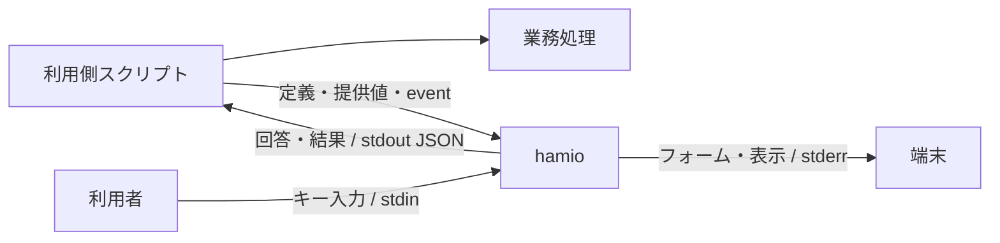

# hamio 基本設計

hamio は、開発用スクリプトの入力フォームと出力を統一するターミナル UI ツールである。利用側のスクリプトは任意の言語で業務処理を実行し、質問、進捗、結果の表示を CLI と JSON で hamio に委譲する。人には共通の操作画面を、プログラムには構造化した回答と終了状態を提供する。

本書は製品の目的、責務、構成、品質条件を定める。各文書は次の範囲を扱う。

| 文書                          | 定める内容                                             |
| ----------------------------- | ------------------------------------------------------ |
| 本書                          | 製品の責務、設計方針、受け入れ条件                     |
| [API 契約](api.md)            | コマンド、JSON、状態遷移、終了コード、資源上限         |
| [実装設計](implementation.md) | モジュールの依存方向、処理の流れ、副作用と資源の所有者 |
| [開発手順](development.md)    | Nix、ローカル検査、Git hooks、CI、プレビュー、性能測定 |
| [配布手順](distribution.md)   | 配布物、ライセンス、導入、更新、公開、保守             |
| [README](../README.md)        | 利用と開発の入口、実装・検証・公開の状態               |

## 1. 目的と対象範囲

プロジェクトごとに言語や業務要件が異なっても、質問、確認、進捗、結果を同じ規則で扱えるようにする。利用者が操作を覚える負担と、開発者が UI を実装・保守する負担を減らす。起動待ち、メモリ使用量、CPU 使用量、業務処理への追加時間も製品品質に含める。

| 項目           | 構成と理由                                                                              |
| -------------- | --------------------------------------------------------------------------------------- |
| 言語間の接続   | CLI と UTF-8 JSON を使い、言語別 SDK を必須にしない                                     |
| 製品実装       | Bun + TypeScript。端末の質問操作には `@clack/core` を使う                               |
| 利用側への提供 | 本体・製品依存・Bun を含む単一実行ファイル。UI のためのランタイム構築を不要にする       |
| 対象環境       | macOS arm64、Linux x64/arm64 の glibc 環境。配布時の試験環境は macOS 15 と Ubuntu 24.04 |
| 入力           | 文字入力、確認、単一選択、複数選択、秘密入力                                            |
| 出力           | メッセージ、値の一覧、表、進捗、結果、エラー                                            |
| 機械利用       | 非対話入力、JSON 応答、終了コード、範囲を選べる機能照会                                 |
| 開発環境       | Nix と lockfile でツール・依存を固定する                                                |
| 配布と利用許諾 | GitHub Releases で版を固定して配布する。本体は MIT License とする                       |

API v1 の範囲はローカルのターミナル UI とする。Web UI、常駐サーバー、ネットワーク API、汎用ワークフロー、任意コードを実行するプラグイン、自由なテーマ、全画面ダッシュボードは含めない。

## 2. 用語と責務

| 用語         | 意味                                                         |
| ------------ | ------------------------------------------------------------ |
| 利用側       | hamio を呼び出すスクリプトと、その管理プロジェクト           |
| 業務処理     | ビルド、テスト、外部照会、Git 操作など、スクリプト本来の処理 |
| 公開契約     | 利用側と共有するコマンド、データ、制約、終了規則             |
| フォーム定義 | 質問の型、ラベル、選択肢、制約、既定値を記述した JSON        |
| run          | 一つの連続表示プロセスが扱う、開始から結果確定までの表示単位 |
| task         | run 内で開始・進捗・完了を追跡する業務処理の単位             |
| event        | run や task の状態変化を通知する一件の JSON                  |
| NDJSON       | 各行に一つの JSON を記述する連続入力の形式                   |
| TTY          | キー入力や画面表示に使う端末接続                             |
| 機械モード   | 対話待ちと装飾を使わず、構造化した結果を返す動作             |
| 背圧         | 受信先の処理速度に合わせて、送り手が書き込み完了を待つ仕組み |
| プレビュー   | 実際の端末出力から生成するレビュー用の画像と操作録画         |

| 利用側の責務                                   | hamio の責務                                    |
| ---------------------------------------------- | ----------------------------------------------- |
| 質問内容、選択肢、既定値を決める               | 定義に従って入力画面を構成する                  |
| 外部照会など業務上の妥当性を確認する           | 型、必須条件、長さ、選択肢を検証する            |
| 順序、並列数、権限、再試行、取り消しを制御する | 受信した状態を検証し、表示・集計する            |
| 秘密項目を指定し、回答を保管・利用する         | 入力をマスクし、秘密指定した表示値を除く        |
| スクリプト全体の成否を判断する                 | UI の成功、不足、無効値、障害、キャンセルを返す |
| 利用する製品版を選び、変更をレビューする       | 指定された公開版を検証して配置する              |

同梱 Bun は hamio 自身の実行に使う。利用側のコードの読み込みや業務コマンドの起動は行わない。利用側の言語ランタイム、業務用の認証情報、外部サービスとの通信は利用側が管理する。

## 3. 利用側との接続

一回の呼び出しを一つのプロセスとコマンドで完結させる。回答、run の状態、描画、キャンセルを呼び出し間で共有しない。

| コマンド       | 入力                                         | 完了条件                                   |
| -------------- | -------------------------------------------- | ------------------------------------------ |
| `form`         | 定義ファイル、任意の提供値、対話時のキー入力 | 回答の解決、不足・無効値の判定、または中断 |
| `render`       | 表示部品の配列                               | 表示または JSON 応答の書き込み             |
| `stream`       | 一つの run の NDJSON                         | `run.finish` の受理と最終応答の書き込み    |
| `capabilities` | 照会する範囲                                 | 契約版、製品版、機能、上限の返却           |

例えばデプロイ用スクリプトでは、利用側が hamio のフォームで環境と確認を取得する。その回答を使って認証、接続確認、デプロイを実行し、進捗と結果を hamio へ渡す。

関連する質問は一つのフォームへまとめる。提供値、既定値の順に回答を解決し、必須の不足項目だけを配列順に質問する。非対話では不足を返し、無効値がある場合は対話を開始しない。不足、無効値、中断では部分回答を返さない。

並列処理の通知は、利用側が一つの送信経路へ集約し、run 全体の連番を付ける。すべての task を終了してから業務結果を `run.finish` で渡す。hamio は完了後に EOF を待たずに終了し、完了前の EOF はプロトコル違反とする。

同じ端末を描画するプロセスは一つに限る。連続表示の途中で質問が必要になった場合は、利用側が task と run を終了してフォームを開く。回答後の連続表示には別の run を使う。API v1 に run の一時停止・再開は設けない。

## 4. 内部構成と副作用

製品は、規則、処理手順、表示計算、入出力の境界を持つ。CLI が具体的な実装を接続する。

| 層            | 担当する処理                                                      | 依存と副作用の規則                                                       |
| ------------- | ----------------------------------------------------------------- | ------------------------------------------------------------------------ |
| `core`        | 契約の型、入力検証、フォーム値の解決、run / task の状態、秘密指定 | I/O、環境変数、timer、端末ライブラリを使わない                           |
| `application` | コマンドの決定、処理順序、JSON 応答                               | 渡された入出力インターフェースを呼ぶ。具体的なアダプターを import しない |
| `terminal`    | 質問の画面、表、通知、進捗の文字列                                | 渡された状態と表示条件から計算し、端末へ書き込まない                     |
| `adapters`    | ファイル、標準入出力、端末制御、背圧、timer                       | 確保した資源の終了と後始末を担当する                                     |
| `cli`         | 実装の接続、環境の読み取り、signal、プロセス終了                  | 一回の実行の入出力とキャンセルを所有する                                 |

色、幅、対話条件は値として渡す。公開契約に Bun のオブジェクトや Clack の設定を含めない。質問のキー操作と状態管理は Clack、画面の文字列は hamio が担当する。

端末アダプターは人向け表示や質問が必要なときに読み込む。機械モードでは端末の初期化と進捗描画を行わない。製品から配布スクリプトを呼ぶ依存は設けず、GitHub との通信は導入・更新の入口に限定する。

## 5. 公開契約と互換性

要求は UTF-8 の JSON とし、未知のキー、未対応の `apiVersion`、不正な型、上限超過を入力境界で拒否する。フォーム定義は許可項目を限定した形式とし、任意関数、実行コマンド、外部参照、汎用 JSON Schema の評価を受け付けない。項目 ID と選択肢の値は表示ラベルから独立させる。

数値は有限な IEEE 754 値、整数は安全な整数範囲とする。大きな整数、日時、バイト列は利用側が文字列へ符号化する。言語固有のオブジェクトや暗黙の型変換を使わない。

終了コードは UI 操作の状態を表す。要求不正、不足、無効値、順序違反、資源上限、I/O 障害、キャンセルを識別する。業務結果の `result.success: false` を正しく表示した場合は終了コード0とする。利用側は業務結果も確認し、確認の取得失敗を肯定の回答へ置き換えない。

製品版は `package.json` の `version` を実行ファイルへ埋め込み、契約版は `apiVersion` で管理する。既存の意味、必須条件、終了状態の変更には別の契約版を使う。応答への任意項目追加は互換変更とし、利用側は未知の応答項目を無視する。必要な機能や上限は `capabilities` で範囲を選んで照会できる。

## 6. 端末と機械出力

| 経路                 | 用途                                                      |
| -------------------- | --------------------------------------------------------- |
| フォーム定義ファイル | 質問の構造。対話のキー入力と読み取り先を分ける            |
| stdin                | キー入力、非対話フォームの提供値、表示定義、または event  |
| stdout               | 回答、結果、エラー。`--help` と `--version` を除いて JSON |
| stderr               | 人向けのフォーム、表、通知、進捗                          |

対話、表示形式、色は独立して指定する。明示指定を優先し、省略時だけ TTY と環境変数から決定する。TTY は接続先の情報として扱い、人と AI エージェントの識別には使わない。`/dev/tty` を暗黙に開かない。

フォームの回答は対話時も JSON とする。AI エージェントと CI は `form --interactive never` または `render / stream --format json` を指定する。この経路では対話待ちと装飾を使わず、stderr を空に保つ。

機械向けの連続出力は最終応答一つを既定とし、全 event が必要な場合だけ `--events` を使う。人向け表示は端末幅と行数に収め、省略件数を示す。JSON の非秘密値は表示上の省略・置換を行わない。秘密指定は両形式に適用する。警告、失敗、不足、結果は明示的に伝える。

出力量は stdout と stderr の合計 byte 数で測る。token の測定ではエージェントの取得経路と tokenizer を特定する。byte 数の差を token 削減率へ置き換えない。

## 7. 性能設計

hamio は利用側のビルドやテストと CPU・メモリを共有する。UI 自体の処理と、利用側の JSON 生成・転送・待機・補助プロセスを含む追加負荷を評価する。

### 起動と配布サイズ

関連する質問は一つのフォーム、継続的な通知は一つの stream へまとめる。task ごとの UI プロセス、業務実行用 Worker、描画用 Worker は設けない。業務の並列数は利用側が管理する。

JavaScript bundle は minify し、開発ツールを製品へ含めない。bundle、同梱実行ファイル、gzip のサイズを別々に測る。圧縮は梱包時だけ行い、日常の build・check へ含めない。圧縮サイズと実行時メモリを別の指標として扱う。

導入先のコマンドは実行ファイルへの symlink とする。通常起動に launcher、通信、版確認、依存取得を加えない。

### 入力処理と背圧

連続入力は read 単位で受け、行を順に切り出す。完全な行は直接 decode し、read をまたぐ未完成行だけを保持する。JSON の共通制約を一度検証し、種別の検証では同じ木の共通検査を繰り返さない。

event 応答と表示行は16 KiBを目安にまとめて書き込む。次の入力待ち、完了、エラーの前にも排出する。書き込み完了を待つ背圧と5秒の書き込み期限により、遅い受信先に対する蓄積と無期限待機を防ぐ。

利用側も可能な範囲で JSON 化前に通知を集約する。複数の送信元が同じ pipe へ直接書き込まず、一つの経路で順序を確定する。

### 描画と保持データ

進捗は最大10 fpsで一行を更新する。状態の取得と文字列生成は描画時に行い、書き込み中の更新は最新状態へ集約する。通知と結果は保留中の進捗を整理してから表示する。変化がなければ timer を動かさない。

| データ               | 保持規則                                                     |
| -------------------- | ------------------------------------------------------------ |
| 活動中 task          | 最新状態を保持し、完了時に詳細を解放する                     |
| 完了 task            | 再利用検出用 ID と集計値を run 終了まで保持する              |
| 途中進捗             | 描画に必要な最新状態を保持する                               |
| info / success 通知  | 表示と任意の event 応答後に解放する                          |
| warning / error 通知 | 最終応答まで上限付きで保持する                               |
| 表・値の一覧         | 単発入力の上限内で扱う。取得、分割、ページ選択は利用側が行う |

文書、フレーム、文字列、階層、件数、task、通知、質問の出力待ち行列には[資源上限](api.md#資源上限と機能照会)を設ける。超過時は明示的に失敗し、全 event の履歴は保持しない。これらはアプリの保持量の制限であり、ランタイムを含むプロセス全体のメモリ上限を強制するものではない。

### 性能予算

次をリリース判定用の目標とする。OS、基準機、端末、Bun 版、入力、負荷を固定して測定する。

| 指標                   | 目標                                  | 条件                                                                                              |
| ---------------------- | ------------------------------------- | ------------------------------------------------------------------------------------------------- |
| 小さい機械向け呼び出し | 応答取得まで p95 100 ms以内           | 入出力各4 KiB以下。OS cache を温めた新規プロセス。cold start は別記                               |
| 入力応答               | 表示反映まで p95 50 ms以内            | 日本語を含む通常フォーム。人の思考時間と業務処理を除く                                            |
| メモリ                 | 定常 RSS 64 MiB、peak RSS 128 MiB以内 | 1 run、活動中100 task以内、各1 KiB以内の通知2,000件。通知種別の保持規則に従い、補助プロセスも評価 |
| 業務への追加時間       | hamio なしに対して5%以内              | 対照は5秒以上。同じ業務結果・並列数で人の入力待ちなし。短い処理は絶対追加時間も評価               |
| 待機中 CPU             | 1 core換算で平均1%以下                | 新着 event・アニメーションのない30秒間                                                            |

中央値、p95、試行数、ばらつき、測定 API、単位を残す。JS heap、RSS、PSS、macOS の phys_footprint を区別し、複数プロセスの peak RSS の合計を同時点の専有物理メモリとみなさない。

並列評価では業務並列数と同時 run 数を変え、各プロセスと業務全体を測る。省メモリ設定、bytecode、Worker、キャッシュ、予算の変更は同条件の基準版と比較し、改善と悪化を併記する。profiler や強制 GC を使う診断は通常測定と分ける。

## 8. セキュリティ設計

保護対象は開発マシン、利用側コード、認証情報、回答、端末、配布物とする。外部データは取得者にかかわらず未信頼入力として検証する。

### 入力と秘密情報

入力境界で型、キー、数値範囲、サイズ、階層、件数を検証する。人向け表示では外部文字列の端末命令、制御文字、双方向制御文字を無害化し、hamio が生成した端末命令だけを使う。JSON 応答は JSON の規則でエスケープする。

秘密のフォーム値は入力中にマスクし、成功応答の回答経路だけへ返す。秘密指定した表示値と表の列は両形式で `[redacted]` に置換する。エラーに入力値、秘密、ファイル内容、内部 stack を含めない。

自由文と `result.data` の秘密情報は利用側が管理する。利用側は回答の stdout を捕捉し、保管、ログ、エージェントへの転送を制御する。hamio は秘密の自動検出、暗号化、OS 権限の分離を担当しない。

### 実行環境と供給元

製品コードを実行ファイルへ含め、実行時の依存取得、外部 schema の取得、動的プラグインを設けない。`.env`、`bunfig.toml`、`package.json`、`tsconfig.json` の自動読み込みを無効にする。

`BUN_OPTIONS` と `BUN_BE_BUN` は Bun がアプリ開始前に扱う環境変数である。起動元の環境を信頼境界に含め、未信頼データから設定しない。hamio は通常の OS プロセスであり、sandbox として使わない。

依存の取得元、版、integrity、コード差分、lifecycle scripts を確認し、ランタイムまで固定する。既知脆弱性の検査、配布物の由来確認、ランタイム更新と再配布を保守工程に含める。

## 9. 開発環境と品質検査

`flake.lock` で開発ツールを、`bun.lock` で JavaScript 依存を固定する。開発 shell は `aarch64-darwin`、`aarch64-linux`、`x86_64-linux` を対象とし、ローカルと CI で同じ定義を使う。clone ごとに `./scripts/dev.sh bun run setup` で固定依存の取得と Git hooks の導入を行う。

| 工程                | 検査                                                                         |
| ------------------- | ---------------------------------------------------------------------------- |
| 編集中              | 保存時 format、型診断、対象のテスト、UI の目視確認                           |
| commit 前           | ステージ済みファイル。部分ステージを保持し、同時タスクを2に制限              |
| push 前・作業完了前 | Lint、format、strict 型検査、テスト、プレビュー照合                          |
| PR                  | Linux の1ジョブで全体検査、全 system の Nix 定義評価、追跡ファイルの差分確認 |
| OS に関わる変更     | macOS の手動ジョブでも端末 I/O と実行ファイルを確認                          |
| リリース            | 三つの対象環境でビルド・実行試験し、公開資産の導入まで確認                   |

TS・JS・JSON は Biome、Markdown・YAML は Prettier、Nix は nixfmt、Shell は shfmt で format する。ShellCheck と actionlint を併用する。検査と hooks は自動修正せず、開発者が修正コマンドを実行して差分を確認する。

Quality workflow は所有者による同一リポジトリの `master` 向け PR の作成・更新・再開で起動する。branch push と PR close では起動しない。pre-push は作業ツリー、PR はマージ候補、リリースは版タグの commit を検証する。Nix 定義の評価と各 OS での実行試験を区別する。

AI エージェントは [AGENTS.md](../AGENTS.md)と、担当範囲に合う設計・TypeScript・性能のスキルに従う。検査コマンドと実施範囲は[開発手順](development.md)に定める。

## 10. 端末 UI のプレビュー

疑似端末（PTY）で実際の出力を記録し、代表状態の PNG と操作過程の GIF を生成する。`product` は製品 CLI、`fixture` は録画基盤の検証用プログラムを実行し、画像と説明で確認対象を識別できるようにする。

シナリオには端末サイズ、待つ出力、送るキー、撮影位置を定義する。Bun の PTY、agg、Pillow で順次処理し、時間、出力、event、画像サイズ、描画スレッド数に上限を設ける。

生成元と生成物の SHA-256 が一致すれば再利用し、不足、変更、破損時に生成する。生成中に入力源が変わった場合は成果物を採用しない。PNG と生成記録をソースと同じ commit に含め、GIF と端末出力の記録はローカルへ保存する。hooks と CI は保存済み PNG の照合を行う。

録画はダミーデータと限定した環境変数を使う。PR の画像リンクは対象 commit SHA に固定し、チャットには確認した PNG を表示する。外部サービスへの自動送信は行わない。内容照合、目視、実端末、アクセシビリティ、性能の検査範囲を区別する。[生成と共有の手順](development.md#8-ターミナル-ui-のプレビュー)

## 11. リポジトリ・配布・保守

### 公開とライセンス

`9uiLe/hamio` は閲覧、clone、fork ができる公開リポジトリとし、変更権限を所有者に限定する。一般投稿とレビューを制限し、期限付き制限は失効前に確認する。マージ条件は branch ruleset で管理する。

hamio 本体は [MIT License](../LICENSE) とし、著作権表記は `Copyright (c) 2026 9uiLe` とする。ライセンスによる利用許諾と、リポジトリへの変更権限は別に管理する。配布物には本体のライセンス全文と第三者の notices を含め、各部品の配布条件に従う。

### 配布物と信頼条件

ビルド用 Bun と同梱用 Bun を区別する。同梱用には Nix 入力が版と hash を指定した公式ランタイムを使い、Nix store を参照する loader 修正を含めない。

公開資産は対象ごとの gzip、圧縮前後の SHA-256、SBOM、notices と共通インストーラーで構成する。SBOM は Software Bill of Materials、すなわち同梱部品の在庫情報を指す。SPDX 2.3 で本体、解決した production npm 依存、hash で特定した Bun を記録する。本体の `licenseDeclared` は `MIT` とする。

Bun は native ライブラリと polyfill を含む一つの部品として記録する。内部部品の版を個別に解決していない範囲を明記し、未確認のライセンスを推測で補わない。提供元の notices、ソース、再リンク手順を添える。

GitHub の provenance はソースとビルド工程の由来を、release attestation は公開リリースと資産の結び付きを証明する。immutable releases によって公開済みタグと資産の差し替えを防ぐ。利用側はインストーラー自身も実行前に検証する。

### 導入・更新・ロールバック

利用側は `.hamio-version` に `vX.Y.Z` を保存する。POSIX インストーラーと GitHub CLI が公開元、Release workflow、タグと commit、GitHub-hosted runner、各資産の由来を検証し、圧縮前後の hash と実行ファイルの版を確認する。

配置先ごとに lock を取得し、一時領域で検証してから版ごとのディレクトリへ保存する。最後に `.tools/bin/hamio` の symlink を切り替える。失敗時は使用中の版を維持し、管理対象外のファイルを上書きしない。利用側の GitHub Actions には同じインストーラーを呼ぶ composite action を提供する。

更新とロールバックは対象版を明示し、同じ検証・配置の経路を使う。同梱 Bun の修正は hamio の別の製品版として再配布する。通常起動で自己更新や配布先への通信を行わない。

### リリースと保守

タグの版と package の版、`master` への commit の包含、clean worktree、本体のライセンス設定を公開前に確認する。ビルド、証明発行、公開の job を分け、全資産を draft release へ添付してから公開する。公開後は各対象環境で実物を導入して確認する。

Quality workflow は読み取り権限で動き、checkout 後に認証情報を保持しない。Release workflow の書き込み権限は証明発行と公開の job に限定する。`pull_request_target` は使わない。

公開済み資産は差し替えず、影響版の告知と修正版の発行で対応する。通常更新、緊急更新、非公開の脆弱性報告窓口を保守工程に含める。操作方法と信頼条件は[配布手順](distribution.md)に定める。

## 12. リリースの受け入れ条件

配布する実行ファイルを試験対象とし、対象ソース・環境・入力が分かる記録で次の条件を評価する。

| 対象         | 条件                                                                         |
| ------------ | ---------------------------------------------------------------------------- |
| 開発基盤     | 固定したツールと lockfile でローカル・CI の検査を実行できる                  |
| 公開契約     | 回答、エラー、終了コード、順序、上限、業務結果との分離が契約に一致する       |
| 多言語       | Shell・Python で同じ契約を扱い、他言語も標準プロセス I/O で接続できる        |
| 端末         | 日本語、emoji、狭い幅、resize、色なし、Ctrl-C、EOF、入力モード復旧を確認する |
| 機械モード   | 対話待ちと装飾がなく、人向け表示と同じ回答・業務状態を表す                   |
| 出力量       | 成功、失敗、不足、大量入力で byte と token を測り、重要情報を保持する        |
| 性能         | 性能予算と利用側の JSON 生成・転送を含む追加負荷を評価する                   |
| 並列・長時間 | 業務並列数と同時 run 数を変え、業務時間、完了 task の累積、保持量を確認する  |
| 混雑・中断   | 遅い受信先、閉じた出力先、大量 event で無期限待機や重要通知の喪失がない      |
| 入力保護     | 巨大・不正 JSON、深い構造、制御文字、秘密を安全に扱う                        |
| プレビュー   | 製品入口・シナリオと画像が一致し、代表状態を目視確認できる                   |
| 配布物       | Bun・Nix・実行時の依存取得が不要で、暗黙設定を読み込まず、対象環境で動く     |
| 配布検証     | 不正な資産・由来を拒否し、失敗時は使用中の版を維持する                       |
| 在庫と許諾   | SBOM を出荷物と照合し、MIT 本文と各部品の notices・配布条件を確認する        |

記録にはソース commit または内容 hash、Nix 入力、Bun 版、ビルド設定、生成物 hash、OS、CPU、RAM、端末、負荷、測定 API、単位、試行数を含める。UI 単体の試験と、同じ業務の hamio なし・ありの比較を区別する。

## 13. 検証結果と保証範囲

設計目標、実装された検査、実行済みの結果、公開版の保証範囲を別々に記録する。リリースノートには確認した OS・CPU・libc、性能の評価条件、端末とアクセシビリティの範囲、配布物の検証方法、既知の制約を示す。

ローカルの試験結果は実施した環境に限定する。GitHub CLI の代替実装による試験と、公開資産に対する実際の署名検証を区別する。SBOM の署名で在庫の網羅性や脆弱性の不存在を保証せず、バイト単位のビルド再現性も環境の固定とは別に評価する。未検証の項目は公開時に明記する。

## 根拠資料

技術資料は選定条件と一次情報を、測定資料は対象ソースと条件を特定した観測値を記録する。測定値を異なるソースや環境へそのまま適用しない。

- [UI と言語間連携](research/ui-and-integration.md): Clack、JSON、端末と機械出力。
- [ランタイムとサプライチェーン](research/runtime-and-supply-chain.md): Bun 同梱、Nix、依存管理、配布検証。
- [性能特性と測定](research/performance.md): 起動、メモリ、並列処理、測定 API。
- [製品 API の性能評価](research/api-performance.md): コマンドの応答、出力量、検証範囲。
- [実行基盤の性能比較](research/refactor-performance.md): 対象を特定した実行ファイルのサイズ、処理時間、並列実行、入力応答。
- [CI の構成と測定](research/ci.md): 検査範囲、準備時間、ジョブ構成。
- [プレビューの性能評価](research/preview-performance.md): 照合・生成時間、CPU、メモリ。
- [配布手順の根拠](distribution.md#根拠): immutable releases、attestation、runner、SPDX。
