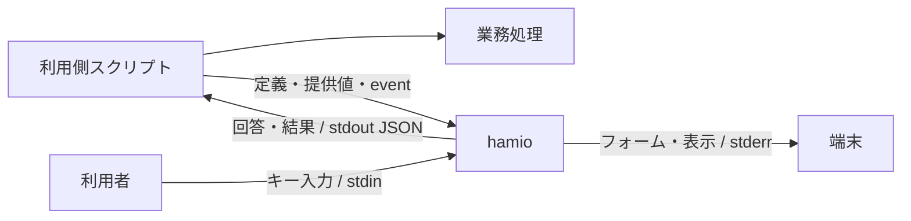
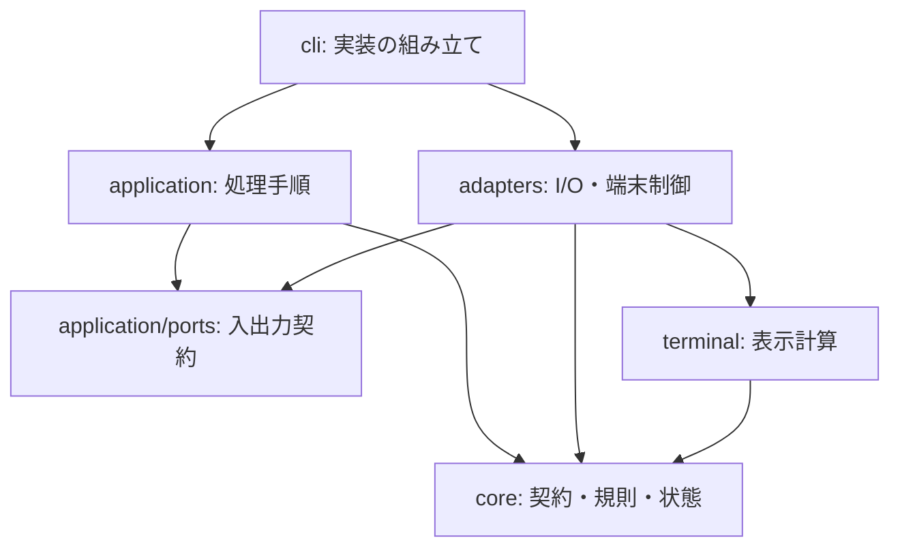

# hamio 基本設計

本書は製品の責務、依存境界、性能目標と設計理由を定める。コマンド・JSON・終了状態・資源上限の正本は [API 契約](api.md)、操作の正本は[開発手順](development.md)と[配布手順](distribution.md)とする。

## 1. 目的と対象範囲

スクリプトごとに質問の操作や結果の表現が異なると、利用者は操作を覚え直し、開発者は UI を個別に保守する必要がある。hamio はローカルのプロセス I/O と JSON で入力・表示を共通化し、業務処理の言語や構造への依存を避ける。サーバー、ネットワーク認証、言語別 SDK の保守は持ち込まない。

API v1 はローカルのターミナル UI を対象とする。Web UI、常駐サービス、ネットワーク API、利用側コードの実行、汎用ワークフロー、任意コードのプラグイン、自由なテーマ、全画面ダッシュボードは対象外とする。

## 2. 責務

| 利用側が決めること                         | hamio が担当すること                       |
| ------------------------------------------ | ------------------------------------------ |
| 質問内容、選択肢、既定値                   | 定義に従う表示と回答の取得                 |
| 外部照会を含む業務上の妥当性               | 型、必須条件、長さ、選択肢の検証           |
| 業務の順序、並列数、権限、再試行、取り消し | 受信した状態の検証、表示、集計             |
| 秘密項目の指定、回答の保管と利用           | 秘密入力のマスク、秘密指定した表示値の除去 |
| スクリプト全体の成否                       | UI の成功、不足、無効値、障害、中断の返却  |
| 採用する製品版と更新時期                   | 指定した公開版の検証と配置                 |

## 3. 利用側との接続

一回の呼び出しを一つのコマンド・プロセスで完結させ、回答、run、描画、中断の状態を他の呼び出しと共有しない。関連する質問は一つのフォーム、連続する状態は一つの stream にまとめて起動回数を抑える。並列業務の通知は利用側が一つの送信経路へ集約する。

stdout と stderr を分けることで、対話中の回答もプログラムが捕捉できる。定義ファイルとキー入力の読み取り先も分ける。同じ端末の描画は一つのプロセスが担当し、途中で質問する場合は run を終了してフォームを起動する。一時停止・再開や取り消しは利用側が制御する。

## 4. 内部構成と副作用

入力の意味と状態遷移、表示文字列の計算、実際の I/O を分ける。

具体的な adapter を選ぶのは CLI とする。application は注入された入出力契約を使い、adapter を import しない。core と表示計算は環境変数、標準入出力、timer を参照しない。Bun・Clack 固有の型は adapter に閉じる。これにより規則・表示計算を端末なしで試験し、I/O の失敗と後始末を個別に検証できる。

キー操作と質問状態には `@clack/core` を使う。入力編集を自前で保守する負担を避けつつ、hamio 固有の幅・色・秘密表示を守るため表示文字列は hamio が計算する。秘密入力の表示計算にはマスク済み文字列だけを渡す。help・版・機能照会は入力処理を読み込まず、機械モードでは端末を初期化しない。

外部入力は境界で共通の JSON 制約を一度検証し、種別ごとのモデルへ変換する。状態管理と表示は検証済みモデルを扱う。ビルド・配布コードを製品の import graph に含めない。

資源を確保した層が listener、timer、バッファ、端末状態の解放・復旧を担当する。close 後の描画予約を禁じ、背景の状態取得・描画・書き込みの失敗も中断と後始末へ接続する。失敗を未処理の Promise として放置しない。

## 5. 公開契約と互換性

[API 契約](api.md#共通データと互換性)で製品版と契約版を分ける。利用側の更新判断と、JSON の意味の変更を独立して扱うためである。関数、コマンド、外部参照、汎用 JSON Schema を評価せず、UI 定義を業務コードの実行経路にしない。

終了コードは UI 操作の成否を表し、利用側が決めた業務結果を上書きしない。不足・無効値・中断を有効な否定回答と区別し、確認を取得できなかった場合に業務を誤って進めない。

## 6. 端末と機械出力

TTY は接続先の性質であり、人と AI エージェントを識別できない。対話、表示形式、色を独立して指定できるようにし、色を止めただけで非対話になるとは扱わない。`/dev/tty` を暗黙に開かず、利用側が選んだ入出力経路を守る。

人向け表示の幅・件数制限と、JSON の非秘密値を分ける。表示上の省略や置換で機械処理用の値を変えず、秘密指定は両形式に適用する。警告、失敗、不足、結果は黙って捨てない。

## 7. 性能設計

hamio は業務処理と CPU・メモリを共有する。製品単体に加え、利用側の JSON 生成・転送・待機・補助プロセスを含む追加負荷を評価する。task ごとの UI プロセスや event ごとの Worker は生成しない。

### 入出力と保持量

途中進捗は最新状態へ集約し、同じ表示文字列は再描画しない。通知で行を消した場合は再描画を必要とする。更新がなければ timer を動かさず、書き込み完了を待つ背圧と期限により出力待ちの蓄積を防ぐ。

`--events` の受理済み応答は、次の入力待ちと後続エラーの前に排出する。送信側が応答を待つ場合の相互待ちと、受理済み event の欠落・順序逆転を防ぐためである。描画の集約を event 配送の省略へ適用しない。[処理順序](../src/application/run.ts)と[出力バッチ](../src/application/batch.ts)を変更するときもこの条件を保つ。

完了した task の詳細と通常通知は蓄積しない。使用済み task ID は再利用検出のため run 終了まで、警告・エラーは最終応答まで保持し、どちらも[資源上限](api.md#資源上限と機能照会)を適用する。入力・保持量の上限と、ランタイムを含むプロセス全体のメモリ使用量は区別する。

### 性能予算

| 指標                   | 評価目標                              | 測定条件                                                                    |
| ---------------------- | ------------------------------------- | --------------------------------------------------------------------------- |
| 小さい機械向け呼び出し | 応答取得まで p95 100 ms以内           | 入出力各4 KiB以下。OS cache を温めた新規プロセス。cold start は別記         |
| 入力応答               | 表示反映まで p95 50 ms以内            | 日本語を含む通常フォーム。思考時間と業務処理を除く                          |
| メモリ                 | 定常 RSS 64 MiB、peak RSS 128 MiB以内 | 1 run、活動中100 task以内、各1 KiB以内の通知2,000件。補助プロセスも評価     |
| 業務への追加時間       | hamio なしに対して5%以内              | 対照は5秒以上。同じ結果・並列数で入力待ちなし。短い業務は絶対追加時間も評価 |
| 待機中 CPU             | 1 core換算で平均1%以下                | 新着 event・アニメーションのない30秒間                                      |

性能予算は設計目標であり、保証値ではない。[測定手順](development.md#製品試験と性能測定)で条件を揃え、[リリース評価](release-readiness.md)で実測値と未測定範囲を示す。

## 8. セキュリティ設計

保護対象は開発マシン、利用側コード、認証情報、回答、端末、配布物である。外部データは取得者にかかわらず入力境界で検証する。端末命令には色以外の操作もあるため、SGR だけを除去する防御にしない。人向け表示では外部の端末命令、制御文字、双方向制御文字を無害化し、JSON は JSON の規則でエスケープする。

秘密フォームの実値は業務で使うため成功応答に返す。マスクは回答 stdout の保管・ログ・転送を保護しない。自由文や `result.data` の秘密も利用側が管理する。表示値の秘密指定と公開エラーの規則は [API 契約](api.md)に従う。

実行ファイルでは `.env`、`bunfig.toml`、`package.json`、`tsconfig.json` の自動読み込みを無効にし、起動先のプロジェクトによる暗黙の動作変更を避ける。実行時の外部 import、依存・schema の取得、動的プラグインを設けない。`BUN_OPTIONS` と `BUN_BE_BUN` はアプリ開始前に作用するため、起動元の環境変数と OS の権限・標準ライブラリを信頼条件に含める。hamio は利用側コードの sandbox ではない。

npm 依存の監査で同梱 Bun・native 部品まで確認できたとは扱わない。確認範囲、非公開の報告、修正版の提供は [SECURITY.md](../SECURITY.md)に従う。

## 9. 配布の設計理由

単一実行ファイルには固定した公式 Bun を同梱し、配布用ランタイムには Nix 向け loader 修正を加えない。利用側へ Nix の導入や store への依存を持ち込まないためである。Nix パッケージを選ぶ場合の Linux 調整と信頼範囲は[配布手順](distribution.md#検証と信頼条件)に定める。圧縮は梱包時だけ行い、通常の build・check に圧縮負荷を加えない。

候補は独立した作業領域で依存取得から生成し、同じ入力・対象環境で全資産の byte 一致を確認する。SBOM の日時には commit 時刻を使う。現在時刻を埋め込むと、日時に依存する namespace の hash も変わり、同じ入力からの再現性を失うためである。別ホストでの一致や依存の無害性をこの比較だけで主張しない。

証明発行と公開の job は製品コードを実行せず、必要な書き込み権限を各工程に限定する。所有者の管理設定確認・承認と公開資産の操作も分ける。由来の証明はコードの無害性や在庫の網羅性を保証しない。公開・導入・障害復旧は[配布手順](distribution.md#保守者のリリース工程)、GitHub 上の保護設定は[開発手順](development.md#リポジトリの保護設定)を正本とする。
