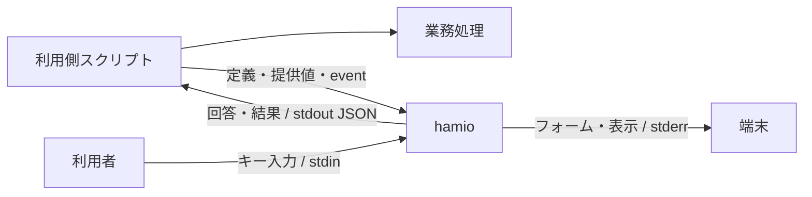
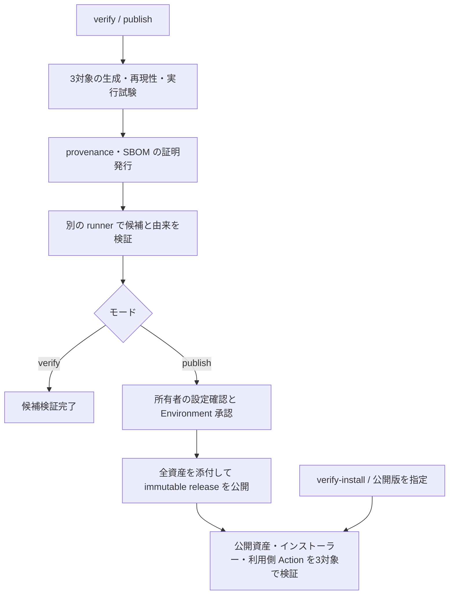

# hamio 基本設計

hamio は、開発用スクリプトの質問、進捗、表、結果を共通のターミナル UI で扱うためのコマンドラインツールである。利用側は業務処理を任意の言語で実装し、UI に必要な定義と状態を JSON で渡す。hamio は入力と表示を担当し、業務の実行・権限・並列数は利用側が管理する。

本書は製品の責務、構成、品質条件、配布と保守の方針を定める。各文書の役割は次のとおりとする。

| 文書                                 | 定める内容                                           |
| ------------------------------------ | ---------------------------------------------------- |
| [API 契約](api.md)                   | コマンド、JSON、状態遷移、終了コード、資源上限       |
| [実装設計](implementation.md)        | モジュールの依存方向、処理順序、副作用と資源の所有者 |
| [開発手順](development.md)           | Nix、検査、Git hooks、CI、プレビュー、性能測定       |
| [配布手順](distribution.md)          | 導入、更新、候補検証、公開、公開版の導入試験         |
| [リリース評価](release-readiness.md) | 製品・検証環境を特定した結果、実測値、未検証範囲     |
| [セキュリティ方針](../SECURITY.md)   | 非公開の報告、同梱部品の確認、修正版の提供           |

## 1. 目的と対象範囲

スクリプトごとに質問の操作や結果の表現が異なると、利用者は操作を覚え直し、開発者は UI を個別に保守する必要がある。hamio は入出力の契約を共通化し、業務処理の言語や構造に依存せずに使えるようにする。開発作業と同時に動く製品として、起動、応答、CPU、メモリ、出力量も品質条件に含める。

| 項目     | 方針                                                                                 |
| -------- | ------------------------------------------------------------------------------------ |
| 利用方法 | ローカルのプロセス I/O と UTF-8 JSON。Shell、Python、Go、TypeScript などから呼び出す |
| UI       | 文字入力、確認、選択、秘密入力、メッセージ、値の一覧、表、進捗、結果、エラー         |
| 自動実行 | 明示的な非対話指定、JSON 応答、終了コード、範囲を指定する機能照会                    |
| 実装     | Bun + TypeScript。質問のキー操作と状態管理に `@clack/core` を使う                    |
| 配布     | 本体・製品依存・Bun を含む単一実行ファイルを GitHub Releases で提供する              |
| 配布検証 | macOS 15 arm64、Ubuntu 24.04 x64 / arm64（glibc）の native 環境で行う                |
| 開発基盤 | Nix と lockfile でツールを固定し、ローカルと PR で同じ検査を使う                     |

UI の利用に Bun・Node.js・Nix の導入を求めない。同梱 Bun は hamio の実行に使う。業務処理のランタイムと依存は利用側が用意する。

API v1 はローカルのターミナル UI を対象とする。Web UI、常駐サービス、ネットワーク API、利用側コードの実行、汎用ワークフロー、任意コードのプラグイン、自由なテーマ、全画面ダッシュボードは対象外とする。

## 2. 用語と責務

| 用語                     | 意味                                                                        |
| ------------------------ | --------------------------------------------------------------------------- |
| 利用側                   | hamio を呼び出すスクリプトと、その管理プロジェクト                          |
| 業務処理                 | ビルド、テスト、外部照会、Git 操作など、スクリプト本来の処理                |
| 公開契約                 | 利用側と共有するコマンド、データ形式、制約、終了規則                        |
| フォーム定義             | 質問の型、ラベル、選択肢、制約、既定値を記述する JSON                       |
| run / task               | 連続表示の開始から結果確定までの単位 / run 内で状態を追跡する業務単位       |
| event / NDJSON           | 状態を通知する一件の JSON / 各行に一つの JSON を置く連続入力形式            |
| TTY / PTY                | 端末接続 / 自動試験や録画に使う疑似端末                                     |
| 機械モード               | 対話待ちと装飾を使わず、構造化した応答を返す動作                            |
| 背圧                     | 受信先の速度に合わせ、書き込みの完了を待つ仕組み                            |
| 配布候補 / 資産          | 公開の検証対象となる生成物一式 / gzip、checksum、在庫、通知などの各ファイル |
| SBOM                     | Software Bill of Materials。同梱部品の在庫情報                              |
| provenance / attestation | ソースとビルド工程の由来 / その情報などに対する署名付き証明                 |
| immutable release        | 公開済みのタグと添付資産を固定する GitHub Release                           |

| 利用側が決めること                         | hamio が担当すること                       |
| ------------------------------------------ | ------------------------------------------ |
| 質問内容、選択肢、既定値                   | 定義に従う表示と回答の取得                 |
| 外部照会を含む業務上の妥当性               | 型、必須条件、長さ、選択肢の検証           |
| 業務の順序、並列数、権限、再試行、取り消し | 受信した状態の検証、表示、集計             |
| 秘密項目の指定、回答の保管と利用           | 秘密入力のマスク、秘密指定した表示値の除去 |
| スクリプト全体の成否                       | UI の成功、不足、無効値、障害、中断の返却  |
| 採用する製品版と更新時期                   | 指定した公開版の検証と配置                 |

例えばデプロイ用スクリプトでは、hamio が環境の選択と確認を取得し、利用側が回答に基づいて認証・接続・デプロイを行う。利用側は処理中の状態と結果を hamio へ渡す。外部接続とデプロイの権限は利用側が持つ。

## 3. 利用側との接続

一回の呼び出しを一つのコマンド・プロセスで完結させる。回答、run、描画、中断の状態は呼び出しごとに持ち、他の呼び出しと共有しない。

| コマンド       | 入力                                         | 完了条件                                   |
| -------------- | -------------------------------------------- | ------------------------------------------ |
| `form`         | 定義ファイル、任意の提供値、対話時のキー入力 | 回答の解決、不足・無効値の判定、または中断 |
| `render`       | 表示部品の配列                               | 表示と応答の書き込み                       |
| `stream`       | 一つの run を表す NDJSON                     | `run.finish` の受理と最終応答の書き込み    |
| `capabilities` | 照会する機能の範囲                           | 契約版、製品版、対応機能、上限の返却       |

関連する質問は一つのフォームにまとめる。回答は提供値、既定値の順に解決し、必須の不足項目だけを定義順に質問する。無効値があれば質問を開始せず、非対話での不足は不足として返す。不足、無効値、中断では部分回答を返さない。

並列業務の event は利用側が一つの送信経路へ集約し、run 全体に連番を付ける。全 task の完了後に `run.finish` を送り、hamio は EOF を待たずに終了する。完了前の EOF はプロトコル違反とする。

同じ端末の描画は一つのプロセスが担当する。途中で質問する場合は run を終了してフォームを起動し、回答後に別の run を開始する。業務処理の一時停止や取り消しは利用側が制御する。

## 4. 内部構成と副作用

入力の意味と状態遷移、表示文字列の計算、実際の I/O を分ける。CLI が具体的な入出力を接続し、Bun・Clack のオブジェクトを公開契約へ含めない。

| 層            | 責務                                                  | 副作用の扱い                                     |
| ------------- | ----------------------------------------------------- | ------------------------------------------------ |
| `core`        | 型、入力検証、回答の解決、run / task の状態、秘密指定 | I/O、環境変数、timer、端末ライブラリを参照しない |
| `application` | コマンドの決定、処理順序、JSON 応答、出力バッチ       | 注入された入出力契約を呼ぶ                       |
| `terminal`    | 無害化、幅調整、質問・表・進捗の文字列計算            | 端末へ書き込まない                               |
| `adapters`    | ファイル、ストリーム、端末制御、背圧、timer           | 確保した資源と後始末を所有する                   |
| `cli`         | 実装の組み立て、環境、signal、終了コード              | 一回の実行の入出力と中断を所有する               |

application は具体的な adapter を参照しない。規則と表示計算は端末なしで試験でき、I/O の障害と後始末は adapter ごとに確認できる。資源を確保した層が listener、timer、バッファ、端末状態の解放・復旧を担当する。

help・版・機能照会は入力処理を読み込まずに応答する。質問と人向け表示は必要な呼び出しで読み込み、機械モードでは端末を初期化しない。Clack がキー操作と質問状態を、hamio が表示文字列を担当する。

ビルド・配布コードは製品の import graph に含めない。入力収集、実行ファイル生成、メタデータ計算、検証、配置を分け、候補ごとの作業領域と出力先を明示する。[実装設計](implementation.md)に依存方向と資源の寿命を定める。

## 5. 公開契約と互換性

入力境界では UTF-8 JSON を解析し、未対応の `apiVersion`、未知のキー、不正な型、上限超過を拒否する。フォーム定義は許可した項目だけを受け付ける。関数、コマンド、外部参照、汎用 JSON Schema を評価しない。ID と選択肢の値は表示ラベルから独立させる。

数値は有限な IEEE 754 値、整数は安全な整数範囲とする。大きな整数、日時、バイト列は利用側が文字列へ符号化し、言語固有の値や暗黙の型変換に依存しない。

終了コードは UI 操作の状態を表す。業務失敗を示す `result.success: false` でも、正常に表示できれば終了コードは0とする。利用側は終了コードと回答・業務結果の両方を確認する。確認の false は有効な回答として扱い、取得失敗を肯定へ置き換えない。

製品版は `package.json` の `version`、契約版は `apiVersion` で管理する。既存の意味、必須条件、終了状態を変える場合は別の契約版を使う。応答への任意項目追加は互換変更とし、利用側は未知の応答項目を無視する。JSON の形式、状態遷移、終了コード、制約値の正本は [API 契約](api.md)とする。

## 6. 端末と機械出力

| 経路         | 用途                                                      |
| ------------ | --------------------------------------------------------- |
| 定義ファイル | フォームの構造。キー入力と読み取り先を分ける              |
| stdin        | キー入力、非対話の提供値、表示定義、または event          |
| stdout       | 回答、結果、エラー。`--help` と `--version` を除いて JSON |
| stderr       | 人向けのフォーム、表、通知、進捗                          |

対話、表示形式、色は個別に指定する。明示指定を優先し、省略時に TTY と環境変数で既定動作を決める。TTY から人と AI エージェントを識別せず、`/dev/tty` を暗黙に開かない。

AI エージェントと CI は `form --interactive never` または `render / stream --format json` を指定する。機械モードは対話待ちと装飾を使わず、stderr を空に保つ。stream の stdout は最終応答一つを既定とし、受理した全 event が必要な場合に `--events` を指定する。

人向け表示は幅と件数を制限し、省略件数を示す。JSON の非秘密値には表示上の省略や置換を適用せず、秘密指定は両形式へ適用する。警告、失敗、不足、結果を黙って捨てない。出力量は stdout と stderr の合計 bytes で測り、token を評価する場合は取得経路と tokenizer を記録する。

## 7. 性能設計

hamio は業務処理と CPU・メモリを共有する。製品単体と、利用側の JSON 生成・転送・待機・補助プロセスを含む追加負荷をそれぞれ測る。

### 起動と配布サイズ

関連する質問を一つのフォーム、連続する状態を一つの stream にまとめ、プロセスの起動回数を抑える。task ごとの UI プロセスや event ごとの Worker は生成しない。業務の並列数は利用側が決める。

本体を minify し、開発ツールを bundle から除外する。JavaScript、ランタイム込みの実行ファイル、gzip は別々にサイズを評価する。圧縮は梱包時に行い、通常のビルドや検査で圧縮コストを払わない。利用側は実行ファイルへの symlink を直接起動し、通常起動では通信・依存取得・更新確認を行わない。

### 入力・出力・描画

連続入力は read 単位で受け、必要な行を順に decode する。read をまたぐ未完成行だけを保持し、`run.finish` 後の入力は処理しない。共通の JSON 制約を一度検証してから、種別のモデルへ変換する。

event 応答と表示行は16 KiBを目安にまとめて書く。行を分割しないため、最大1行分が閾値に加わる。次の入力待ち、完了、エラーの前にも排出する。書き込み完了を待つ背圧と5秒の期限で、出力待ちの蓄積と無期限待機を防ぐ。利用側も JSON 化の前に通知を集約し、同じ pipe への書き込み順を一つの経路で確定する。

進捗は最大10 fpsで一行に描画する。描画時に最新状態と文字列を計算し、書き込み中の更新も最新状態へ集約する。同じ文字列は再描画を省く。通知で進捗行を消した場合は同じ内容でも再描画し、更新がなければ timer を動かさない。

### 保持量

| データ                   | 保持期間                                                         |
| ------------------------ | ---------------------------------------------------------------- |
| 活動中 task の詳細       | 最新状態を保持し、task 完了時に解放する                          |
| 使用済み task ID・集計値 | ID の再利用検出と結果生成のため run 終了まで保持する             |
| 途中進捗                 | 描画に必要な最新状態だけを保持する                               |
| info / success 通知      | 表示と任意の event 応答後に解放する                              |
| warning / error 通知     | 上限付きで最終応答まで保持する                                   |
| 表・値の一覧             | 単発入力の上限内で扱う。取得、分割、ページ選択は利用側が担当する |

文書、フレーム、文字列、階層、件数、task、通知、質問の出力待ち行列に[資源上限](api.md#資源上限と機能照会)を設け、超過時は明示的に失敗する。保持データの上限と、ランタイムを含むプロセス全体のメモリ使用量は区別する。

### 性能予算

| 指標                   | 評価目標                              | 測定条件                                                                    |
| ---------------------- | ------------------------------------- | --------------------------------------------------------------------------- |
| 小さい機械向け呼び出し | 応答取得まで p95 100 ms以内           | 入出力各4 KiB以下。OS cache を温めた新規プロセス。cold start は別記         |
| 入力応答               | 表示反映まで p95 50 ms以内            | 日本語を含む通常フォーム。思考時間と業務処理を除く                          |
| メモリ                 | 定常 RSS 64 MiB、peak RSS 128 MiB以内 | 1 run、活動中100 task以内、各1 KiB以内の通知2,000件。補助プロセスも評価     |
| 業務への追加時間       | hamio なしに対して5%以内              | 対照は5秒以上。同じ結果・並列数で入力待ちなし。短い業務は絶対追加時間も評価 |
| 待機中 CPU             | 1 core換算で平均1%以下                | 新着 event・アニメーションのない30秒間                                      |

性能予算は設計目標である。保証値は OS、基準機、端末、Bun、入力、負荷を特定した測定に基づいて定める。中央値、p95、試行数、ばらつき、測定 API・単位を残し、改善と悪化の両方を記録する。通常測定と profiler・強制 GC を使う診断、JS heap・RSS・PSS・macOS footprint はそれぞれ区別する。

## 8. セキュリティ設計

保護対象は開発マシン、利用側コード、認証情報、回答、端末、配布物である。外部データは取得者にかかわらず入力境界で検証する。人向け表示では外部の端末命令、制御文字、双方向制御文字を無害化し、JSON 応答は JSON の規則でエスケープする。

秘密のフォーム値は入力中にマスクし、成功応答の `values` に返す。秘密指定した表示値と表の列は `[redacted]` に置換する。エラーに入力値、ファイル内容、秘密、内部 stack を含めない。自由文や `result.data` の秘密、回答 stdout の保存・ログ・転送は利用側が管理する。

実行ファイルでは `.env`、`bunfig.toml`、`package.json`、`tsconfig.json` の自動読み込みを無効にする。実行時の外部 import、依存・schema の取得、動的プラグインを設けない。アプリ開始前に作用する `BUN_OPTIONS` と `BUN_BE_BUN`、OS の権限と標準ライブラリは実行環境の信頼条件に含める。hamio は利用側コードの sandbox ではない。

依存は取得元、版、integrity、差分、lifecycle scripts を確認して固定する。npm 依存の監査と、同梱 Bun・native 部品の advisory、許諾、ソース提供条件を分けて確認する。公開資産には由来と完全性の検証を必須とし、検証サービスの障害時も省略しない。非公開の報告と修正版の提供は [SECURITY.md](../SECURITY.md)に従う。

## 9. 開発環境と品質検査

開発 shell は `aarch64-darwin`、`aarch64-linux`、`x86_64-linux` に対応する。Nix のツールを `flake.lock`、JavaScript 依存を `bun.lock` で固定し、ローカルと CI で同じ検査を使う。

| 工程              | 対象と検査                                                                               |
| ----------------- | ---------------------------------------------------------------------------------------- |
| 編集              | 型診断、保存時 format、対象テスト、UI の目視                                             |
| commit            | ステージ済みファイル。部分ステージを保持し、同時タスクは2                                |
| push・作業完了    | 作業ツリー全体の Lint、format、strict 型検査、テスト、プレビュー照合                     |
| PR                | マージ候補。Ubuntu の1ジョブで全体検査、全 Nix system の定義評価、追跡ファイルの差分確認 |
| OS に依存する変更 | 選択した ref に対する macOS の手動 Quality 検査を併用                                    |
| 配布候補          | 3対象の native runner で再現性、実行ファイル、証明を検証                                 |

Quality は所有者または Dependabot による同一リポジトリの `master` 向け PR の作成・更新・再開と、所有者の手動実行を入口とする。branch push と PR close では起動しない。共通検査を PR に、OS・CPU ごとの配布検証を Release に配置する。

検査は自動修正せず、修正は差分を確認して明示的に実行する。ツール、hooks、CI、領域別スキルは[開発手順](development.md)、AI エージェントの作業規則は [AGENTS.md](../AGENTS.md)に定める。

## 10. 端末 UI のプレビュー

PTY で実際の製品出力と入力操作を記録し、代表状態の PNG と操作過程の GIF を生成する。製品 CLI の確認には `product` シナリオ、録画基盤の確認には `fixture` シナリオを使う。

シナリオは端末サイズ、期待出力、送信キー、撮影位置を定める。生成元と成果物の hash が一致すれば再利用し、不足・破損・内容変更があれば生成する。生成中に入力源が変わった場合は失敗とする。

ソース、PNG、生成記録を同じ commit に含める。GIF と端末出力の記録はローカルに保存する。PR には commit SHA に固定した画像リンクを、チャットには確認済み PNG を載せる。内容照合、見た目、実端末、アクセシビリティ、性能を別々に評価する。[プレビュー手順](development.md#8-ターミナル-ui-のプレビュー)

## 11. リポジトリ・配布・保守

### 公開元と変更権限

`9uiLe/hamio` は閲覧・clone・fork が可能な公開リポジトリとし、変更権限を所有者に限定する。`master` は PR と `quality` 成功を必須とし、force push・削除を禁止する。版タグは管理者だけが作成でき、作成後の更新・削除を禁止する。

Dependabot の更新 PR と非公開の脆弱性報告を受け付け、自動マージは行わない。投稿は collaborator に制限し、期限付きの制限は失効前に更新する。GitHub 上の ruleset、Environment、immutable releases の設定は[開発手順](development.md#リポジトリの保護設定)で管理する。

hamio 本体は [MIT License](../LICENSE)、著作権表記は `Copyright (c) 2026 9uiLe` とする。第三者部品には各部品の許諾・通知条件を適用する。利用許諾と、公開元への変更権限は別に管理する。

### 配布候補と再現性

同梱 Bun は版と hash を固定した公式ランタイムとし、Nix store を参照する loader 修正を加えない。各対象に gzip、圧縮前後の SHA-256、SPDX 2.3 SBOM、notices を用意し、共通の `install.sh` と合わせて13資産を公開する。

ソースの commit と内容 hash を記録し、候補ごとの独立した作業領域で固定依存の取得、ビルド、梱包を行う。SBOM の日時は commit 時刻から決める。同じ入力・ランタイム・対象環境から二回生成した全資産の byte 一致と、gzip から展開した実行ファイルの API・端末試験を公開条件とする。

SBOM は本体、production npm 依存、hash で特定した Bun を記録する。Bun 内部の native 部品と polyfill は集約して扱い、個別の版・許諾を確定していない範囲を明示する。notices に本体・npm 依存の許諾全文、Bun 提供元の通知、ソース・再リンク手順への参照を含める。

### 検証・承認・公開

Release workflow は所有者の手動実行を入口とする。実行目的を次の3モードで指定し、タグ push 自体では起動しない。

| モード           | 対象                                    | 完了までの工程                                |
| ---------------- | --------------------------------------- | --------------------------------------------- |
| `verify`（既定） | 選択したブランチまたはタグ              | 3対象の候補生成、証明発行、候補検証           |
| `publish`        | `package.json` と一致する `vX.Y.Z` タグ | 候補検証、所有者の承認、公開、3対象の導入試験 |
| `verify-install` | `version` に指定した公開済みの `vX.Y.Z` | 公開資産の検証、3対象の導入試験               |

候補生成は公開元、実行モード、clean worktree、ライセンスを検査する。`publish` ではタグと package の一致、`master` への包含も必須とする。所有者は候補の結果、許諾・advisory、対応範囲を確認し、immutable releases が有効であることを照会してから `release` Environment を承認する。

管理設定の照会は所有者の管理権限、公開は job の `contents: write` で行う。証明発行と公開の job は製品コードを実行せず、書き込み権限を担当工程に限定する。公開は全資産を draft に添付してから行い、実際の immutable release を検証する。同じ版が存在する場合は停止し、公開済み資産を差し替えない。

導入試験は実際の公開資産、インストーラー、その製品タグの commit にある利用側 Action を使う。検証を実行する workflow の ref・commit と、検証対象の製品タグ・commit は別に記録する。`verify-install` はビルド・証明発行・公開を行わず、公開版の取得と実行を独立して確認する。

### 導入・更新・障害対応

利用側は `.hamio-version` に完全な `vX.Y.Z` を固定する。インストーラー自身と公開資産について、immutable release との結び付き、repository・workflow・タグ・commit・runner、圧縮前後の hash、実行ファイルの版を検証する。成功後に `.tools/bin/hamio` の symlink を切り替え、失敗時は使用中の版を保持する。管理対象外のファイルは上書きしない。

更新とロールバックも同じ検証経路を使う。同梱 Bun の修正は新しい製品版で提供する。公開後の導入失敗や脆弱性には、影響範囲と回避策の告知、影響版の推奨停止、新しい版での修正で対応する。操作は[配布手順](distribution.md)、報告と修正の責任は[セキュリティ方針](../SECURITY.md)に定める。

## 12. リリースの受け入れ条件

公開判断では対象ソース・環境・実行結果を記録し、実装された検査と、実際に確認できた条件を照合する。

| 対象             | 確認する条件                                                                                                              |
| ---------------- | ------------------------------------------------------------------------------------------------------------------------- |
| 開発基盤         | 固定ツールでローカル・CI の検査を実行できる                                                                               |
| 契約・言語間連携 | 回答、終了コード、エラー、順序、上限、業務結果の意味が一致し、Shell・Python と標準プロセス I/O で接続できる               |
| 機械モード       | 対話待ちと装飾を使わず、人向け UI と同じ回答・業務状態を表す                                                              |
| 入力保護         | 巨大・不正 JSON、深い構造、制御文字、秘密値を安全に扱う                                                                   |
| 端末・プレビュー | 日本語、emoji、狭い幅、resize、色なし、中断、端末復旧を確認し、製品入口の PNG・録画と対応する                             |
| 資源・性能       | 大量 event、遅い・閉じた出力先、同時 run、長時間利用を評価し、起動・描画・メモリ・CPU・利用側の追加負荷の未測定範囲を示す |
| 出力量           | 成功・失敗・不足・大量入力の bytes と token を測り、重要情報を保持する                                                    |
| 配布・再現性     | 対象環境で開発ランタイムや実行時依存取得が不要で、暗黙設定を読まず、独立生成した全資産が一致し、展開後の試験に通る        |
| 証明・配置       | 不正な由来と資産を拒否し、配置失敗時に使用中の版を保持する                                                                |
| 在庫・許諾       | 出荷物と SBOM を照合し、許諾・通知・ソース提供条件と確認範囲を記録する                                                    |
| 運用             | 必須検査、タグ保護、公開承認、非公開報告、修正版の提供経路を確認する                                                      |

候補検証は公開前の条件であり、immutable release と公開資産の結び付きは公開後の導入試験で確認する。失敗した工程を残りの成功で置き換えず、対象と結果を分けて記録する。

## 13. 検証結果と保証範囲

設計目標、検査の実装、実施結果、公開版の保証範囲を区別する。リリース評価とリリースノートは製品タグ・commit・入力 hash、検証 workflow の ref・commit・実行 URL、固定ツール、生成物 hash、確認環境、既知の制約を特定する。性能には OS・CPU・RAM・libc、端末、負荷、測定 API・単位・試行数を付ける。

独立生成の一致は同じ入力・対象環境で評価し、異なる OS の資産同士の一致を求めない。GitHub CLI の代替実装による失敗処理、実際の provenance、公開物の導入は別の検証として扱う。証明はコードの無害性や在庫の網羅性を保証するものではない。

ローカルの実測を他の OS や業務全体へ一般化しない。PTY の結果から実端末の描画、IME、アクセシビリティの適合を推定せず、未検証の条件に保証を付けない。[リリース評価](release-readiness.md)から実施結果と生データを参照できるようにする。

## 根拠資料

- [UI と言語間連携](research/ui-and-integration.md): 質問ライブラリ、JSON、端末と機械出力。
- [ランタイムとサプライチェーン](research/runtime-and-supply-chain.md): Bun 同梱、Nix、依存管理、配布検証。
- [性能特性と測定](research/performance.md)、[API 評価](research/api-performance.md)、[実行基盤の比較](research/refactor-performance.md)、[配布基盤と実行経路の評価](research/reproducibility-performance.md): 条件付きの測定値と生データ。
- [CI](research/ci.md)、[プレビュー](research/preview-performance.md): 開発基盤の検査範囲と性能。
- [Bun・native 依存の確認](research/runtime-review.md): 固定ソース、脆弱性情報、許諾と調査範囲。
- [配布手順の根拠](distribution.md#根拠): immutable releases、attestation、runner、SPDX。
