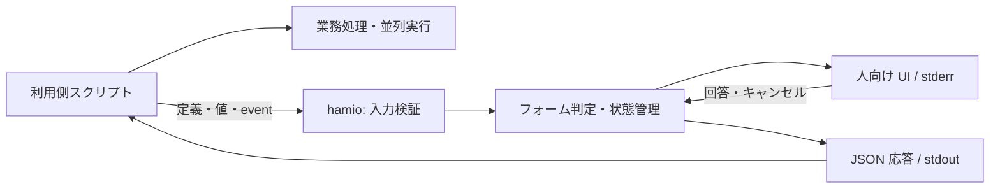

# hamio 基本設計

hamio は、開発用スクリプトの入力フォーム、進捗、表、結果を統一するターミナル UI ツールである。利用側は任意の言語で業務処理を実装し、CLI と JSON を通じて入力と表示を hamio に委譲する。人には操作しやすい端末 UI を、AI エージェントと CI には対話待ちのない構造化データを提供する。

本書は製品の責務と品質条件を定める。[API 契約](api.md)は利用側から観測できる入出力と動作規則、[実装設計](implementation.md)はモジュールとデータフロー、[開発手順](development.md)は環境構築と検査を定める。実装・検証・公開リリースの状況は [README](../README.md) に記載する。

## 1. 目的と対象範囲

プロジェクトごとにスクリプトの言語や処理が異なっても、質問、確認、状態、結果を同じ規則で読み取れるようにする。UI の実装と保守を共通化し、利用者が操作を覚える時間と、開発者がスクリプトを作る時間を減らす。UI の追加による起動待ち、メモリ消費、業務処理の遅延も製品品質として管理する。

| 項目         | 設計                                                                              |
| ------------ | --------------------------------------------------------------------------------- |
| 接続方法     | Shell、Python、Go、TypeScript などから、標準のプロセス I/O と JSON で呼び出す     |
| 本体         | Bun + TypeScript で実装する                                                       |
| 実行ファイル | 本体、UI 依存、Bun ランタイムを同梱し、UI の利用に Bun・Node.js・Nix を要求しない |
| 対象 OS      | macOS と Linux。製品の CPU・最低 OS・libc の保証範囲は配布物の試験で確定する      |
| 入力         | 文字入力、確認、単一選択、複数選択、秘密入力                                      |
| 表示         | メッセージ、値の一覧、表、進捗、結果、エラー                                      |
| 機械利用     | 事前指定値、安定した JSON、明示的な終了状態、必要な範囲の機能照会                 |

API v1 はローカルのターミナル UI を対象とする。Web UI、常駐サービス、ネットワーク API、汎用ワークフロー、任意コードを実行するプラグイン、自由なテーマ、全画面ダッシュボード、自己更新は提供しない。言語別 SDK を必須にせず、Shell と Python の利用例を接続方法の見本とする。

## 2. 用語と責務

| 用語         | 意味                                                                   |
| ------------ | ---------------------------------------------------------------------- |
| 利用側       | hamio を起動するスクリプトと、そのスクリプトを管理するプロジェクト     |
| 業務処理     | API 呼び出し、ビルド、Git 操作、ファイル変更など、スクリプト本来の処理 |
| フォーム定義 | 質問の項目、型、制約、ラベル、選択肢を記述する JSON                    |
| 公開契約     | 利用側と hamio が共有する CLI、データ形式、状態、制約、終了規則        |
| run          | 一つの連続表示プロセスが扱う、開始から結果確定までの単位               |
| task         | run 内で開始・進捗・完了を識別する業務処理の単位                       |
| event        | run や task の状態変化を通知する一件の JSON                            |
| TTY          | 標準入出力が接続する端末。対話や描画の可否を判定するために使う         |
| 機械モード   | 対話待ちと端末装飾を使わず、構造化データを返す動作                     |
| プレビュー   | 実際の端末出力から生成する、レビュー用の静止画と操作録画               |

| 利用側の責務                                         | hamio の責務                                        |
| ---------------------------------------------------- | --------------------------------------------------- |
| 質問内容、選択肢、初期値を決める                     | 共通の入力部品を表示する                            |
| 外部 API の照会など、業務上の妥当性を判断する        | 型、必須条件、長さ、選択肢を検証する                |
| 業務の順序、並列数、権限、再試行、取り消しを管理する | 受信した状態を検証して表示する                      |
| 秘密項目を指定し、回答の保管と利用を管理する         | 秘密入力をマスクし、指定された秘密値を表示から除く  |
| 回答と業務結果をもとにスクリプト全体の成否を決める   | UI の成功、不足入力、無効値、障害、キャンセルを返す |

同梱する Bun は hamio 自身を実行する。Python、Go、利用側の TypeScript 実行環境など、業務処理に必要な環境は利用側が用意する。hamio は利用側コードを読み込まず、業務コマンドを子プロセスとして起動しない。

## 3. 実行構成

利用側は独立した hamio プロセスを起動し、ファイルまたは標準入力で定義と通知を渡す。hamio は標準エラー出力へ端末 UI、標準出力へ JSON 応答を出す。言語間の接続に Bun 固有のオブジェクトや UI ライブラリの API を使わない。

本体は単一プロセスで構成する。契約の検証、状態管理、I/O、描画を内部モジュールに分け、フォームの端末操作には Clack のアダプターを使う。Clack 固有の設定を公開契約へ持ち込まない。表、通知、進捗は共通の描画モジュールが処理する。

ビルドでは開発ツールを実行する Bun と、製品に埋め込む Bun を区別する。前者は Nixpkgs の開発用パッケージ、後者は同じ Nix 入力が版と hash を固定する公式ランタイムを使う。製品に開発マシンの Nix store への依存を持ち込まない。具体的なビルド設定は[実装設計](implementation.md)に定める。

## 4. 利用方法とライフサイクル

### フォーム

関連する質問を一つの定義にまとめ、`hamio form` を一度起動する。定義、提供済みの値、既定値を検証し、必須の不足項目だけを配列順に質問する。非対話では不足項目を即座に返す。回答の完了前にキャンセルした場合は部分回答を返さない。

業務に依存する再質問は利用側が制御する。たとえば接続先の回答を受けた後、利用側が疎通を確認し、不成立なら新しいフォームを起動する。フォーム定義に実行コマンド、任意関数、外部参照を含めない。

### 単発表示

`hamio render` に表示部品の配列を渡す。hamio は端末表示または JSON 応答を生成して終了する。結果の成否、警告、秘密指定は利用側がデータに明示する。

### 連続表示

`hamio stream` を起動し、一つの run の event を改行区切りの JSON で送る。この形式を NDJSON と呼ぶ。`run.start` で開始し、task の開始・進捗・完了を送り、すべての task が終了した後に `run.finish` で結果を確定する。task や進捗の更新ごとにプロセスを起動しない。

利用側は並列処理からの通知を一つの送信経路へ集約し、run 全体の連番を付ける。hamio は通知の順序と task の状態を検証する。完了前の EOF はプロトコル違反であり、業務成功にはしない。

### 端末の共有と中断

同じ端末を同時に描画するプロセスと、有効な質問はそれぞれ一つとする。連続表示の途中で質問する場合、利用側は活動中の task と run を終了してからフォームを起動する。回答後の連続表示には新しい run を使う。API v1 に run の一時停止・再開は設けない。

hamio のキャンセル時は入力モードとカーソルを復旧し、キャンセル応答を返す。業務を停止するか、表示なしで継続するかは利用側が判断する。UI の終了コードと業務結果は別に扱う。

## 5. 公開契約

API v1 は `form`、`render`、`stream`、`capabilities` の四つのコマンドを公開する。CLI オプション、JSON の各項目、状態遷移、終了コード、資源上限の詳細は [API 契約](api.md)を正本とする。

要求データは UTF-8 の JSON とし、未知のキー、未対応の `apiVersion`、不正な型を UI 操作前に拒否する。フォームは専用の閉じた定義形式を使い、汎用 JSON Schema の評価器を提供しない。ID と値は表示ラベルから独立させる。

数値は有限な IEEE 754 値、整数は安全な整数範囲に限る。大きな整数、日時、バイト列は利用側が明示的に文字列へ符号化する。言語固有のクラスや関数を要求に含めない。

実装版と契約版は別に管理する。API v1 の意味、必須条件、終了状態を変更する場合は新しい契約版を使う。応答への任意項目追加は互換変更とし、利用側は未知の応答項目を無視する。`capabilities` は必要な機能と上限だけを選択して照会できる。

UI の正常終了は業務成功を意味しない。`result.success: false` を正しく表示した場合も UI の終了コードは0である。不足入力、無効値、入力不正、プロトコル違反、資源上限、I/O 障害、キャンセルはそれぞれ識別できる状態で返す。

## 6. 対話と出力の規則

対話の可否、表示形式、色は独立して指定する。明示指定を優先し、省略時だけ TTY と環境変数から既定動作を決める。TTY は接続先の情報であり、人と AI エージェントを識別する仕組みにはしない。

| 経路                 | 用途                                                                             |
| -------------------- | -------------------------------------------------------------------------------- |
| フォーム定義ファイル | 質問の構造。対話の stdin と共有しない                                            |
| stdin                | 対話時のキー入力、非対話フォームの提供値、単発表示の定義、または連続表示の event |
| stdout               | 回答、結果、エラー。`--help` と `--version` を除き JSON を返す                   |
| stderr               | 人向けのフォーム、表、通知、進捗                                                 |

`form` の回答は対話の有無にかかわらず JSON である。機械利用では `--interactive never` を指定し、非対話の不足を対話待ちへ切り替えない。`/dev/tty` は暗黙に開かない。`render` と `stream` は `--format json` で端末表示を止める。機械モードの stderr に描画や診断を混ぜない。

連続表示の機械出力は最終応答一つを既定とする。全 event が必要な利用側だけが `--events` を指定する。入力の進捗件数に比例して、エージェントへ渡す出力量を増やさない。

人向けの表は端末幅と表示行数に収め、省略を示す。JSON では表示の都合による省略や文字列の置換を行わず、指定された秘密値の除去を適用する。入力上限を超えるデータの分割、ページ選択、取得は利用側が管理する。警告、失敗、不足、機械向けの結果を黙って切り捨てない。

出力量は stdout と stderr の合計で評価する。token 数を評価する場合は、対象エージェントの取得経路と tokenizer を指定し、byte 数との違いを記録する。

## 7. 性能設計

hamio はビルドやテストと CPU・メモリを共有する。UI 自身の処理だけでなく、利用側の JSON 生成、転送、待機、補助プロセスを含めて追加負荷を評価する。

### 並列処理と描画

業務の並列数と依存関係は利用側が決める。hamio は一つの入力経路を逐次検証し、非同期 I/O で待機する。描画用 Worker は設けず、全 CPU コアを使う並列描画も行わない。

TTY の進捗は最新状態へ集約し、最大10 fpsで一行を更新する。出力待ち中も新しい進捗は最新状態として保持し、全更新分の描画を積み上げない。通知と完了は保留中の進捗行を整理して出力する。状態変更がなければ進捗用 timer を動かさず、機械モードでは描画を起動しない。

利用側も可能な範囲で JSON 化前に進捗を集約する。複数の生産者が同じ pipe に直接書き込む構成を避け、送信の失敗と hamio の終了を処理する。遅い出力による待機は発生し得るため、UI の応答だけでなく業務の所要時間を測る。

### メモリと混雑時の扱い

JSON 文書・フレーム、文字列、階層、項目数、活動中 task、run 全体の task、警告保持、対話出力の待ち行列に上限を設ける。[API の資源上限](api.md#資源上限と機能照会)を超えた要求は明示的に失敗させる。

| データ               | 保持と配送の規則                                                             |
| -------------------- | ---------------------------------------------------------------------------- |
| 活動中 task          | 最新状態を保持する。完了時に詳細を解放し、再利用検出用の ID と集計値を残す   |
| 途中進捗             | 人向け描画を最新状態へ集約する。機械出力は `--events` 指定時だけ各通知を返す |
| info / success 通知  | 人向けには表示し、最終応答用の履歴を保持しない                               |
| warning / error 通知 | 最終応答へ保持する。件数上限を超えたら失敗し、古い警告を捨てない             |
| 表と値の一覧         | 単発入力の上限内で扱う。大量データの保存、集計、検索は利用側が行う           |
| 回答・結果           | 出力の背圧と5秒の書き込み期限を扱い、配送失敗を成功へ置き換えない            |

全 event と完了 task の詳細履歴を保持しない。アプリ内の保持量上限は OS の厳密なメモリ制限とは異なり、同梱ランタイムを含むプロセス全体のメモリを別に測定する。

### 暫定性能予算

次の値を初期リリースの品質目標とする。達成状況は、OS ごとに基準機、端末、Bun 版、入力、負荷を固定して判定する。

| 指標                   | 目標                                   | 測定条件                                                                                                                   |
| ---------------------- | -------------------------------------- | -------------------------------------------------------------------------------------------------------------------------- |
| 小さい機械向け呼び出し | 起動から応答取得まで p95 100 ms以内    | 入出力各4 KiB以下。OS cache を温めた新規プロセス。cold start は別記する                                                    |
| 入力応答               | キー入力から表示反映まで p95 50 ms以内 | 日本語を含む通常フォーム。人の思考時間と業務処理を除く                                                                     |
| メモリ                 | 定常 RSS 64 MiB、peak RSS 128 MiB以内  | 1 run、活動中100 task以内、各1 KiB以内の通知2,000件。通知は API の種別別保持規則に従う。補助プロセスの同時使用量も評価する |
| 業務への追加時間       | hamio なしの対照に対して5%以内         | 対照は5秒以上。同じ業務結果・並列数、人の入力待ちなし。短い処理は絶対追加時間も評価する                                    |
| 待機中の CPU           | 1 core換算で平均1%以下                 | 新着 event・アニメーションのない30秒間                                                                                     |

中央値、p95、試行数、ばらつきを記録する。JS heap、RSS、共有ページを按分する PSS、macOS の phys_footprint は別の指標として、測定 API と単位を明示する。複数プロセスの RSS 合計を専有物理メモリとみなさず、Worker を測る場合は二重計上を避ける。

省メモリ設定、bytecode、Worker などの変更は一条件ずつ比較し、起動、応答、メモリ、CPU、業務時間の利得と悪化を記録する。予算変更にも利用シナリオと測定根拠を必要とする。[製品 API の性能評価](research/api-performance.md)は初期測定を記録する資料であり、全予算の達成を証明するものではない。

## 8. セキュリティ設計

保護対象は開発マシン、利用側コード、認証情報、回答、端末、配布物とする。所有者のスクリプトが取得したデータも、外部由来であれば未信頼入力として扱う。

### 入力と秘密情報

型、キー、数値範囲、サイズ、階層、件数を境界で検証する。人向け表示では外部文字列の端末制御命令と双方向制御文字を無害化し、hamio が生成した端末命令だけを描画に使う。JSON 応答はエスケープして出力する。

秘密のフォーム値は入力時にマスクし、成功応答の回答経路だけへ返す。表示定義で秘密と指定した値・表の列は、人向けと機械向けの両方で除去する。エラーには入力値、秘密、ファイル内容、内部 stack を含めない。

自由文や `result.data` に含まれる秘密の自動検出は行わない。利用側は回答の stdout を捕捉し、保管、ログ、AI エージェントへの転送を管理する。表示マスクは暗号化や OS の権限分離を代替しない。

### 実行環境

通常の UI 利用はオフラインで完結する。必要なコードを実行ファイルに含め、実行時の依存取得、外部 schema の取得、動的プラグインを設けない。ビルド設定で `.env`、`bunfig.toml`、`package.json`、`tsconfig.json` の暗黙読み込みを無効化する。

Bun の `BUN_OPTIONS` と `BUN_BE_BUN` はアプリ開始前に作用するため、利用側は信頼できる環境で起動し、未信頼データからこれらを設定しない。hamio は同じ OS 権限で動く通常のプロセスであり、sandbox として使用しない。

依存取得時は版・integrity・取得元・差分・lifecycle scripts を確認する。ランタイムを含む依存の固定、脆弱性検査、配布物の由来確認を組み合わせる。固定された依存にも脆弱性はあり得るため、更新と再配布を保守工程に含める。

## 9. 開発環境と品質検査

開発環境は Nix で管理し、`flake.lock` がツール、`bun.lock` が JavaScript 依存を固定する。開発 shell は `aarch64-darwin`、`aarch64-linux`、`x86_64-linux` を対象とし、ローカルと CI で同じ定義を使う。依存取得と hooks 導入は clone ごとの明示的なセットアップで行う。

| 工程                | 検査                                                                        |
| ------------------- | --------------------------------------------------------------------------- |
| 編集中              | エディタの保存時 format、型診断、対象のテスト、UI の目視確認                |
| commit 前           | ステージ済みファイルの検査。部分ステージを保持し、同時タスクは2に制限する   |
| push 前・作業完了前 | Lint、format、strict 型検査、テスト、プレビューの更新漏れ                   |
| PR                  | Linux の1ジョブで全体検査、Nix 全 system の定義評価、追跡ファイルの差分確認 |
| OS に関わる変更     | macOS でも同じ検査を実行し、端末 I/O と実行ファイルを確認する               |

TS・JS・JSON は Biome、Markdown・YAML は Prettier、Nix は nixfmt、Shell は shfmt で format する。ShellCheck と actionlint も使用する。検査と hooks はソースを自動修正せず、修正コマンドの差分は開発者が確認する。

自動 CI は所有者による同一リポジトリの `master` 向け PR の作成・更新・再開に限定し、push と PR close では起動しない。ローカル pre-push は作業ツリー、PR の CI はマージ候補を検証する。Nix の定義評価は他 OS での実行試験を代替しない。

AI エージェントは [AGENTS.md](../AGENTS.md)を入口とし、設計、TypeScript、性能のスキルから作業に必要な領域だけを読む。具体的なコマンドと各検査の範囲は[開発手順](development.md)に定める。

## 10. 端末 UI のプレビュー

実際の疑似端末出力から代表状態の PNG と操作の GIF を生成し、PR とチャットでレビューする。`product` シナリオは製品 CLI を実行し、`fixture` シナリオは録画基盤の検証用プログラムを実行する。画像には確認対象を明示する。

生成元と生成物の SHA-256 が一致する場合は再利用し、不足・変更・破損がある場合に録画と描画を実行する。強制生成も指定できる。通常の hooks と CI は版管理された PNG と生成元の照合だけを行う。

PNG と生成記録はソースと同じ commit に含める。GIF と端末出力の記録はローカルに置き、専用の生成記録で照合する。PR の画像リンクは確認対象の commit SHA に固定し、チャットには確認した PNG を表示する。

シナリオは端末サイズ、待つ出力、送るキー、撮影位置を定義する。Bun の PTY で出力を一度記録し、agg で端末命令を描画し、一つの Pillow プロセスで PNG に変換する。生成を順次実行し、時間・出力・event 件数・画像サイズ・描画スレッド数に上限を設ける。生成前後で入力源が変わった場合は生成物を採用しない。

記録にはダミーデータと限定した環境変数を使い、外部サービスへ自動送信しない。画像の照合は更新漏れを検出する。見た目は目視で確認し、各 OS の実端末、アクセシビリティ、製品性能は専用の試験で評価する。生成手順は[開発手順](development.md#8-ターミナル-ui-のプレビュー)、計測方法と数値は[プレビューの性能評価](research/preview-performance.md)に記載する。

## 11. リポジトリ・配布・保守

### 公開リポジトリ

`9uiLe/hamio` は公開リポジトリとして運用し、変更権限を所有者に限定する。第三者の一般投稿を受け付けない運用とし、GitHub の投稿・レビュー制限を適用する。期限付き制限は失効前に確認する。公開による閲覧、clone、fork は許容する。

CI は `pull_request_target` を使わず、トークンを読み取り権限に限定し、checkout 後に認証情報を保持しない。マージ条件は branch ruleset で管理する。ローカル hooks と workflow の起動条件だけをマージ制限に用いない。

### 公開リリースの要件

製品の配布先は GitHub Releases とし、OS・CPU 別の実行ファイルに版、対応環境、checksum、provenance、SBOM を添付する。provenance はソースとビルド工程の由来、SBOM は同梱部品・取得元・ライセンスの一覧を示す。公開後のタグと資産は immutable releases で固定する。これらは公開リリースの要件であり、ローカルビルドの成功とは別に判定する。

| 対象         | 固定・追跡する情報                                           |
| ------------ | ------------------------------------------------------------ |
| ツールと依存 | Nix 入力、Bun ランタイム、JavaScript 依存の lockfile         |
| ビルド工程   | Actions・再利用 workflow の完全な commit SHA、設定、実行権限 |
| 生成物       | ソース commit、ビルド設定、バイナリ hash、対応環境           |
| 配布元       | `9uiLe/hamio`、公開 workflow、ソース ref / commit            |
| SBOM         | JavaScript 依存、Bun、native 部品、取得元、ライセンス        |

配布候補は Bun・Nix のない環境で実行し、通常利用に `/nix/store` とネットワーク取得が不要であることを確認する。開発環境の固定、配布工程の隔離、バイト単位の再現性は別々に検証する。

checksum は完全性、provenance は配布元とビルド工程の確認に使う。検証ツールの取得経路と信頼する repository・workflow・commit を定め、SBOM を実際の出荷物と照合する。ビルド権限と公開権限は分離し、公開権限は必要な工程だけに与える。

### 更新と脆弱性対応

利用者は版を指定して明示的に更新し、検証に失敗した資産は実行・置換しない。同梱 Bun の修正には hamio の再配布で対応する。保守には通常更新、緊急セキュリティ更新、影響版の告知、修正版の公開、非公開の脆弱性報告窓口を含める。

## 12. リリースの受け入れ条件

製品の受け入れ試験には配布候補の実行ファイルを使う。TS の直接実行、開発ツールの取得、プレビュー生成の測定とは区別する。

| 対象         | 条件                                                                                    |
| ------------ | --------------------------------------------------------------------------------------- |
| 開発基盤     | 固定したツールと lockfile でローカル・CI の検査を実行できる                             |
| 公開契約     | 回答、エラー、終了コード、順序、上限、業務結果との分離が API 契約に一致する             |
| 多言語       | Shell・Python で同じ回答・結果・エラーを扱え、標準プロセス I/O で他言語からも接続できる |
| 端末         | 日本語幅、emoji、狭い幅、resize、色なし、Ctrl-C、EOF、入力モードの復旧を確認する        |
| 機械モード   | 対話待ちと装飾がなく、人向け UI と同じ回答・業務状態を表す                              |
| 出力量       | 成功・失敗・不足・大量入力について byte と token を測定し、重要情報を保持する           |
| 性能         | 基準環境で性能予算と、利用側の JSON 生成・転送を含む追加負荷を評価する                  |
| 並列・長時間 | 業務並列数と同時 run 数を変え、業務時間、完了 task の累積、保持量を確認する             |
| 混雑・中断   | 大量 event、遅い端末・pipe、閉じた出力先で無期限待機や重要通知の黙った喪失がない        |
| 入力保護     | 巨大・不正 JSON、深い構造、制御文字、秘密を含む入力を安全に扱う                         |
| プレビュー   | 製品入口とシナリオを識別でき、生成元と画像が一致し、代表状態を目視確認する              |
| 配布物       | Bun・Nix と実行時の依存取得が不要で、暗黙設定を読み込まず、保証する環境で動く           |
| 配布検証     | 改ざんや想定外の repository・workflow・commit の資産を拒否し、SBOM を出荷物と照合する   |

測定記録にはソース commit または内容 hash、Nix 入力、Bun 版、ビルド設定、生成物 hash、CPU、RAM、OS、端末、負荷、測定 API、単位、試行数を含める。通常測定と profiler・強制 GC を伴う診断を分け、UI 単体と同じ業務の対照実験を記録する。

## 13. 詳細仕様の確定項目

API v1 のコマンド、入出力、状態遷移、資源上限、内部構成は本書と詳細文書に定める。公開リリースでは次の環境条件と配布工程を検証し、利用者に提示する保証範囲を確定する。

| 項目           | 公開前に確定する内容                                                           |
| -------------- | ------------------------------------------------------------------------------ |
| 対応環境       | CPU architecture、最低 OS、Linux libc と、各実行ファイルの実機試験結果         |
| 性能保証       | OS ごとの基準機・端末・固定データ、長時間・並列業務を含む予算の達成状況        |
| 端末の対応範囲 | 実端末、入力方法、resize、アクセシビリティの試験結果                           |
| 配布工程       | ビルド環境の隔離、署名・provenance の信頼条件、検証ツールの取得経路、SBOM 生成 |
| 保守           | 更新と緊急再配布の手順、影響版の告知、非公開の脆弱性報告窓口                   |

## 根拠資料

調査・測定資料は対象版、条件、確認範囲を併記する。外部製品の機能、hamio の仕様、実測結果を区別し、測定時のソースと異なる構成へ結果をそのまま適用しない。

- [UI と言語間連携](research/ui-and-integration.md): UI 共通化、Clack、JSON、端末と機械出力。
- [ランタイムとサプライチェーン](research/runtime-and-supply-chain.md): Bun 同梱、Nix、依存管理、配布検証。
- [性能特性と測定](research/performance.md): 起動、メモリ、並列処理、計測 API。
- [製品 API の性能評価](research/api-performance.md): 同梱実行ファイルの初期測定、出力量、検証範囲。
- [CI の構成と測定](research/ci.md): 検査範囲、準備時間、ジョブ構成。
- [プレビューの性能評価](research/preview-performance.md): 画像の照合・生成にかかる時間、CPU、メモリ。
