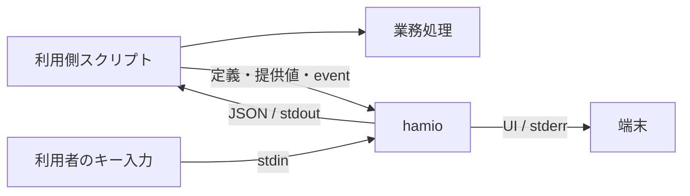

# hamio 基本設計

hamio は、開発用スクリプトの入力フォーム、進捗、表、結果を統一するターミナル UI ツールである。利用側は任意の言語で業務処理を書き、CLI と JSON を通じて入力と表示を hamio に委譲する。対話する人には操作画面を、AI エージェントと CI には構造化した回答を提供する。

本書は製品の目的、責務、構成、品質条件を定める。利用側が実装する入出力の詳細は [API 契約](api.md)、内部モジュールの設計は[実装設計](implementation.md)、環境構築と検査の操作は[開発手順](development.md)を参照する。実装済みの機能と検証範囲は [README](../README.md) に記載する。

## 1. 目的と対象範囲

スクリプトの言語や処理内容が異なっても、質問、確認、状態、結果を同じ規則で扱えるようにする。UI の実装と保守を共通化し、操作を覚える負担とスクリプトを開発する負担を減らす。UI の追加によって生じる起動待ち、CPU・メモリ使用量、業務処理の遅延も製品品質として管理する。

| 項目             | 設計                                                                 |
| ---------------- | -------------------------------------------------------------------- |
| 利用方法         | Shell、Python、Go、TypeScript などから独立したプロセスとして呼び出す |
| 接続形式         | CLI、UTF-8 の JSON、標準入出力、ローカルファイル                     |
| 実装             | Bun + TypeScript。フォームの端末操作には `@clack/core` を使う        |
| 実行環境         | 本体、製品依存、Bun を一つの実行ファイルへ同梱する                   |
| 利用側の導入条件 | hamio の UI 利用に Bun・Node.js・Nix を要求しない                    |
| 対象 OS          | macOS と Linux。CPU・最低 OS・libc の保証範囲は配布物の試験で定める  |
| 入力             | 文字入力、確認、単一選択、複数選択、秘密入力                         |
| 表示             | メッセージ、値の一覧、表、進捗、結果、エラー                         |
| 機械利用         | 提供済みの値による非対話実行、JSON 応答、終了コード、機能照会        |

API v1 の提供範囲はローカルのターミナル UI とする。Web UI、常駐サービス、ネットワーク API、汎用ワークフロー、任意コードを実行するプラグイン、自由なテーマ、全画面ダッシュボード、自己更新は含めない。言語別 SDK を必須とせず、Shell と Python の利用例でプロセス間の接続方法を示す。

## 2. 用語と責務

| 用語         | 意味                                                                |
| ------------ | ------------------------------------------------------------------- |
| 利用側       | hamio を呼び出すスクリプトと、そのスクリプトを管理するプロジェクト  |
| 業務処理     | ビルド、テスト、外部 API の照会、Git 操作など、スクリプト本来の処理 |
| 公開契約     | 利用側と hamio が共有するコマンド、データ形式、状態、制約、終了規則 |
| フォーム定義 | 質問の型、ラベル、選択肢、制約、既定値を記述した JSON               |
| run          | 連続表示プロセス一つが扱う、開始から結果確定までの表示単位          |
| task         | run 内で開始・進捗・完了を識別する業務処理の単位                    |
| event        | run や task の状態変化を通知する一件の JSON                         |
| NDJSON       | 各行に一つの JSON オブジェクトを記述する連続入力の形式              |
| TTY          | キー入力や画面表示を行う端末接続                                    |
| 機械モード   | 対話待ちと端末装飾を使わず、構造化した結果を返す動作                |
| 背圧         | 出力先が受け取れる速度に合わせて送り手の処理を待たせること          |
| プレビュー   | 実際の端末出力から生成するレビュー用の画像と操作録画                |

| 利用側の責務                                         | hamio の責務                                       |
| ---------------------------------------------------- | -------------------------------------------------- |
| 質問内容、選択肢、既定値を決める                     | 定義に従って共通の入力部品を表示する               |
| 外部照会など業務上の妥当性を判断する                 | 型、必須条件、長さ、選択肢を検証する               |
| 業務の順序、並列数、権限、再試行、取り消しを管理する | 受信した状態を検証し、表示と集計を行う             |
| 秘密項目を指定し、回答の保管・利用を管理する         | 秘密入力をマスクし、指定された秘密値を表示から除く |
| 回答と業務結果からスクリプト全体の成否を決める       | UI の成功、不足、無効値、障害、キャンセルを返す    |

同梱する Bun は hamio 自身を実行する。利用側の Python、Go、TypeScript などに必要な実行環境は利用側が用意する。hamio は利用側コードを読み込まず、業務コマンドを子プロセスとして起動しない。

たとえばデプロイ用スクリプトでは、hamio が環境の選択と確認を受け取り、利用側が認証、接続確認、デプロイを実行する。利用側は進捗と業務結果を hamio へ送り、表示を委譲する。接続先の変更や再試行も利用側が判断する。

## 3. 実行構成

一回の呼び出しは、一つの hamio プロセスと一つのコマンドで完結する。プロセスを分けることで、利用側の言語ランタイムやライブラリへ依存せずに接続できる。呼び出し間でフォーム値、run 状態、描画、キャンセルを共有しない。

内部は次の責務に分ける。入力や状態の規則が、端末ライブラリの API に依存しない構造とする。

| 層            | 責務                                                                  |
| ------------- | --------------------------------------------------------------------- |
| `core`        | 公開契約の型、入力検証、フォーム値の解決、run / task の状態、秘密指定 |
| `application` | コマンドの決定、処理順序、JSON 応答、必要な入出力のインターフェース   |
| `terminal`    | 安全な表示文字列、質問の画面、表、通知、進捗の生成                    |
| `adapters`    | ファイル・標準入出力、端末制御、背圧、描画 timer、後始末              |
| `cli`         | 実装の接続、環境の読み取り、signal、プロセスの終了                    |

`application` は入出力のインターフェースを使い、具体的なアダプターを import しない。`core` は I/O を行わず、`terminal` は端末への書き込みを行わない。色、幅、対話条件は値として渡し、表示設定のために環境変数を書き換えない。

人向け表示とフォームの端末アダプターは必要な経路で読み込む。機械モードでは端末の初期化と進捗描画を行わない。フォームの操作制御は `@clack/core` に委譲し、画面の文字列は hamio が生成する。ライブラリ固有の型は公開契約に含めない。

## 4. 利用方法とライフサイクル

### フォーム

`hamio form` は定義と提供値を検証し、提供値、既定値の順で回答を解決する。必須の不足項目だけを配列順に質問する。非対話の場合は質問を開かず、不足する項目 ID を返す。無効値がある場合も質問を開かず、問題のある項目と理由を返す。

関連する質問は一つの定義へまとめ、一度の起動で受け取る。全回答が確定する前の中断、不足、無効値では部分回答を返さない。業務に依存する確認や再質問は、利用側が新しいフォームとして呼び出す。

### 単発表示

`hamio render` は表示部品の配列を受け取り、端末表示または JSON 応答を生成して終了する。利用側は表示する業務結果、警告、秘密指定をデータに含める。大量データの取得、分割、ページ選択は利用側で行う。

### 連続表示

`hamio stream` は一つの run の event を NDJSON で受け取る。`run.start` で開始し、task の開始・進捗・完了を順に適用する。すべての task が完了した後、`run.finish` の業務結果を最終応答として返す。

利用側は並列処理からの通知を一つの送信経路に集約し、run 全体で連番を付ける。hamio は run ID、連番、task の状態を検証する。`run.finish` で EOF を待たずに終了し、完了前の EOF はプロトコル違反として扱う。

### 端末の所有と中断

同じ端末へ接続する描画プロセスと、同時に開く質問はそれぞれ一つとする。連続表示の途中で質問が必要になったら、利用側は活動中の task と run を終了し、フォームを起動する。回答後の連続表示には新しい run を使う。API v1 は run の一時停止・再開を提供しない。

キャンセル時は質問と描画を閉じ、入力モードとカーソルを復旧する。業務処理を停止するか、表示なしで続けるかは利用側が判断する。表示の終了状態から業務の停止を推測しない。

## 5. 公開契約

API v1 は `form`、`render`、`stream`、`capabilities` を公開する。コマンドの全オプション、JSON の項目、終了コード、状態遷移、資源上限は [API 契約](api.md)を正本とする。

要求は UTF-8 の JSON とし、未知のキー、未対応の `apiVersion`、不正な型、上限超過を境界で拒否する。フォームは閉じた定義形式とし、任意関数、実行コマンド、外部参照、汎用 JSON Schema の評価を含めない。項目 ID と選択肢の値は表示ラベルから独立させる。

数値は有限な IEEE 754 値、整数は安全な整数範囲とする。大きな整数、日時、バイト列は利用側が文字列へ明示的に符号化する。言語固有のオブジェクトや暗黙の型変換に依存しない。

UI の終了状態と業務結果は別に返す。`result.success: false` を正しく表示した場合の終了コードは0である。不足入力、無効値、要求不正、順序違反、資源上限、I/O 障害、キャンセルは、それぞれ識別できる状態とする。確認の取得失敗を肯定の回答として扱わない。

実装版と契約版は独立して管理する。既存の意味、必須条件、終了状態の変更には新しい契約版を使う。応答への任意項目追加は互換変更とし、利用側は未知の応答項目を無視する。`capabilities` では必要な機能や上限だけを選択して照会できる。

## 6. 対話と出力の規則

標準入力を `stdin`、標準出力を `stdout`、標準エラー出力を `stderr` と呼ぶ。人向け画面とプログラムが受け取る回答は別の経路に出す。

| 経路                 | 用途                                                     |
| -------------------- | -------------------------------------------------------- |
| フォーム定義ファイル | 質問の構造。対話のキー入力と読み取り先を共有しない       |
| stdin                | キー入力、非対話フォームの提供値、表示定義、または event |
| stdout               | 回答、結果、エラー。`--help` と `--version` を除き JSON  |
| stderr               | 人向けのフォーム、表、通知、進捗                         |

対話、表示形式、色は独立して指定する。明示指定を優先し、省略時だけ TTY と環境変数から動作を決める。TTY は接続先の情報であり、人と AI エージェントを識別する手段にはしない。

フォームの回答は対話時も JSON とする。機械利用では `form --interactive never` または `render / stream --format json` を指定し、対話待ち、端末装飾、stderr の診断出力を発生させない。`/dev/tty` は暗黙に開かない。

連続表示の機械出力は最終応答一つを既定とする。全 event が必要な利用側だけが `--events` を使う。途中進捗を既定の応答へ複製せず、AI エージェントが受け取る出力量を抑える。

人向け表示は端末幅と表示行数に収め、省略があれば示す。JSON の非秘密値には表示上の省略や置換を適用しない。指定された秘密値の除去は両方の形式へ適用する。警告、失敗、不足、結果は黙って切り捨てない。

出力量は stdout と stderr の合計 byte 数で評価する。token 数には対象エージェントの取得経路と tokenizer を指定し、byte 数から削減率を推定しない。

## 7. 性能設計

UI は利用側のビルドやテストと CPU・メモリを共有する。評価対象は UI 自身の起動・処理だけでなく、利用側の JSON 生成、転送、出力待ち、補助プロセスを含む追加負荷とする。

### 入力と出力

連続入力は read 単位で受け、その中の行を順に切り出して検証する。完全な行は直接 decode し、read をまたぐ未完成行だけを保持する。汎用 JSON 検証は一度行い、種別ごとの検証と重複させない。

表の行と `--events` の応答は16 KiBを目安にまとめて出力する。行・応答は分割しないため、閾値に最大1件分が加わる。次の入力を待つ前と、完了・異常終了時に受理済みの応答を排出する。出力完了を待つことで背圧を伝え、順序を維持する。

### 並列処理と描画

業務の並列数と依存関係は利用側が管理する。hamio は一つの run の入力を逐次処理し、I/O を非同期に待つ。業務 task ごとに UI プロセスや Worker を作らず、描画用 Worker も設けない。

進捗は最大10 fpsで一行を更新する。状態の取得と文字列生成は実際の描画時に行う。書き込み中の進捗更新は最新状態へ集約し、すべての更新を描画待ちに積まない。通知と結果は保留中の進捗を整理して出す。状態の変化がなければ timer を動かさない。

利用側も可能な範囲で JSON 化する前に進捗を集約する。複数の送信元が同じ pipe に直接書き込まず、一つの経路へまとめる。別々の run を同時実行する場合は、各プロセスと業務全体の資源使用量を測る。同じ端末の描画は共有しない。

### メモリと混雑

入力文書、フレーム、文字列、階層、項目数、task、通知、質問の出力待ち行列に上限を設ける。具体的な値は [API の資源上限](api.md#資源上限と機能照会)に定める。超過時は明示的に失敗する。

| データ               | 保持規則                                                   |
| -------------------- | ---------------------------------------------------------- |
| 活動中 task          | 最新状態を保持し、完了時に詳細を解放する                   |
| 完了 task            | 再利用検出用の ID と集計値だけを run 終了まで保持する      |
| 途中進捗             | 描画に使う最新状態だけを保持する                           |
| info / success 通知  | 表示と任意の event 応答が終わったら保持しない              |
| warning / error 通知 | 最終応答用に上限まで保持し、超過をエラーにする             |
| 表・値の一覧         | 単発入力の上限内で扱い、永続化・集計・検索は利用側に任せる |
| 出力                 | 完了を待ち、5秒の期限と書き込みエラーを扱う                |

全 event の履歴を蓄積しない。アプリが保持するデータの上限と、ランタイムを含むプロセス全体のメモリ使用量は別に管理する。

### 配布サイズ

JavaScript bundle、Bun を同梱した実行ファイル、圧縮した配布候補のサイズをそれぞれ測る。製品に開発用ツールを含めず、bundle は minify する。gzip は転送用の明示的な工程とし、通常の build・check では実行しない。圧縮後のサイズを実行時メモリの削減とみなさない。

### 性能予算

次の値をリリース判定用の目標とする。達成状況は、OS ごとに基準機、端末、Bun 版、入力、負荷を固定して確認する。

| 指標                   | 目標                                   | 測定条件                                                                                          |
| ---------------------- | -------------------------------------- | ------------------------------------------------------------------------------------------------- |
| 小さい機械向け呼び出し | 起動から応答取得まで p95 100 ms以内    | 入出力各4 KiB以下。OS cache を温めた新規プロセス。cold start は別記                               |
| 入力応答               | キー入力から表示反映まで p95 50 ms以内 | 日本語を含む通常フォーム。人の思考時間と業務処理を除く                                            |
| メモリ                 | 定常 RSS 64 MiB、peak RSS 128 MiB以内  | 1 run、活動中100 task以内、各1 KiB以内の通知2,000件。通知種別の保持規則に従い、補助プロセスも評価 |
| 業務への追加時間       | hamio なしの対照に対して5%以内         | 対照は5秒以上。同じ業務結果・並列数、人の入力待ちなし。短い処理は絶対追加時間も評価               |
| 待機中の CPU           | 1 core換算で平均1%以下                 | 新着 event・アニメーションのない30秒間                                                            |

中央値、p95、試行数、ばらつき、測定 API と単位を残す。JS heap、RSS、PSS、macOS の phys_footprint は区別する。複数プロセスの peak RSS 合計を、同時点の専有物理メモリとみなさない。

省メモリ設定、bytecode、Worker、キャッシュなどの採用と予算の見直しには、利用シナリオに基づく比較を必要とする。通常測定と profiler・強制 GC を伴う診断を分け、改善した指標と悪化した指標を併記する。測定記録は[根拠資料](#根拠資料)へ保存し、確認していない予算の達成根拠にはしない。

## 8. セキュリティ設計

保護対象は開発マシン、利用側コード、認証情報、回答、端末、配布物とする。外部由来のデータは、所有者のスクリプトが取得したものであっても未信頼入力として検証する。

### 入力と秘密情報

型、キー、数値範囲、サイズ、階層、件数を境界で検証する。人向け表示では外部文字列の端末命令、制御文字、双方向制御文字を無害化し、hamio が生成した端末命令だけを使う。JSON 応答は JSON の規則に従ってエスケープする。

秘密のフォーム値は入力中にマスクし、成功応答の回答経路だけへ返す。秘密と指定した表示値・表の列は、人向けと機械向けの両形式で除去する。エラーに入力値、秘密、ファイル内容、内部 stack を含めない。

自由文と `result.data` の秘密情報は利用側が管理する。hamio は秘密の自動検出を行わない。利用側は回答の stdout を捕捉し、保管、ログ、AI エージェントへの転送を制御する。表示マスクは暗号化や OS の権限分離を代替しない。

### 実行と依存

UI の通常利用はオフラインで完結する。必要なコードを実行ファイルに含め、実行時の依存取得、外部 schema の取得、動的プラグインを設けない。ビルドで `.env`、`bunfig.toml`、`package.json`、`tsconfig.json` の自動読み込みを無効にする。

Bun の `BUN_OPTIONS` と `BUN_BE_BUN` はアプリ開始前に作用する。起動元の環境を信頼境界に含め、利用側は未信頼データからこれらを設定しない。hamio は同じ OS 権限で動く通常のプロセスであり、sandbox として使わない。

依存の取得元、版、integrity、差分、lifecycle scripts を確認し、ランタイムを含めて固定する。既知の脆弱性の検査と配布物の由来確認を組み合わせる。依存の固定だけでは脆弱性への対処にならないため、更新と再配布を保守工程に含める。

## 9. 開発環境と品質検査

開発環境は Nix で管理する。`flake.lock` でツール、`bun.lock` で JavaScript 依存を固定し、ローカルと CI で同じ定義を使う。開発 shell は `aarch64-darwin`、`aarch64-linux`、`x86_64-linux` を対象とする。

依存取得と Git hooks の導入は clone ごとに明示的に行う。日常の作業は Nix shell で実行し、次の段階で検査する。

| 工程                | 検査                                                                         |
| ------------------- | ---------------------------------------------------------------------------- |
| 編集中              | 保存時 format、型診断、対象のテスト、UI の目視確認                           |
| commit 前           | ステージ済みファイル。部分ステージを保持し、同時タスクは2に制限              |
| push 前・作業完了前 | Lint、format、strict 型検査、テスト、プレビュー照合                          |
| PR                  | Linux の1ジョブで全体検査、全 system の Nix 定義評価、追跡ファイルの差分確認 |
| OS に関わる変更     | macOS でも同じ試験を実行し、端末 I/O と実行ファイルを確認                    |

TS・JS・JSON は Biome、Markdown・YAML は Prettier、Nix は nixfmt、Shell は shfmt で format する。ShellCheck と actionlint も使う。検査と hooks は自動修正せず、修正は開発者がコマンドで適用して差分を確認する。

自動 CI の対象は、所有者による同一リポジトリの `master` 向け PR の作成・更新・再開とする。push と PR close では起動しない。pre-push は作業ツリー、PR の CI はマージ候補を検証する。Nix の定義評価を別 OS での実行試験の代わりにはしない。

AI エージェントは [AGENTS.md](../AGENTS.md)から作業規則を読み、設計、TypeScript、性能のうち作業に必要なスキルを使う。コマンドと検査範囲の詳細は[開発手順](development.md)に定める。

## 10. 端末 UI のプレビュー

製品 UI は実際の疑似端末出力を記録し、代表状態の PNG と操作過程の GIF で確認する。`product` シナリオは製品 CLI、`fixture` シナリオは録画基盤を検証するプログラムを実行する。確認対象を画像と説明で識別できるようにする。

生成元と生成物の SHA-256 が一致する場合は再利用し、不足、変更、破損があれば生成する。通常の hooks と CI は保存済み PNG と生成元の照合を行う。PNG と生成記録はソースと同じ commit に含め、GIF と端末出力の記録はローカルに保存する。

シナリオに端末サイズ、待つ出力、送るキー、撮影位置を定義する。Bun の PTY で記録し、agg で端末命令を描画し、Pillow で画像に変換する。生成は順次実行し、時間、出力、event 件数、画像サイズ、描画スレッド数に上限を設ける。生成中に入力源が変わった場合は生成物を採用しない。

録画にはダミーデータと限定した環境変数を使い、外部サービスへ自動送信しない。PR の画像リンクは対象 commit SHA に固定し、チャットには確認した PNG を表示する。照合は更新漏れ、目視は見た目を確認する工程とする。実端末、アクセシビリティ、製品性能はそれぞれ専用の試験で評価する。[生成と共有の手順](development.md#8-ターミナル-ui-のプレビュー)

## 11. リポジトリ・配布・保守

### 公開リポジトリ

`9uiLe/hamio` は閲覧、clone、fork ができる公開リポジトリとし、変更権限を所有者に限定する。第三者の一般投稿を受け付けない運用とし、投稿・レビュー制限を適用する。期限付き制限は失効前に確認する。

CI は `pull_request_target` を使わず、トークンを読み取り権限に限定する。checkout 後に認証情報を保持しない。マージ条件は branch ruleset で管理し、ローカル hooks と workflow の起動条件だけに依存しない。

### 配布候補と公開リリース

ビルドは開発ツール用の Bun と製品に同梱する Bun を区別する。同梱用には、固定した Nix 入力が版と hash を指定する公式ランタイムを使う。製品へ開発マシンの Nix store 依存を持ち込まず、実行時の依存取得を不要にする。

ローカルではホストの OS・CPU 向けの `dist/hamio` と、転送用の `dist/hamio.gz` を生成する。公開リリースには OS・CPU 別の実行ファイルを用意し、GitHub Releases へ版、対応環境、checksum、provenance、SBOM とともに公開する。

provenance はソースとビルド工程の由来、SBOM は同梱部品・取得元・ライセンスの一覧を示す。checksum で完全性を確認し、provenance の repository・workflow・commit が信頼条件に合うことを検証する。SBOM は実際の出荷物と照合する。公開後のタグと資産は immutable releases で固定する。

| 対象         | 記録する情報                                                 |
| ------------ | ------------------------------------------------------------ |
| ツールと依存 | Nix 入力、Bun ランタイム、JavaScript 依存の lockfile         |
| ビルド工程   | Actions・再利用 workflow の完全な commit SHA、設定、実行権限 |
| 生成物       | ソース commit、ビルド設定、生成物 hash、対応環境             |
| 配布元       | `9uiLe/hamio`、公開 workflow、ソース ref / commit            |
| SBOM         | JavaScript 依存、Bun、native 部品、取得元、ライセンス        |

ビルド権限と公開権限を分離し、公開権限は必要な工程だけに与える。検証ツールの取得経路と信頼条件を定め、検証に失敗した資産は実行・置換しない。開発環境の固定、ビルド環境の隔離、バイト単位の再現性は個別に確認する。

### 更新と脆弱性対応

利用者は版を指定して明示的に更新する。同梱 Bun の修正には hamio の再配布で対応する。通常更新、緊急更新、影響版の告知、修正版の公開、非公開の脆弱性報告窓口を保守手順に含める。

## 12. リリースの受け入れ条件

受け入れ試験は配布候補の実行ファイルに対して行う。開発用 TS の直接実行や、プレビュー生成の成功を製品の動作保証へ代用しない。

| 対象         | 条件                                                                                |
| ------------ | ----------------------------------------------------------------------------------- |
| 開発基盤     | 固定したツールと lockfile でローカル・CI の検査を実行できる                         |
| 公開契約     | 回答、エラー、終了コード、順序、上限、業務結果との分離が契約に一致する              |
| 多言語       | Shell・Python で同じ回答・結果・エラーを扱い、他言語も標準プロセス I/O で接続できる |
| 端末         | 日本語、emoji、狭い幅、resize、色なし、Ctrl-C、EOF、入力モード復旧を確認する        |
| 機械モード   | 対話待ちと装飾がなく、人向け表示と同じ回答・業務状態を表す                          |
| 出力量       | 成功、失敗、不足、大量入力で byte と token を測り、重要情報を保持する               |
| 性能         | 基準環境で性能予算と利用側の JSON 生成・転送を含む追加負荷を評価する                |
| 並列・長時間 | 業務並列数と同時 run 数を変え、業務時間、完了 task の累積、保持量を確認する         |
| 混雑・中断   | 大量 event、遅い端末・pipe、閉じた出力先で無期限待機や重要通知の黙った喪失がない    |
| 入力保護     | 巨大・不正 JSON、深い構造、制御文字、秘密を含む入力を安全に扱う                     |
| プレビュー   | 製品入口とシナリオを識別でき、生成元と画像が一致し、代表状態を目視確認する          |
| 配布物       | Bun・Nix・実行時の依存取得が不要で、暗黙設定を読み込まず、保証する環境で動く        |
| 配布検証     | 不正な資産や想定外の由来を拒否し、SBOM を出荷物と照合する                           |

記録にはソース commit または内容 hash、Nix 入力、Bun 版、ビルド設定、生成物 hash、OS、CPU、RAM、端末、負荷、測定 API、単位、試行数を含める。UI 単体の試験と、同じ業務の hamio なし・ありの比較を区別する。

## 13. 保証範囲の定め方

本書と詳細文書は API v1 の機能、責務、内部構成、品質目標を定める。公開する保証範囲は、配布対象ごとの試験結果に基づいて提示する。

| 項目     | 公開時に必要な情報                                                   |
| -------- | -------------------------------------------------------------------- |
| 対応環境 | CPU architecture、最低 OS、Linux libc、実行ファイルの実機試験結果    |
| 性能     | OS ごとの基準機・端末・入力、長時間・並列業務を含む予算の達成状況    |
| 端末     | 実端末、入力方法、resize、アクセシビリティの確認範囲                 |
| 配布工程 | ビルド環境の隔離、署名・provenance の信頼条件、検証ツール、SBOM 生成 |
| 保守     | 更新・緊急再配布の手順、影響版の告知、非公開報告窓口                 |

ローカルビルド、特定の OS での試験成功、公開リリースの準備完了は別の状態として記録する。未検証の項目を対応済みと表記しない。

## 根拠資料

調査資料は技術の性質と採用条件を、測定資料は対象のソース・環境・入力と観測値を記録する。測定値は記録された構成の評価として扱い、ソースや環境の異なる製品へそのまま適用しない。

- [UI と言語間連携](research/ui-and-integration.md): UI 共通化、Clack、JSON、端末と機械出力。
- [ランタイムとサプライチェーン](research/runtime-and-supply-chain.md): Bun 同梱、Nix、依存管理、配布検証。
- [性能特性と測定](research/performance.md): 起動、メモリ、並列処理、測定 API。
- [製品 API の性能評価](research/api-performance.md): 機械向けコマンドの測定条件、出力量、検証範囲。
- [実行基盤の性能比較](research/refactor-performance.md): ソースを特定した二つの実行ファイルのサイズ、処理時間、並列実行、入力応答。
- [CI の構成と測定](research/ci.md): 検査範囲、準備時間、ジョブ構成。
- [プレビューの性能評価](research/preview-performance.md): 画像の照合・生成にかかる時間、CPU、メモリ。
