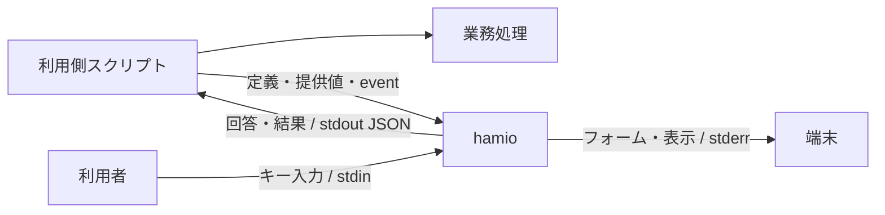

# hamio 基本設計

hamio は、スクリプトの入力フォーム、進捗、表、結果を共通のターミナル UI として提供する。利用側は任意の言語で業務処理を書き、表示する定義と状態を CLI・JSON で渡す。hamio は人向けの画面とプログラム向けの応答を生成する。

製品は本体、製品依存、Bun を含む単一実行ファイルとする。利用側に UI 用のランタイム導入を求めず、通常起動で通信や依存取得を行わない。開発・ビルドは Nix で環境を固定し、配布物は独立した二回の生成と実行試験を通して公開する。

## 1. 目的と対象範囲

スクリプトごとに異なる質問、確認、進捗、結果の扱いを統一し、利用者の操作負担と開発者の UI 保守負担を減らす。業務処理と同時に動くツールとして、起動時間、応答、CPU、メモリ、出力量も品質条件に含める。

| 項目       | 採用する構成                                                      |
| ---------- | ----------------------------------------------------------------- |
| 接続方式   | コマンドラインと UTF-8 JSON。言語別 SDK を必須にしない            |
| 実装       | Bun + TypeScript。質問のキー操作と状態管理に `@clack/core` を使う |
| 配布対象   | macOS arm64、Linux x64/arm64 の glibc 環境                        |
| 配布試験   | macOS 15、Ubuntu 24.04 の各 CPU に対応した runner                 |
| 質問       | 文字入力、確認、単一選択、複数選択、秘密入力                      |
| 表示       | メッセージ、値の一覧、表、進捗、結果、エラー                      |
| 自動実行   | 非対話入力、JSON 応答、終了コード、範囲を指定する機能照会         |
| 開発環境   | `flake.lock` と `bun.lock` で固定したツールと依存                 |
| 公開・許諾 | GitHub Releases による固定版の配布。hamio 本体は MIT License      |

API v1 の対象はローカルのターミナル UI とする。Web UI、常駐サービス、ネットワーク API、汎用ワークフロー実行、任意コードのプラグイン、自由なテーマ、全画面ダッシュボードは対象外である。

## 2. 用語と責務

| 用語         | 意味                                                         |
| ------------ | ------------------------------------------------------------ |
| 利用側       | hamio を呼び出すスクリプトと、その管理プロジェクト           |
| 業務処理     | ビルド、テスト、外部照会、Git 操作など、スクリプト本来の処理 |
| 公開契約     | 利用側と共有するコマンド、データ、制約、終了規則             |
| フォーム定義 | 質問の型、ラベル、選択肢、制約、既定値を記述する JSON        |
| run          | 一つの連続表示プロセスが扱う、開始から結果確定までの表示単位 |
| task         | run 内で開始・進捗・完了を追跡する業務処理の単位             |
| event        | run または task の状態を通知する一件の JSON                  |
| NDJSON       | 各行に一つの JSON を置く連続入力の形式                       |
| TTY / PTY    | 端末接続 / 自動試験などに使う疑似端末                        |
| 機械モード   | 対話待ちと装飾を使わず、構造化した応答を返す動作             |
| 背圧         | 受信先の速度に合わせて書き込み完了を待つ仕組み               |
| SBOM         | Software Bill of Materials。同梱部品の在庫情報               |

| 利用側が決めること                         | hamio が担当すること                            |
| ------------------------------------------ | ----------------------------------------------- |
| 質問内容、選択肢、既定値                   | 定義に従う画面と回答の取得                      |
| 外部照会を含む業務上の妥当性               | 型、必須条件、長さ、選択肢の検証                |
| 業務の順序、並列数、権限、再試行、取り消し | 受信した状態の検証、表示、集計                  |
| 秘密項目の指定、回答の保管と利用           | 入力のマスク、秘密指定した表示値の除外          |
| スクリプト全体の成否                       | UI の成功、不足、無効値、障害、キャンセルの返却 |
| 採用する製品版と更新の判断                 | 指定した公開版の検証と配置                      |

同梱 Bun は hamio 自身の実行に使う。利用側のコード、言語ランタイム、認証情報、業務コマンド、外部サービスとの通信は利用側が管理する。

## 3. 利用側との接続

一回の呼び出しは一つのコマンド・プロセスで完結する。回答、run、描画、キャンセルの状態は呼び出し間で共有しない。

| コマンド       | 入力                                         | 処理の完了                                 |
| -------------- | -------------------------------------------- | ------------------------------------------ |
| `form`         | 定義ファイル、任意の提供値、対話時のキー入力 | 回答の解決、不足・無効値の判定、または中断 |
| `render`       | 表示部品の配列                               | 表示と応答の書き込み                       |
| `stream`       | 一つの run を表す NDJSON                     | `run.finish` の受理と最終応答の書き込み    |
| `capabilities` | 照会する機能の範囲                           | 契約版、製品版、機能、上限の返却           |

デプロイ用スクリプトでは、利用側が `form` で環境と確認を取得し、回答を使って認証・接続・デプロイを行う。その進捗と業務結果を `stream` へ渡す。hamio はデプロイ先へ接続しない。

関連する質問は一つのフォームへまとめる。回答は提供値、既定値の順に解決し、必須の不足項目を定義順に質問する。無効値があれば質問を始めず、非対話では不足を返す。不足、無効値、中断で部分回答を返さない。

並列業務の event は利用側で一つの送信経路へ集約し、run 全体の連番を付ける。全 task を完了してから `run.finish` を送る。hamio は完了後に EOF を待たずに終了し、完了前の EOF をプロトコル違反として扱う。

同じ端末を描画するプロセスは一つとする。連続表示中に質問が必要なら、利用側が run を完了してフォームを開き、回答後は別の run を開始する。API v1 は run の一時停止・再開を持たない。

## 4. 内部構成と副作用

依存関係は規則と明示的な入出力契約へ向ける。CLI が具体的な実装を接続し、環境から得た値と操作を渡す。

| 層            | 責務                                                  | 副作用の境界                                   |
| ------------- | ----------------------------------------------------- | ---------------------------------------------- |
| `core`        | 型、入力検証、回答の解決、run / task の状態、秘密指定 | I/O、環境変数、timer、端末ライブラリを使わない |
| `application` | コマンドの決定、処理順序、JSON 応答、出力バッチ       | 注入された入出力契約を呼ぶ                     |
| `terminal`    | 無害化、幅調整、質問・表・進捗の文字列                | 値から計算し、端末には書き込まない             |
| `adapters`    | ファイル、ストリーム、端末制御、背圧、timer           | 確保した資源と後始末を所有する                 |
| `cli`         | 実装の組み立て、環境、signal、終了コード              | 一回の実行の入出力と中断を所有する             |

色・幅・対話条件を値として表し、Bun や Clack のオブジェクトを公開契約へ含めない。質問のキー操作と状態管理は Clack、表示文字列は hamio が担当する。

help・版・機能の照会は入力処理を読み込まずに応答する。質問と人向け表示の実装は必要な呼び出しで読み込み、機械モードでは端末を初期化しない。

ビルド・配布コードは製品の実行経路から独立させる。ビルド入力の収集、実行ファイルの生成、メタデータの計算、検証、ファイル配置を分け、作業ディレクトリと出力先を各工程に明示する。[実装設計](implementation.md)にモジュール間の契約と資源の所有者を定める。

## 5. 公開契約と互換性

要求は UTF-8 JSON とし、未知のキー、未対応の `apiVersion`、不正な型、資源上限超過を入力境界で拒否する。フォーム定義は許可項目を限定し、関数、コマンド、外部参照、汎用 JSON Schema の評価を受け付けない。項目 ID と選択肢の値は表示ラベルから独立させる。

数値は有限な IEEE 754 値、整数は安全な整数範囲とする。大きな整数、日時、バイト列は利用側が文字列へ符号化する。言語固有の値や暗黙の型変換を公開契約に持ち込まない。

終了コードは UI 操作の状態を表す。業務結果の `result.success: false` を正しく受け取り表示した場合も、UI は終了コード0で完了する。利用側は回答・業務結果と終了コードの両方を確認する。確認の取得失敗を肯定の回答へ置き換えない。

製品版は `package.json` の `version`、契約版は `apiVersion` で管理する。既存の意味、必須条件、終了状態を変える場合は別の契約版を使う。応答への任意項目追加は互換変更とし、利用側は未知の応答項目を無視する。データ形式、終了コード、資源上限の正本は [API 契約](api.md)とする。

## 6. 端末と機械出力

| 経路         | 用途                                                      |
| ------------ | --------------------------------------------------------- |
| 定義ファイル | フォームの構造。キー入力と読み取り先を分ける              |
| stdin        | キー入力、非対話の提供値、表示定義、または event          |
| stdout       | 回答、結果、エラー。`--help` と `--version` を除いて JSON |
| stderr       | 人向けのフォーム、表、通知、進捗                          |

対話、表示形式、色をそれぞれ指定できる。明示指定を優先し、省略時に TTY と環境変数を参照する。TTY は接続先の情報であり、人と AI エージェントを識別する手段には使わない。`/dev/tty` を暗黙に開かない。

AI エージェントと CI は `form --interactive never` または `render / stream --format json` を指定する。機械モードは装飾と対話待ちを使わず、stderr を空に保つ。連続出力は最終応答一つを既定とし、受理した全 event が必要な場合に `--events` を指定する。

人向け表示は幅と表示件数を制限し、省略件数を示す。JSON の非秘密値は表示上の省略・置換を行わず、秘密指定は両形式へ適用する。警告、失敗、不足、結果を黙って捨てない。

出力量は stdout と stderr の合計 bytes で測る。token を評価する場合は取得経路と tokenizer を定め、byte 数の差と区別する。

## 7. 性能設計

UI は業務処理と CPU・メモリを共有する。製品単体の負荷に加え、利用側の JSON 生成、転送、待機、補助プロセスを含む追加負荷を評価する。

### 起動と配布サイズ

一つのフォームで関連する質問を、一つの stream で連続する状態を扱う。task ごとの UI プロセスや event ごとの Worker を作らない。業務の並列度は利用側が決める。

本体を minify し、開発ツールを bundle に含めない。JavaScript、ランタイム込みの実行ファイル、gzip のサイズを別々に測る。圧縮は梱包工程に限定する。利用側は実行ファイルへの symlink を直接起動し、launcher や起動時の更新確認を挟まない。

### 入力と出力

連続入力は read 単位で受け、必要な行を順に decode する。未完成行だけを保持し、完了後の入力を処理しない。共通の JSON 制約を一度検証してから種別のモデルへ変換する。

event 応答と表示行は16 KiBを目安にまとめて書く。行を分割しないため、閾値には最大1行分が加わる。次の入力待ち、完了、エラーの前にも排出する。書き込み完了を待つ背圧と5秒の期限で、遅い受信先に対する蓄積と無期限待機を防ぐ。

利用側も JSON 化前に通知を集約する。複数の送信元が同じ pipe へ直接書き込まず、一つの経路で順序を確定する。

### 描画と保持量

進捗は最大10 fpsで一行に描画する。最新状態の取得と文字列生成は描画時に行う。書き込み中の更新は集約し、同じ表示文字列なら書き込みを省く。通知で進捗行を消した後は同じ内容でも再描画する。更新がなければ timer を動かさない。

| データ                    | 保持期間                                               |
| ------------------------- | ------------------------------------------------------ |
| 活動中 task の詳細        | 最新状態を保持し、task 完了時に解放                    |
| 使用済み task ID と集計値 | ID の再利用を検出するため run 終了まで保持             |
| 途中進捗                  | 描画に必要な最新状態だけを保持                         |
| info / success 通知       | 表示と任意の event 応答後に解放                        |
| warning / error 通知      | 最終応答まで上限付きで保持                             |
| 表・値の一覧              | 単発入力の上限内。取得、分割、ページ選択は利用側の責務 |

文書、フレーム、文字列、階層、件数、task、通知、質問の出力待ち行列に[資源上限](api.md#資源上限と機能照会)を設ける。超過時は明示的に失敗する。アプリの保持量の制限と、ランタイムを含むプロセス全体のメモリを区別する。

### 性能予算

以下をリリース評価の目標とする。OS、基準機、端末、Bun、入力、負荷を固定して判定する。

| 指標                   | 目標                                  | 測定条件                                                                                      |
| ---------------------- | ------------------------------------- | --------------------------------------------------------------------------------------------- |
| 小さい機械向け呼び出し | 応答取得まで p95 100 ms以内           | 入出力各4 KiB以下、OS cache を温めた新規プロセス。cold start は別記                           |
| 入力応答               | 表示反映まで p95 50 ms以内            | 日本語を含む通常フォーム。人の思考時間と業務処理を除く                                        |
| メモリ                 | 定常 RSS 64 MiB、peak RSS 128 MiB以内 | 1 run、活動中100 task以内、各1 KiB以内の通知2,000件。通知の保持規則に従い、補助プロセスも評価 |
| 業務への追加時間       | hamio なしに対して5%以内              | 対照は5秒以上。同じ業務結果・並列数で人の入力待ちなし。短い処理は絶対追加時間も評価           |
| 待機中 CPU             | 1 core換算で平均1%以下                | 新着 event・アニメーションのない30秒間                                                        |

記録には中央値、p95、試行数、ばらつき、API、単位を含める。JS heap、RSS、PSS、macOS の phys_footprint を区別し、各プロセスの peak RSS 合計を同時点の専有物理メモリとみなさない。

並列評価では業務並列数と同時 run 数を変える。実行設定や実装を比較するときは改善と悪化を併記し、profiler・強制 GC による診断と通常測定を分ける。予算は目標であり、達成の根拠は対象を特定した測定記録とする。

## 8. セキュリティ設計

保護対象は開発マシン、利用側コード、認証情報、回答、端末、配布物とする。外部データは取得者にかかわらず未信頼入力として検証する。

入力境界で型、キー、数値範囲、サイズ、階層、件数を確認する。人向け表示では外部文字列の端末命令、制御文字、双方向制御文字を無害化し、hamio 自身が生成する端末命令だけを使う。JSON 応答は JSON の規則でエスケープする。

秘密のフォーム値は入力中にマスクし、成功応答の回答経路へ返す。秘密指定した表示値と表の列は `[redacted]` に置換する。エラーへ入力値、ファイル内容、秘密、内部 stack を含めない。自由文と `result.data` の秘密、回答 stdout の保管・ログ・転送は利用側が管理する。

実行ファイルは `.env`、`bunfig.toml`、`package.json`、`tsconfig.json` の自動読み込みを無効にする。実行時の外部 import、依存取得、schema 取得、動的プラグインを設けない。`BUN_OPTIONS` と `BUN_BE_BUN` はアプリ開始前に作用するため、起動元の環境を信頼境界に含める。hamio は通常の OS 権限で動作し、sandbox ではない。

依存は取得元、版、integrity、差分、lifecycle scripts を確認して固定する。同梱ランタイムの既知脆弱性、配布物の由来、更新と再配布も保守対象とする。

## 9. 開発環境と品質検査

Nix の開発 shell は `aarch64-darwin`、`aarch64-linux`、`x86_64-linux` を対象とする。ローカルと CI は同じ定義を使い、clone ごとの setup で固定依存と Git hooks を導入する。

| 工程                | 検査                                                                       |
| ------------------- | -------------------------------------------------------------------------- |
| 編集中              | 型診断、保存時 format、対象テスト、UI の目視                               |
| commit 前           | ステージ済みファイル。部分ステージを保持し、同時タスクは2                  |
| push 前・作業完了前 | Lint、format、strict 型検査、テスト、プレビュー照合                        |
| PR                  | Linux 1ジョブの全体検査、全 system の Nix 定義評価、追跡ファイルの差分確認 |
| OS に関わる変更     | macOS の手動ジョブを併用し、端末 I/O と実行ファイルを検査                  |
| リリース            | 三つの対象環境で資産を生成・検証し、公開物を導入                           |

Quality workflow は所有者または Dependabot による同一リポジトリの `master` 向け PR の作成・更新・再開と手動実行を対象とする。branch push と PR close では起動しない。pre-push は作業ツリー、PR はマージ候補、リリースはタグの commit を検査する。

検査は自動修正せず、開発者が修正の差分を確認する。ツール、hooks、CI、スキルの使い方は[開発手順](development.md)、AI エージェントの作業規則は [AGENTS.md](../AGENTS.md)を正本とする。

## 10. 端末 UI のプレビュー

PTY で製品の出力と操作を記録し、代表状態の PNG と操作過程の GIF を生成する。`product` は製品 CLI の確認、`fixture` は録画基盤の確認を担当する。

シナリオに端末サイズ、待つ出力、送るキー、撮影位置を定める。キャプチャと描画を順次行い、時間、出力、event、画像サイズ、描画スレッド数に上限を設ける。生成元と成果物の hash が一致すれば再利用し、生成中に入力源が変われば採用しない。

PNG と生成記録をソースと同じ commit へ含め、GIF と端末出力の記録はローカルへ保存する。hooks と CI は保存済み PNG の照合を行う。PR は対象 commit SHA に固定した画像を埋め込み、チャットには確認した PNG を表示する。

録画にはダミーデータと限定した環境変数を使う。内容照合、目視、実端末、アクセシビリティ、性能はそれぞれの検査で評価する。[生成・確認・共有の手順](development.md#8-ターミナル-ui-のプレビュー)に従う。

## 11. リポジトリ・配布・保守

### 公開と利用許諾

`9uiLe/hamio` は閲覧、clone、fork が可能な公開リポジトリとし、変更権限を所有者に限定する。`master` は PR と `quality` の成功を必須とし、force push・削除を禁止する。版タグは管理者だけが作成し、作成後の変更・削除を禁止する。Dependabot の更新 PR と非公開の脆弱性報告を受け付け、自動マージは行わない。期限付きの投稿制限の失効を管理する。

hamio 本体は [MIT License](../LICENSE)、著作権表記は `Copyright (c) 2026 9uiLe` とする。ライセンスによる利用許諾とリポジトリへの変更権限を別に管理し、本体と第三者部品の許諾・通知条件に従って配布する。

### 再現可能な配布候補

同梱用 Bun は Nix 入力で版と hash を指定した公式ランタイムとし、Nix store を参照する loader 修正を含めない。公開資産は対象別の gzip、圧縮前後の SHA-256、SPDX 2.3 SBOM、notices と共通インストーラーで構成する。

ビルド入力を内容で固定し、ソース commit と内容 hash を記録する。各候補は独立した作業ディレクトリで固定依存の取得、ビルド、梱包を行う。SBOM の日時は commit 時刻から決める。同じ入力・ランタイム・対象環境で二回生成した全資産が一致し、gzip から展開した実行ファイルが API・端末試験を通ることを公開条件とする。

SBOM は本体、解決した production npm 依存、hash で特定した Bun を記録する。Bun 内部の native 部品と polyfill は一つの部品として扱い、個別の版・ライセンスを確定していない範囲を明記する。notices には本体・依存のライセンス全文と Bun 提供元の通知、ソース・再リンク手順を含める。

### 公開と導入

公開前にタグと package の版、`master` への commit の包含、clean worktree、ライセンスを検査する。Release workflow は手動実行とし、既定は公開しない候補検証とする。ビルド、証明発行、候補の証明・実行検証、公開、公開物の導入試験を別 job にする。公開は版タグ・明示指定・所有者の Environment 承認を必須とし、タグ push だけでは起動しない。書き込み権限を証明発行・公開に限定し、全資産を draft release に添付してから公開する。

immutable releases で公開済みタグと資産を固定する。provenance はソースとビルド工程の由来、release attestation は公開リリースと資産の結び付きを検証するために使う。これらの証明はコードの無害性や SBOM の網羅性を保証しない。

利用側は `.hamio-version` に完全な `vX.Y.Z` を記録する。導入時はインストーラー自身を検証し、指定版の公開元、workflow、タグ・commit、runner、各資産、圧縮前後の hash、実行ファイルの版を照合する。配置先の lock と一時領域を使い、成功後に `.tools/bin/hamio` の symlink を切り替える。失敗時は使用中の版を保持し、管理対象外のファイルを上書きしない。

更新とロールバックは同じ検証経路を使う。同梱 Bun の修正も hamio の新しい製品版として配布する。公開済み資産を差し替えず、影響版の告知と修正版の発行で保守する。通常・緊急更新と非公開の脆弱性報告窓口を保守工程に含める。導入、公開、障害時の操作は[配布手順](distribution.md)に定める。

## 12. リリースの受け入れ条件

配布する実行ファイルを対象とし、ソース・環境・入力を特定できる記録で次を評価する。

| 対象         | 確認する条件                                                          |
| ------------ | --------------------------------------------------------------------- |
| 開発基盤     | 固定ツールでローカル・CI の検査を実行できる                           |
| 公開契約     | 回答、エラー、終了コード、順序、上限、業務結果の扱いが一致する        |
| 多言語       | Shell・Python の利用例と、標準プロセス I/O による接続が動く           |
| 端末         | 日本語、emoji、狭い幅、resize、色なし、中断、入力モード復旧を確認する |
| 機械モード   | 対話待ちと装飾を使わず、人向け UI と同じ回答・業務状態を表す          |
| 出力量       | 成功、失敗、不足、大量入力の bytes・token を測り、重要情報を保持する  |
| 性能         | 性能予算と利用側の生成・転送を含む追加負荷を評価する                  |
| 並列・長時間 | 業務時間、同時 run、完了 task の累積、保持量を確認する                |
| 混雑・中断   | 遅い・閉じた出力先や大量 event で無期限待機・重要通知の喪失がない     |
| 入力保護     | 巨大・不正 JSON、深い構造、制御文字、秘密を安全に扱う                 |
| プレビュー   | 製品入口・シナリオと画像が一致し、代表状態を目視確認できる            |
| 配布実行     | 利用側の Bun・Nix・依存取得が不要で、暗黙設定を読まず対象環境で動く   |
| 配布検証     | 不正な資産・由来を拒否し、失敗時は使用中の版を維持する                |
| 再現性       | 同じ入力・ランタイム・対象環境の独立生成で公開資産がすべて一致する    |
| 在庫・許諾   | SBOM を出荷物と照合し、本体と各部品の配布条件を確認する               |

## 13. 検証結果と保証範囲

設計目標、検査コード、実行した結果、公開版の保証範囲を区別する。リリースノートには OS・CPU・libc、性能条件、端末・アクセシビリティの確認範囲、配布検証の方法、既知の制約を示す。

記録には commit または内容 hash、Nix 入力、Bun、ビルド設定、生成物 hash、OS、CPU、RAM、端末、負荷、測定 API、単位、試行数を含める。UI 単体の測定を業務全体の負荷へ、ローカルの試験を他の OS の結果へ置き換えない。GitHub CLI の代替実装による失敗処理の試験と、公開資産の実際の署名検証も区別する。

再現性は同じ対象・入力条件で評価する。環境の固定だけで byte 一致を推定せず、異なる OS・CPU の資産同士に一致を求めない。未検証の条件は保証範囲に含めない。

## 文書の役割

| 文書                          | 正本とする内容                                 |
| ----------------------------- | ---------------------------------------------- |
| [API 契約](api.md)            | コマンド、JSON、状態遷移、終了コード、資源上限 |
| [実装設計](implementation.md) | 依存方向、処理の流れ、副作用と資源の所有者     |
| [開発手順](development.md)    | Nix、検査、hooks、CI、プレビュー、性能測定     |
| [配布手順](distribution.md)   | 導入、更新、梱包、公開、保守                   |
| [README](../README.md)        | 利用・開発の入口と提供状況                     |

## 根拠資料

技術資料は一次情報と採用条件を、測定資料は対象ソースと条件を特定した観測値を扱う。

- [UI と言語間連携](research/ui-and-integration.md): Clack、JSON、端末と機械出力。
- [ランタイムとサプライチェーン](research/runtime-and-supply-chain.md): Bun 同梱、Nix、依存管理、配布検証。
- [性能特性と測定](research/performance.md): 起動、メモリ、並列処理、測定 API。
- [製品 API の性能評価](research/api-performance.md): コマンドの応答と出力量。
- [実行基盤の性能比較](research/refactor-performance.md): 実行ファイルのサイズ、処理時間、並列実行、入力応答。
- [配布基盤と実行経路の評価](research/reproducibility-performance.md): 配布物の再現性、処理負荷、同一進捗の描画。
- [CI の構成と測定](research/ci.md): 検査範囲、準備時間、job 構成。
- [プレビューの性能評価](research/preview-performance.md): 照合・生成時間、CPU、メモリ。
- [配布手順の根拠](distribution.md#根拠): immutable releases、attestation、runner、SPDX。
