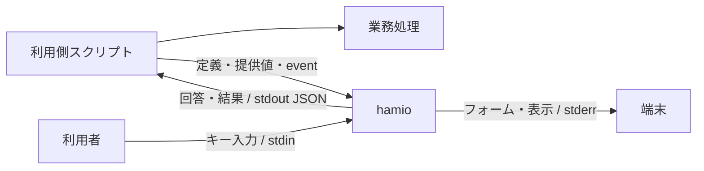
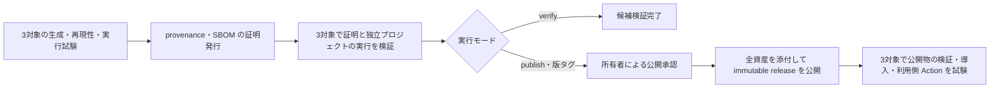

# hamio 基本設計

hamio は、開発用スクリプトの入力フォーム、進捗、表、結果を共通のターミナル UI として提供する。利用側は任意の言語で業務処理を実装し、コマンドラインと JSON で hamio に入出力を委譲する。hamio は回答と表示を担当し、業務処理の実行権限や制御を持たない。

本書は製品の目的、責務、構成、品質条件の正本である。データ形式は [API 契約](api.md)、モジュールの処理は[実装設計](implementation.md)、操作は[開発手順](development.md)と[配布手順](distribution.md)に定める。特定のソースで実施した検証は[リリース評価](release-readiness.md)に記録する。

## 1. 目的と対象範囲

スクリプトごとに質問の操作や結果の表現が異なると、利用者は操作を覚え直し、開発者は UI を個別に保守する必要がある。hamio はこの入出力を統一し、業務処理の言語や実装方法を利用側に残す。開発作業と同時に動くため、起動、応答、CPU、メモリ、出力量も設計対象とする。

| 項目     | 構成                                                                |
| -------- | ------------------------------------------------------------------- |
| 接続     | ローカルのプロセス I/O、UTF-8 JSON、コマンドライン                  |
| 実装     | Bun + TypeScript。質問のキー操作と状態管理に `@clack/core` を使用   |
| 配布     | 本体・製品依存・Bun を含む単一実行ファイルを GitHub Releases で提供 |
| 対象環境 | macOS 15 arm64、Ubuntu 24.04 x64 / arm64（glibc）で配布物を試験     |
| 入力     | 文字入力、確認、単一選択、複数選択、秘密入力                        |
| 表示     | メッセージ、値の一覧、表、進捗、結果、エラー                        |
| 自動実行 | 非対話入力、JSON 応答、終了コード、範囲を指定する機能照会           |
| 開発     | Nix と lockfile による環境固定、ローカル検査、Git hooks、PR 検査    |

利用側に UI 用の Bun・Node.js・Nix の導入を求めない。同梱 Bun は hamio 自身の実行に使い、利用側の TypeScript や他言語のコードを実行するためには提供しない。

API v1 の対象はローカルのターミナル UI とする。Web UI、常駐サービス、ネットワーク API、汎用ワークフロー実行、任意コードのプラグイン、自由なテーマ、全画面ダッシュボードは対象外である。

## 2. 用語と責務

| 用語                     | 意味                                                                                       |
| ------------------------ | ------------------------------------------------------------------------------------------ |
| 利用側                   | hamio を呼び出すスクリプトと、その管理プロジェクト                                         |
| 業務処理                 | ビルド、テスト、外部照会、Git 操作など、スクリプト本来の処理                               |
| 公開契約                 | 利用側と共有するコマンド、データ形式、制約、終了規則                                       |
| フォーム定義             | 質問の型、ラベル、選択肢、制約、既定値を記述する JSON                                      |
| run / task               | 一つの連続表示の開始から結果確定までの単位 / run 内で状態を追跡する業務単位                |
| event / NDJSON           | 状態を通知する一件の JSON / 各行に一つの JSON を置く連続入力形式                           |
| TTY / PTY                | 端末接続 / 自動試験や録画に使う疑似端末                                                    |
| 機械モード               | 対話待ちと装飾を使わず、構造化した応答を返す動作                                           |
| 背圧                     | 受信先の速度に合わせ、書き込みの完了を待つ仕組み                                           |
| 配布候補 / 資産          | 公開の検証対象となる生成物一式 / 実行ファイルの gzip、checksum、在庫、通知などの各ファイル |
| SBOM                     | Software Bill of Materials。同梱部品の在庫情報                                             |
| provenance / attestation | ソースとビルド工程の由来 / その情報などに対する署名付き証明                                |
| immutable release        | 公開済みのタグと添付資産を固定する GitHub Release                                          |

| 利用側が決めること                         | hamio が担当すること                       |
| ------------------------------------------ | ------------------------------------------ |
| 質問内容、選択肢、既定値                   | 定義に従った表示と回答の取得               |
| 外部照会を含む業務上の妥当性               | 型、必須条件、長さ、選択肢の検証           |
| 業務の順序、並列数、権限、再試行、取り消し | 受信した状態の検証、表示、集計             |
| 秘密項目の指定、回答の保管と利用           | 秘密入力のマスク、秘密指定した表示値の除去 |
| スクリプト全体の成否                       | UI の成功、不足、無効値、障害、中断の返却  |
| 製品版の採用と更新                         | 指定した公開版の検証と配置                 |

## 3. 利用側との接続

一回の呼び出しは一つのコマンド・プロセスで完結する。回答、run、描画、キャンセルの状態を他の呼び出しと共有しない。

| コマンド       | 入力                                         | 完了条件                                   |
| -------------- | -------------------------------------------- | ------------------------------------------ |
| `form`         | 定義ファイル、任意の提供値、対話時のキー入力 | 回答の解決、不足・無効値の判定、または中断 |
| `render`       | 表示部品の配列                               | 表示と応答の書き込み                       |
| `stream`       | 一つの run を表す NDJSON                     | `run.finish` の受理と最終応答の書き込み    |
| `capabilities` | 照会する機能の範囲                           | 契約版、製品版、対応機能、上限の返却       |

例えばデプロイ用スクリプトは `form` で環境と確認を取得し、回答を使って認証・接続・デプロイを行い、進捗と結果を `stream` へ渡す。接続とデプロイの責任は利用側にある。

関連する質問は一つのフォームにまとめる。回答を提供値、既定値の順に解決し、必須の不足項目だけを定義順に質問する。無効値があれば質問を開始せず、非対話での不足は不足として返す。不足、無効値、中断では部分回答を返さない。

並列業務の event は利用側で一つの送信経路へ集約し、run 全体の連番を付ける。全 task の完了後に `run.finish` を送り、hamio は EOF を待たずに終了する。完了前の EOF はプロトコル違反とする。同じ端末の描画は一つのプロセスが担当し、途中で質問が必要なら run を終了してフォームを起動する。回答後は別の run を開始する。

## 4. 内部構成と副作用

CLI が具体的な入出力実装を接続し、入力規則と表示計算は環境から独立させる。Bun・Clack のオブジェクトを公開契約へ含めない。

| 層            | 責務                                                  | 副作用                                           |
| ------------- | ----------------------------------------------------- | ------------------------------------------------ |
| `core`        | 型、入力検証、回答の解決、run / task の状態、秘密指定 | I/O、環境変数、timer、端末ライブラリを参照しない |
| `application` | コマンドの決定、処理順序、JSON 応答、出力バッチ       | 注入された入出力契約を呼ぶ                       |
| `terminal`    | 無害化、幅調整、質問・表・進捗の文字列計算            | 端末に書き込まない                               |
| `adapters`    | ファイル、ストリーム、端末制御、背圧、timer           | 確保した資源と後始末を所有する                   |
| `cli`         | 実装の組み立て、環境、signal、終了コード              | 一回の実行の入出力と中断を所有する               |

help・版・機能照会は入力処理を読み込まずに応答する。質問と人向け表示の実装は必要な呼び出しで読み込み、機械モードでは端末を初期化しない。Clack が質問のキー操作と状態を、hamio が表示文字列を担当する。

ビルド・配布は製品の import graph に含めない。入力収集、実行ファイルの生成、メタデータ計算、検証、配置に責務を分け、各候補の作業領域と出力先を明示する。[実装設計](implementation.md)に各資源の所有者と終了処理を定める。

## 5. 公開契約と互換性

要求は UTF-8 JSON とし、未知のキー、未対応の `apiVersion`、不正な型、上限超過を入力境界で拒否する。フォーム定義は許可した項目だけを受け付け、関数、コマンド、外部参照、汎用 JSON Schema を評価しない。ID と選択肢の値は表示ラベルから独立させる。

数値は有限な IEEE 754 値、整数は安全な整数範囲とする。大きな整数、日時、バイト列は利用側が文字列へ符号化する。言語固有の値や暗黙の型変換に依存しない。

終了コードは UI 操作の状態を表す。`result.success: false` を正常に表示した場合も終了コードは0である。利用側は終了コードと回答・業務結果の両方を確認し、確認の取得失敗を肯定の回答へ置き換えない。

製品版は `package.json` の `version`、契約版は `apiVersion` で管理する。既存の意味、必須条件、終了状態の変更は別の契約版で扱う。応答への任意項目追加は互換変更とし、利用側は未知の応答項目を無視する。具体的なデータ形式、終了コード、資源上限は [API 契約](api.md)に定める。

## 6. 端末と機械出力

| 経路         | 用途                                                      |
| ------------ | --------------------------------------------------------- |
| 定義ファイル | フォームの構造。キー入力とは読み取り先を分ける            |
| stdin        | キー入力、非対話の提供値、表示定義、または event          |
| stdout       | 回答、結果、エラー。`--help` と `--version` を除いて JSON |
| stderr       | 人向けのフォーム、表、通知、進捗                          |

対話、表示形式、色は個別に指定できる。明示指定を優先し、省略時に TTY と環境変数を参照する。TTY を人と AI エージェントの識別には使わず、`/dev/tty` も暗黙に開かない。

AI エージェントと CI は `form --interactive never` または `render / stream --format json` を指定する。機械モードでは stderr を空に保ち、装飾と対話待ちを使わない。連続表示の stdout は最終応答一つを既定とし、受理した全 event が必要な場合に `--events` を指定する。

人向け表示は幅と件数を制限し、省略件数を示す。JSON の非秘密値には表示上の省略や置換を適用せず、秘密指定は両形式へ適用する。警告、失敗、不足、結果を黙って捨てない。出力量は stdout と stderr の合計 bytes で評価し、token の評価には取得経路と tokenizer を記録する。

## 7. 性能設計

UI は業務処理と CPU・メモリを共有する。製品単体の負荷と、利用側の JSON 生成、転送、待機、補助プロセスを含む追加負荷をそれぞれ測る。

### 起動と配布サイズ

関連する質問を一つのフォーム、連続する状態を一つの stream にまとめる。task ごとの UI プロセスや event ごとの Worker は生成しない。業務の並列度は利用側が決める。

本体を minify し、開発ツールを bundle に含めない。JavaScript、ランタイム込みの実行ファイル、gzip のサイズを区別する。圧縮は梱包工程で行う。利用側は実行ファイルへの symlink を直接起動し、通常起動で通信、依存取得、更新確認を行わない。

### 入力・出力・描画

連続入力は read 単位で受け、必要な行を順に decode する。read をまたぐ未完成行だけを保持し、`run.finish` 後の入力は処理しない。共通の JSON 制約を一度検証してから種別のモデルへ変換する。

event 応答と表示行は16 KiBを目安にまとめて書く。行を分割しないため最大1行分が閾値に加わる。次の入力待ち、完了、エラーの前にも排出する。書き込み完了を待つ背圧と5秒の期限で、出力待ちの蓄積と無期限待機を防ぐ。利用側も JSON 化の前に通知を集約し、同じ pipe への書き込み順を一つの経路で確定する。

進捗は最大10 fpsで一行に描画する。状態の取得と文字列生成は描画時に行い、書き込み中の更新を最新状態へ集約する。同じ表示文字列なら書き込みを省く。通知で進捗行を消した後は同じ内容でも再描画し、更新がなければ timer を動かさない。

### 保持量

| データ                   | 保持期間                                               |
| ------------------------ | ------------------------------------------------------ |
| 活動中 task の詳細       | 最新状態を保持し、task 完了時に解放                    |
| 使用済み task ID・集計値 | ID の再利用検出と結果生成のため run 終了まで保持       |
| 途中進捗                 | 描画に必要な最新状態のみ                               |
| info / success 通知      | 表示と任意の event 応答後に解放                        |
| warning / error 通知     | 最終応答まで上限付きで保持                             |
| 表・値の一覧             | 単発入力の上限内。取得、分割、ページ選択は利用側が担当 |

文書、フレーム、文字列、階層、件数、task、通知、質問の出力待ち行列に[資源上限](api.md#資源上限と機能照会)を設け、超過時は明示的に失敗する。アプリの保持量の制限は、ランタイムを含むプロセス全体のメモリ上限とは異なる。

### 性能予算

| 指標                   | 評価目標                              | 測定条件                                                                    |
| ---------------------- | ------------------------------------- | --------------------------------------------------------------------------- |
| 小さい機械向け呼び出し | 応答取得まで p95 100 ms以内           | 入出力各4 KiB以下。OS cache を温めた新規プロセス。cold start は別記         |
| 入力応答               | 表示反映まで p95 50 ms以内            | 日本語を含む通常フォーム。思考時間と業務処理を除く                          |
| メモリ                 | 定常 RSS 64 MiB、peak RSS 128 MiB以内 | 1 run、活動中100 task以内、各1 KiB以内の通知2,000件。補助プロセスも評価     |
| 業務への追加時間       | hamio なしに対して5%以内              | 対照は5秒以上。同じ結果・並列数で入力待ちなし。短い業務は絶対追加時間も評価 |
| 待機中 CPU             | 1 core換算で平均1%以下                | 新着 event・アニメーションのない30秒間                                      |

予算は設計目標とする。保証する数値は、OS、基準機、端末、Bun、入力、負荷を特定した測定結果に基づいて定める。中央値、p95、試行数、ばらつき、API、単位、改善と悪化を記録し、通常測定と profiler・強制 GC を使った診断を分ける。JS heap、RSS、PSS、macOS footprint は別の指標として扱う。

## 8. セキュリティ設計

保護対象は開発マシン、利用側コード、認証情報、回答、端末、配布物である。取得者にかかわらず外部データを入力境界で検証し、人向け表示では外部の端末命令、制御文字、双方向制御文字を無害化する。JSON 応答は JSON の規則でエスケープする。

秘密のフォーム値は入力中にマスクし、成功応答の `values` に返す。秘密指定した表示値と表の列は `[redacted]` に置換する。エラーに入力値、ファイル内容、秘密、内部 stack を含めない。自由文や `result.data` の秘密、回答 stdout の保存・ログ・転送は利用側が管理する。

実行ファイルでは `.env`、`bunfig.toml`、`package.json`、`tsconfig.json` の自動読み込みを無効にする。実行時の外部 import、依存・schema の取得、動的プラグインを設けない。起動前に作用する `BUN_OPTIONS` と `BUN_BE_BUN`、OS の権限と標準ライブラリは実行環境の信頼条件に含める。hamio は利用側コードの sandbox ではない。

依存は取得元、版、integrity、差分、lifecycle scripts を確認して固定する。npm 依存の監査と、同梱 Bun・native 部品の advisory や許諾確認を分ける。非公開の報告、影響調査、修正版の提供は [SECURITY.md](../SECURITY.md)に定める。

## 9. 開発環境と品質検査

開発 shell は `aarch64-darwin`、`aarch64-linux`、`x86_64-linux` を対象とする。Nix のツールを `flake.lock`、JavaScript 依存を `bun.lock` で固定し、ローカルと CI で同じ検査を使う。

| 工程              | 検査                                                                         |
| ----------------- | ---------------------------------------------------------------------------- |
| 編集              | 型診断、保存時 format、対象テスト、UI の目視                                 |
| commit            | ステージ済みファイルを検査。部分ステージを保持し、同時タスクは2              |
| push・作業完了    | Lint、format、strict 型検査、テスト、プレビュー照合                          |
| PR                | Ubuntu の1ジョブで全体検査、全 Nix system の定義評価、追跡ファイルの差分確認 |
| OS に依存する変更 | macOS の手動 Quality 検査を併用                                              |
| 配布候補          | 3対象の native runner で再現性、実行ファイル、証明を検証                     |

Quality は所有者または Dependabot による同一リポジトリの `master` 向け PR の作成・更新・再開と、所有者の手動実行を対象とする。branch push と PR close では起動しない。ローカル hooks は作業ツリー、PR はマージ候補、手動検査は選択した ref を対象とする。

検査は自動修正せず、修正は差分を確認して明示的に実行する。ツール、hooks、CI、スキルの操作は[開発手順](development.md)、AI エージェントの作業規則は [AGENTS.md](../AGENTS.md)に定める。

## 10. 端末 UI のプレビュー

PTY で実際の出力と入力操作を記録し、代表状態の PNG と操作過程の GIF を生成する。`product` シナリオは製品 CLI、`fixture` シナリオは録画基盤の検証を担当する。

端末サイズ、期待出力、送信キー、撮影位置をシナリオに定義する。生成元と成果物の hash が一致する場合は再利用し、不足・破損・内容変更がある場合に生成する。生成中の入力源変更は拒否する。

ソース、PNG、生成記録を同じ commit に含め、GIF と端末出力の記録はローカルに保存する。PR は commit SHA に固定した画像、チャットは確認済み PNG を使う。内容照合、見た目、実端末、アクセシビリティ、性能はそれぞれ検証する。[プレビュー手順](development.md#8-ターミナル-ui-のプレビュー)

## 11. リポジトリ・配布・保守

### 公開と権限

`9uiLe/hamio` は閲覧・clone・fork が可能な公開リポジトリとし、変更権限を所有者に限定する。`master` は PR と `quality` 成功を必須とし、force push・削除を禁止する。版タグは管理者だけが作成でき、作成後の更新・削除を禁止する。Dependabot の更新 PR と非公開の脆弱性報告を受け付け、自動マージは行わない。投稿は collaborator に制限し、期限付きの制限が失効しないよう保守する。

hamio 本体は [MIT License](../LICENSE)、著作権表記は `Copyright (c) 2026 9uiLe` とする。利用許諾とリポジトリへの変更権限を別に管理し、第三者部品には各部品の許諾・通知条件を適用する。

### 再現可能な配布候補

同梱用 Bun は版と hash を固定した公式ランタイムとし、Nix store を参照する loader 修正を含めない。配布資産は対象別の gzip、圧縮前後の SHA-256、SPDX 2.3 SBOM、notices と共通インストーラーで構成する。

ソースの commit と内容 hash を記録し、候補ごとの独立した作業領域で固定依存の取得、ビルド、梱包を行う。SBOM の日時は commit 時刻から決める。同じ入力・ランタイム・対象環境で二回生成した全資産の byte 一致と、gzip から展開した実行ファイルの API・端末試験を公開条件とする。

SBOM は本体、production npm 依存、hash で特定した Bun を記録する。Bun 内部の native 部品と polyfill は集約して扱い、個別の版・許諾を確定していない範囲を明示する。notices には本体・npm 依存の許諾全文、Bun 提供元の通知、ソース・再リンク手順の参照を含める。

### 検証・承認・公開

Release workflow は所有者の手動実行を入口とし、既定の `verify` は候補の生成、証明発行、検証で完了する。`publish` は package と一致する版タグ、`master` への包含、clean worktree、ライセンスを確認し、同じ候補検証を通してから所有者の Environment 承認を待つ。所有者は管理権限が必要な immutable releases の設定を承認前に確認する。workflow は公開後に実際の immutable release を検証する。タグ push だけでは公開しない。

証明発行・公開の job は製品コードを実行せず、書き込み権限をその担当工程に限定する。候補検証は由来と実行を、公開後の導入試験は immutable release と公開資産の結び付きを確認する。証明はコードの無害性や在庫の網羅性を保証するものではない。

公開済みの版は `verify-install` で3対象の導入試験を再実行できる。製品のタグと commit を指定し、ビルド・証明発行・公開は行わない。

### 導入と保守

利用側は `.hamio-version` に完全な `vX.Y.Z` を固定する。インストーラー自身と公開資産の由来、タグ・commit、runner、圧縮前後の hash、実行ファイルの版を検証し、成功後に `.tools/bin/hamio` の symlink を切り替える。失敗時は使用中の版を保持し、管理対象外のファイルを上書きしない。

更新とロールバックは同じ検証経路を使う。同梱 Bun の修正も新しい製品版として提供し、公開済みタグ・資産を差し替えない。公開後の導入失敗や脆弱性には、影響版の告知、回避策、修正版で対応する。[配布手順](distribution.md)と[セキュリティ方針](../SECURITY.md)に操作と担当を定める。

## 12. リリースの受け入れ条件

配布する実行ファイルと運用設定を、対象ソースと環境を特定した記録で評価する。

| 対象       | 確認する条件                                                                 |
| ---------- | ---------------------------------------------------------------------------- |
| 開発基盤   | 固定ツールでローカル・CI の検査を実行できる                                  |
| 契約       | 回答、終了コード、エラー、順序、上限、業務結果の意味が一致する               |
| 言語間連携 | Shell・Python の例と標準プロセス I/O による接続が動く                        |
| 機械モード | 対話待ちと装飾を使わず、人向け UI と同じ回答・業務状態を表す                 |
| 入力保護   | 巨大・不正 JSON、深い構造、制御文字、秘密値を安全に扱う                      |
| 端末       | 日本語、emoji、狭い幅、resize、色なし、中断、入力モードの復旧を確認する      |
| 資源       | 大量 event、遅い・閉じた出力先、同時 run、長時間利用で保持量と終了を評価する |
| 出力量     | 成功・失敗・不足・大量入力の bytes と token を測り、重要情報を保持する       |
| 性能       | 起動、描画、メモリ、CPU、利用側を含む追加負荷を測り、未測定を明記する        |
| プレビュー | 製品入口と PNG・録画が対応し、代表状態を目視確認する                         |
| 配布       | 対象環境で Bun・Nix の導入や実行時依存取得が不要で、暗黙設定を読まない       |
| 再現性     | 独立生成した全資産が一致し、展開した実行ファイルが試験に通る                 |
| 証明・配置 | 不正な由来と資産を拒否し、配置失敗時に使用中の版を保持する                   |
| 在庫・許諾 | 出荷物と SBOM を照合し、許諾・通知・ソース提供条件と確認範囲を記録する       |
| 運用       | 必須検査、タグ保護、公開承認、非公開報告、修正版の提供経路がある             |

## 13. 検証結果と保証範囲

設計目標、検査の実装、実施した結果、公開版の保証範囲を区別する。リリース評価とリリースノートには、対象 commit・内容 hash、固定ツールとビルド設定、生成物 hash、OS・CPU・RAM・libc、端末とアクセシビリティの確認範囲、負荷、測定 API・単位・試行数、既知の制約を記録する。

ローカルの測定を他の OS や業務全体の性能へ一般化しない。独立生成は同じ入力・対象環境で評価し、異なる OS の資産同士の一致を求めない。GitHub CLI の代替実装による失敗処理の試験、実際の provenance 検証、公開物の導入試験を分けて記録する。未検証の条件に保証を付けない。

## 根拠資料

- [UI と言語間連携](research/ui-and-integration.md): 質問ライブラリ、JSON、端末と機械出力。
- [ランタイムとサプライチェーン](research/runtime-and-supply-chain.md): Bun 同梱、Nix、依存管理、配布検証。
- [性能特性と測定](research/performance.md)、[API 評価](research/api-performance.md)、[実行基盤の比較](research/refactor-performance.md)、[配布基盤と実行経路の評価](research/reproducibility-performance.md): 条件付きの測定値と生データ。
- [CI](research/ci.md)、[プレビュー](research/preview-performance.md): 開発基盤の検査範囲と性能。
- [Bun・native 依存の確認](research/runtime-review.md): 固定ソース、脆弱性情報、許諾と調査の範囲。
- [配布手順の根拠](distribution.md#根拠): immutable releases、attestation、runner、SPDX。
