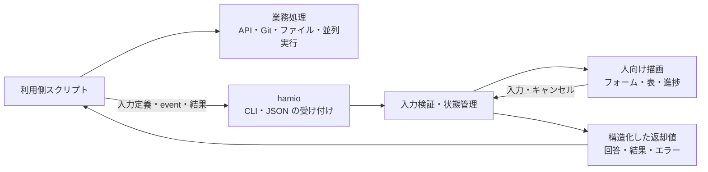

# hamio 設計

hamio は、開発用スクリプトに共通の入力フォームと出力を提供するターミナル UI ツールである。スクリプトの実装言語や業務処理を変えずに、人が操作する画面と、AI エージェント・CI が扱うデータを統一する。

本書は初期リリースの基本設計を定める。実装・動作検証・性能測定は未実施であり、性能値は設計目標として記載する。コマンドや通信形式の細部など、確定していない事項は「詳細仕様の確定項目」にまとめる。

## 1. 製品の目的と範囲

開発用スクリプトでは、入力方法、選択肢、進捗、警告、結果の表現がプロジェクトごとに異なりやすい。利用者には操作の学習負担が生じ、開発者には表示処理の重複実装が生じる。hamio は入力と表示を共通化し、業務処理を利用側に残すことで、この負担を減らす。

代表的な用途は、設定値の収集、実行対象の選択、操作前の確認、複数処理の進捗、処理結果の一覧である。利用側は「何を尋ねるか」「どの処理が進んだか」「どのような結果になったか」を渡し、hamio が共通の UI で表現する。

| 要件 | 設計上の扱い |
| --- | --- |
| 多言語からの利用 | Shell、Python、Go、TypeScript などから CLI と JSON で接続する |
| 利用環境の簡素化 | Bun を同梱した実行ファイルを配布し、UI の利用に Bun・Nix の事前導入を要求しない |
| 対応環境 | macOS と Linux を対象とする。CPU・最低 OS・Linux libc の範囲は検証して定める |
| 統一した操作 | フォーム、選択、確認、秘密入力、メッセージ、表、進捗、結果、エラーを扱う |
| AI エージェント対応 | 非対話入力と構造化出力を提供し、不要な描画と反復出力を抑える |
| 性能 | 起動、入力応答、メモリ、CPU、業務への追加時間をリリース条件として評価する |
| セキュリティ | 未信頼入力、秘密情報、依存取得、ビルド、配布物をそれぞれ検証する |
| 開発環境 | Nix でツールチェーンを固定し、ローカルと CI で共通の定義を使う |

業務処理の実行、順序、並列数、権限、再試行、取り消しは利用側の責務とする。利用側の言語ランタイムやツールも利用側が用意する。hamio は利用側の TypeScript を実行するための Bun 環境を提供しない。

初期リリースの対象はローカルのターミナル UI に限定する。Web UI、常駐サービス、ネットワーク API、任意コードを実行するプラグイン、汎用ワークフロー言語、自由なテーマ、全画面ダッシュボード、自動更新は含めない。

## 2. 用語

| 用語 | 本書での意味 |
| --- | --- |
| 利用側 | hamio を呼び出すスクリプトと、それを管理するプロジェクト |
| 業務処理 | API 呼び出し、ビルド、Git 操作、ファイル変更など、利用側が実行する本来の処理 |
| 入力定義 | 質問の項目、型、制約、ラベル、選択肢を記述したデータ |
| 公開契約 | 利用側と hamio が共有する、入出力データと動作規則の仕様 |
| run | 利用側スクリプトによる一回の業務実行 |
| task | run の中で開始・進捗・完了・失敗を識別する処理単位 |
| event | task の状態変化などを通知する一件のデータ |
| 連続表示 | 複数の event を受け取り、同じ表示プロセスで進捗と結果を更新する利用方法 |
| 描画処理 | 入力や状態のモデルを、端末に表示する文字と制御命令へ変換する処理 |
| 機械モード | AI エージェントや CI 向けに、対話待ちと端末装飾を使わず構造化データを返す動作 |

## 3. 全体構成と責務

hamio は Bun + TypeScript で開発し、Bun と UI 依存を含む独立実行ファイルとして配布する。利用側はプロセスを起動して JSON を渡し、回答や結果を受け取る。これにより、利用側の言語と hamio 内部の UI ライブラリを独立して選べる。

Bun の実行ファイル生成機能と、標準入出力による独立 UI コマンドの実例がこの構成の根拠となる。配布物ごとの成立性は対応環境で検証する。[ランタイムの根拠](research/runtime-and-supply-chain.md)、[言語間連携の根拠](research/ui-and-integration.md)

hamio 内部は、公開契約の受け付け、入力検証と状態管理、人向け描画、構造化出力に分ける。各モジュールは同じ実行ファイルに含める。内部の分割を、常駐プロセスや別サービスの追加には結び付けない。

| 利用側が管理するもの | hamio が管理するもの |
| --- | --- |
| 実行する処理、対象環境、権限 | 共通 UI 部品と表示規則 |
| 質問と選択肢の内容・値 | 型、必須条件、範囲などの基本入力検証 |
| API 照会などを伴う業務上の妥当性 | 不足入力、検証失敗、キャンセルの返却 |
| 処理順序、並列数、再試行、取り消し | task の通知の受信と表示への集約 |
| 秘密値の供給と、秘密を含む項目の指定 | 指定された秘密値の表示・ログへの漏えい抑制 |
| 業務結果とスクリプト全体の終了コード | hamio 自体の成功・失敗・中断の通知 |

公開契約は質問と結果の意味に限定する。UI ライブラリの全オプションを公開すると、その更新が利用側の変更を要求しやすくなるため、ライブラリ固有の処理は内部の変換層に閉じ込める。

入力・段階表示のライブラリは Clack を第一候補とする。日本語表示、端末復旧、Bun 同梱での動作、性能予算を採用条件にする。表や共通出力は hamio の方針で統一し、追加ライブラリは必要な機能ごとに評価する。[UI 基盤の比較](research/ui-and-integration.md#ui-基盤)

## 4. 利用方法とライフサイクル

### フォーム

利用側が入力定義を渡し、hamio が回答、キャンセル、不足入力、検証エラーのいずれかを返す。関連する質問は一つのフォームにまとめ、項目ごとのプロセス起動を避ける。

回答を業務上の条件と照合するのは利用側である。たとえば対象環境への接続可否は利用側が検証し、不成立なら理由を付けて再質問する。hamio はこの判断のための任意関数やコマンドを実行しない。

### 単発表示

利用側がメッセージ、表、結果などのデータを渡し、hamio が指定の形式で出力して終了する。利用側の自由なテキスト出力から、成功・警告・秘密などの意味を推測することはしない。

### 連続表示

利用側は run ごとに通知を一つの経路へ集約し、表示プロセスへ event を送る。表示プロセスは run の表示期間中に再利用する。task や event の数に応じて UI プロセスを増やさない。

連続表示は開始、進捗、完了、失敗を区別する。入力の終端である EOF を、業務成功として解釈しない。利用側は自分の業務結果と hamio の終了状態を別々に確認して、スクリプト全体の成否を決める。

### 端末の共有と中断

同じ端末へ描画する主体は一つにする。業務中にフォームを開くときは、利用側が連続表示からフォームへ端末の使用を切り替える。停止・再開や終了による具体的な切り替え方式は詳細仕様で定める。

同時に有効な質問は一つとし、その回答を必要としない業務処理まで直列化しない。キャンセル時には端末の入力モードと表示状態を復旧し、成功とは異なる結果を返す。UI の障害を理由に業務を自動再実行しない。

## 5. 公開契約

入力と出力には [RFC 8259](https://datatracker.ietf.org/doc/html/rfc8259) に基づく JSON を用いる。JavaScript の関数、クラス、Bun 固有オブジェクトを受け渡さず、他言語でも同じ値と状態を扱える契約にする。

| データ | 必要な情報 |
| --- | --- |
| 入力定義 | 契約版、項目 ID、入力型、必須条件、制約、ラベル、説明、選択肢 |
| 回答 | 項目 ID と値、回答完了・キャンセル・不足・検証失敗の状態 |
| 表示 event | task ID、順序を識別する情報、種別、状態、表示データ |
| 業務結果 | 成否、結果データ、警告、省略の有無 |
| UI エラー | 安定したエラーコード、対象項目、説明、返却結果の有無 |

入力部品は text、confirm、select、multiselect、secret、出力部品は message、key-value、table、progress、result、error を初期範囲とする。名称は部品の意味を示すもので、CLI や JSON の具体的な綴りは詳細仕様で定める。

項目 ID と選択肢の値は、画面のラベルから独立した安定値にする。入力制約と表示順・説明も分離する。JSON Schema を使う場合は対応する制約を明示し、未対応の制約を無視せず拒否する。外部の参照先をネットワークから自動取得しない。

バイナリの版と公開契約の版を分け、未知の major 版は UI 操作前に拒否する。任意項目の追加と必須動作の変更を区別する。機能照会は必要な範囲に限定できる形式とし、通常の実行ごとに全スキーマを出力しない。

不正入力、UI の故障、利用者のキャンセル、業務の失敗は異なる状態として扱う。完了後の古い進捗、順序違反、中断後の event の扱いを定義し、別 run の状態を混ぜない。大きな整数、日時、バイト列の表現も言語間の一致を条件に定める。

## 6. 人向け UI と機械向け出力

人向け表示と機械向け出力は、同じ入力・状態・結果のモデルから生成する。表示形式、対話の可否、色・端末制御の可否は独立した設定とし、明示指定を優先する。端末への接続を示す TTY 判定だけで、人と AI エージェントを識別しない。

| 項目 | 人向け | 機械モード |
| --- | --- | --- |
| 入力 | 端末のフォームで受け付ける | 事前に値を受け取り、不足項目を返す |
| 進捗 | 更新を集約して描画する | 既定は最終結果。要求時だけ必要な event を出力する |
| 結果 | 表や説明で示す | 安定したキーの JSON を返す |
| エラー | 原因と次にできる操作を示す | コード、対象項目、説明、結果状態を返す |
| 装飾 | 端末能力と設定に応じて使う | ANSI 制御、spinner、カーソル操作を使わない |
| 中断 | 端末を復旧しキャンセルを通知する | 成功と区別した状態と終了コードを返す |

端末 UI は stderr、フォーム回答と機械向け結果は stdout を基本経路とする。利用側は回答用の stdout を捕捉する。機械モードでは stderr も管理し、ライブラリ由来のアニメーションや診断ログを通常出力へ混在させない。

フォーム定義とキー入力は別経路で受ける。定義を明示したファイルから読み、stdin でキーを受け、stdout へ回答する構成などを用いる。連続表示では stdin を event の入力に使う。非対話モードで `/dev/tty` を開いて回答を待たない。

AI エージェントには重複進捗、全スキーマ、不要な説明を繰り返し送らない。大量データは項目と範囲を選択できるようにし、省略件数と続きの取得方法を示す。重要な警告、失敗、不足入力は保持する。

JSON という形式だけで token 削減を評価せず、実際の取得方式と tokenizer で stdout・stderr の総出力量を比較する。表示用の省略で、機械向けの値を黙って切り捨てない。[入出力設計の根拠](research/ui-and-integration.md)

## 7. 性能設計

hamio の導入が業務へ加える時間と資源消費を制御する。評価対象には本体だけでなく、利用側の JSON 生成、転送、待機、連携用の補助プロセスを含める。

### 並列処理

業務の並列数と依存関係は利用側が管理する。複数 task の通知は一つの送信経路へまとめ、複数の送信元が同じ pipe に JSON のバイト列を直接書いて混在させない。hamio の描画完了を、業務の更新ごとに待つ構成を避ける。

hamio は I/O を非同期に待ち、同時受付数と待ち行列を制限する。CPU 処理は入力規模、アルゴリズム、処理単位を見直し、それでも必要な場合にだけ Worker の効果を測定する。UI 用に全 CPU コアを既定で占有しない。

Worker の評価には生成、データ転送、状態保持、終了までを含める。非同期 API の使用と CPU の並列実行を区別し、業務のビルドやテストと資源が競合する条件でも測る。[Bun の並列処理特性](research/performance.md)

### 保持量と描画量

受信フレーム、文字列、階層、待ち行列の件数・バイト数、活動中 task、ログ、表に個別の上限を設ける。連続入力は上限付きのフレームで処理し、全入力を巨大な JSON として保持・解析しない。

進捗は task ごとの最新状態へ集約し、完了済み task の詳細は表示用途に応じて解放する。表は表示範囲を限定し、全件の集計・並べ替え・続きの取得は利用側が担当する。

進捗の再描画はまとめて頻度を制限し、値の変わらない状態を再計算しない。入力応答、エラー、完了は進捗の描画周期と分けて扱う。機械モードでは TUI の描画処理と animation timer を起動せず、待機中に不要な処理を繰り返さない。

### 混雑時の扱い

有限のメモリ、全データの保持、無制限に速い送信側を待たせないことは、遅い出力先に対して同時には保証できない。受信と描画を分け、データの重要性に応じて処理する。

| データ | 出力先が遅い場合の扱い |
| --- | --- |
| 途中の進捗 | 最新状態へ置換する。送信側でも可能な範囲で JSON 化前に集約する |
| 詳細ログ | 最近の一定量を保持して省略件数を通知する。全件保存は利用側が明示的に管理する |
| 完了・失敗・重要警告 | 黙って捨てず、受付・配送の失敗を識別する。待機上限を超えたら明示的なエラーを返す |
| 入力要求・回答 | 取得・返却の失敗を成功や肯定へ置き換えない |

UI 障害時に業務を継続するかは利用側が決める。待ち行列の上限と待機時間は、代表データを使って詳細仕様として固定する。

### 暫定性能予算

以下は hamio 独自の設計目標であり、実測値や達成保証ではない。基準機、OS、端末、Bun 版、入力データを定め、配布する実行ファイルで検証する。

| 指標 | 暫定目標 | 測定条件 |
| --- | --- | --- |
| 小さい機械向け呼び出し | 起動から結果取得まで p95 100 ms 以内 | 入出力各 4 KiB 以下、OS cache が温まった状態、hamio は毎回新規起動。cold start は別記 |
| 入力応答 | キー入力から表示反映まで p95 50 ms 以内 | 日本語を含む通常フォーム。業務処理と人の思考時間は除外 |
| メモリ | 定常 RSS 64 MiB、peak RSS 128 MiB 以内 | 1 run、100 task 以内、最近のログ 2,000 行以内・各行 1 KiB 以内。補助プロセスを含む同時使用量も評価 |
| 業務への追加時間 | hamio なしの対照に対して 5% 以内 | 対照 5秒以上、同じ業務結果・並列数、人の入力待ちなし。短い処理は絶対追加時間も評価 |
| 待機中の CPU | 1 core 換算で平均 1% 以下 | 新着 event・animation なしの30秒区間 |

p95 は測定した応答の95%が収まる時間を指す。中央値、p95、試行数、ばらつきを記録する。外部 API の変動や人の操作時間を、hamio による追加時間と混同しない。

メモリは JavaScript のヒープとプロセス全体を別々に観測する。RSS、共有ページを按分する PSS、macOS の phys_footprint は異なる尺度なので、取得 API・単位・OS を記録する。footprint を RSS の予算へそのまま代入しない。

同一プロセスの Worker 分を重複加算せず、複数プロセスの RSS 合計も専有物理メモリと同一視しない。アプリ内の保持量上限と、プロセス全体の厳密なメモリ制限も区別する。[測定 API と制約](research/performance.md#計測指標)

省メモリ設定や bytecode は、メモリ・CPU・応答・起動を合わせて比較する。予算が成立しなければプロセス数、依存、描画方式を見直し、必要なら Bun を含む技術選定を再評価する。目標値の変更には理由を記録する。

## 8. セキュリティ設計

保護対象は開発マシン、利用側のコード、認証情報、入力値、端末、配布物である。UI 定義、表示文字列、ログ、ファイル名、依存コード、ビルド資産は検証対象とする。所有者のスクリプトが取得した値も、取得元が信頼できるとは限らない。

### 入力と秘密情報

入力の型・サイズ・深さ・件数を検証し、外部文字列の端末制御命令を無害化する。描画には hamio が生成した制御命令だけを使う。端末には色以外の操作命令もあるため、色用の SGR の除去だけを対策としない。[端末制御の根拠](research/ui-and-integration.md#表示データと秘密情報)

機械出力ではデータを JSON としてエスケープし、表示用の無害化や省略によって元の値を黙って変更しない。UI 定義から Shell、JavaScript、外部プラグインを実行する経路は設けない。

秘密を含む項目は利用側が指定する。秘密入力の回答には呼び出し元が捕捉する返却経路を要求し、端末への直接表示、復唱、エラー、詳細ログ、永続化への混入を防ぐ。自由文に含まれる秘密の完全な自動検出は保証しない。

返却経路には秘密の実値が存在する。利用側は受け取った値の保管、ログ、エージェントへの転送を管理する。表示マスクは暗号化や権限分離の代わりにはならない。

### 実行環境

通常の UI 利用はオフラインで完結させ、必要なコードを配布物に含める。Bun の暗黙の `.env`・`bunfig.toml` 読み込みはビルド設定で無効化し、依存の自動取得を行わない構成を検証する。

`BUN_OPTIONS` や `BUN_BE_BUN` のような起動前に作用する設定は、固定した Bun 版で挙動を確認する。アプリ起動後のチェックだけで起動環境の影響を排除したとは扱わない。[同梱ランタイムの制約](research/runtime-and-supply-chain.md#実行時の信頼境界)

hamio は利用者と同じ OS 権限で動作する。独立プロセスとランタイム同梱は、任意コードを隔離する sandbox を提供しない。削除・デプロイなどの操作許可、業務の安全性、子孫プロセスの停止は利用側が管理する。

## 9. Nix による開発とビルド

開発用ツールチェーンを `flake.nix` と `flake.lock` で管理し、対象の macOS / Linux system ごとに `devShells` を定義する。ローカルは `nix develop`、CI は同じ定義を用いたコマンド実行を入口とする。

| 管理対象 | 固定方法 |
| --- | --- |
| Bun、Git、検証ツール | Nix の入力と `flake.lock` |
| TypeScript、UI ライブラリ等の JS 依存 | `package.json` と `bun.lock` |
| CI の Actions と再利用 workflow | 完全な commit SHA |
| 配布物との対応 | ソース commit、lockfile、Bun 版、ビルド設定、バイナリ hash |

通常の開発と CI では lockfile を暗黙に更新しない。開発 shell への入場時に、依存インストールや業務処理を自動実行しない。依存取得では lockfile の変更を禁止し、パッケージに付属する lifecycle scripts の実行を抑制する。必要なビルド処理は明示する。

Nix の版、導入経路、必要な feature 設定、信頼するキャッシュを開発手順に定める。Nix の開発 shell だけで、配布ビルドの隔離やバイト単位の再現性が保証されるとは扱わない。[開発環境と依存管理の根拠](research/runtime-and-supply-chain.md#開発環境と依存取得)

配布ビルドを Nix derivation で定義するかは詳細設計で決める。配布候補は Bun・Nix のない環境で検証し、実行時に `/nix/store` を必要としないことを確認する。

## 10. 配布と保守

OS・CPU 別の実行ファイルを、版を指定した GitHub Releases から配布する。対応環境、checksum、ビルドの由来を示す provenance、部品・ライセンス情報を添付する。公開後のタグと添付資産を固定する immutable releases を使用する。

provenance の検証条件には、`9uiLe/hamio`、期待する公開 workflow、ソース ref / commit を含める。checksum による完全性確認と、配布元・ビルド工程の確認を区別する。利用時の検証手順と、検証ツールの入手経路を提供する。

依存部品一覧である SBOM は、JS 依存、同梱 Bun/runtime、追加 native 部品を対象ごとに追跡し、出荷物と照合する。証明情報を付けても一覧の記載漏れは解消しない。依存固定、脆弱性検査、SBOM、provenance のいずれも、コードの無害性を単独では証明しない。

ビルドと公開の権限を分離し、公開権限は必要な工程だけに付与する。依存更新は差分を確認して取り込む。通常更新と緊急セキュリティ更新の手順を定め、同梱する Bun の脆弱性にも hamio の再配布で対応する。

利用者の更新は版を選ぶ明示操作とし、検証失敗時は実行・置換を中断する。バックグラウンドの自己更新は設けない。影響版の告知、修正版の公開、非公開の脆弱性報告窓口を保守に含める。[配布機能と制約](research/runtime-and-supply-chain.md#配布物の検証)

## 11. 公開リポジトリの運用

リポジトリは公開し、変更権限は所有者に限定する。第三者からの一般投稿は受け付けない方針とし、GitHub の投稿・レビュー制限を適用する。期限付きの制限は失効前に見直す。

公開による閲覧・clone・fork と、リポジトリへの変更権限は区別する。公開を保ったまま閲覧や複製を禁止することは運用目標に含めない。第三者のコードを無条件に CI で実行したり、配布物へ取り込んだりしない。

## 12. リリースの受け入れ条件

検証対象は利用者へ配布する実行ファイルとする。開発環境の導入、開発時の TS 直接実行、ビルド、配布物の実行を分けて評価する。以下は実装後に満たすべき条件であり、実施済みの試験結果ではない。

| 対象 | 受け入れ条件 |
| --- | --- |
| 開発環境 | 対象 OS で固定ツールを利用でき、ローカルと CI が同じ定義・lockfile を使う |
| 配布物 | Bun・Nix なしで動作し、通常 UI が依存取得や `/nix/store` を必要としない |
| 多言語 | Shell・Python で回答・結果・エラーが一致し、Go・TS も標準プロセス I/O で接続できる |
| 端末 | 日本語幅、emoji、狭い幅、resize、色なし表示、Ctrl-C、EOF、入力モードの復旧を確認する |
| 機械モード | 対話待ちと端末制御がなく、人向けと同じ値・業務状態を返す |
| 出力量 | 成功・失敗・不足入力・大量出力で byte と token を比較し、重要情報を保持する |
| 性能 | 暫定性能予算を基準環境で評価し、利用側の JSON 生成・転送を含む追加負荷を記録する |
| 並列・長時間 | 業務並列数と同時 run 数を変え、ビルド・テストへの影響、完了 task の累積、保持量を確認する |
| 混雑・中断 | 大量 event、遅い端末・pipe、閉じた出力先で、無期限待機や重要通知の黙った喪失がない |
| 入力保護 | 巨大・不正 JSON、深い構造、制御文字、秘密を含むエラーで検証と保護が機能する |
| 配布検証 | 改ざん、別 repository/workflow、想定外 commit の資産を拒否し、SBOM を出荷物と照合できる |

性能記録にはソース commit、Nix 入力、Bun 版、ビルド設定、hash、CPU、RAM、OS、端末、負荷状態、測定 API、単位、試行数を含める。通常測定と、profile・強制 GC を伴う診断を区別する。

代表的な試験データと結果を回帰検知に残し、Bun、UI 依存、配布方式の変更時に再検証する。UI 単体の速度だけでなく、同じ業務を hamio なし・ありで実行した結果を比較する。

## 13. 詳細仕様の確定項目

| 項目 | 確定する内容 |
| --- | --- |
| コマンドと通信 | CLI 名・引数、JSON フィールド、event の区切り、状態遷移、終了コード、互換期間 |
| 入出力経路 | フォーム定義、回答、秘密値の受け渡しと、フォーム・連続表示間の端末の切り替え |
| 対応環境 | CPU architecture、最低 OS、Linux libc。arm64 / x64 を候補として実機検証する |
| 性能条件 | 基準機・端末・固定データ、入力・保持量上限、描画周期、配送待機時間 |
| 連携支援 | 言語別の補助ライブラリの範囲と、呼び出し・中断・終了状態を扱う利用例 |
| ビルドと保守 | 配布ビルド方式、provenance の信頼条件、検証ツールの取得経路、SBOM 生成、脆弱性報告窓口 |

## 根拠資料

一次情報の確認日は 2026-09-17。外部仕様は採用する固定版で確認する。基本設計の方針と、外部製品が提供する機能・制約を区別して参照する。

- [UI と言語間連携](research/ui-and-integration.md): 既存事例、UI 基盤、JSON 契約、端末と機械出力。
- [ランタイムとサプライチェーン](research/runtime-and-supply-chain.md): Bun 同梱、Nix、依存管理、配布検証。
- [性能特性と測定](research/performance.md): 起動、メモリ、並列処理、計測 API。
