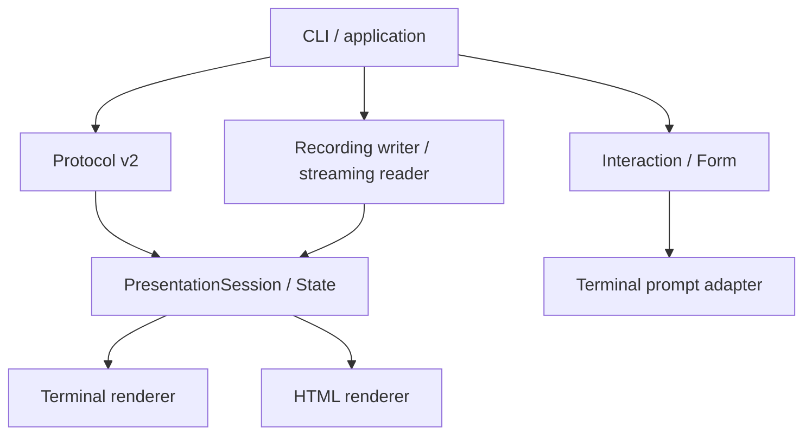

# hamio 基本設計

本書は現在の製品責務と依存境界を定める。公開 CLI / JSON / 終了状態は [Presentation API](presentation-api.md)、[Recording 形式](presentation-recording.md)、[Form 契約](interaction-form.md)を正本とする。公開済み v0.1.0 からの変更は[移行ガイド](migration-v1-to-presentation-v2.md)を参照する。

## 1. 目的と範囲

hamio は Script / AI / Application が人へ提示する意味を、Terminal と HTML で一貫して扱う。業務処理、権限、並列数、再試行、結果の決定は利用側に残す。通常の利用は native executable とローカル JSON/NDJSON。サーバー、ネットワーク認証、言語別 SDK、任意プラグインは現在の製品範囲外である。

## 2. 責務

| 利用側                                     | hamio                                                   |
| ------------------------------------------ | ------------------------------------------------------- |
| Run/Task の業務上の意味・結果と Event 送信 | Protocol validation、PresentationSession の状態遷移検証 |
| 秘密を含まない表示内容の作成               | 構造化された redacted、Terminal 安全表示、HTML escape   |
| Form の質問内容・回答の利用                | 定義検証、対話、秘密入力の画面マスク、回答状態の返却    |
| 製品版の選択と更新時期                     | 固定版の検証可能な配布                                  |

Recording の complete/partial/invalid は Run の succeeded/failed/cancelled とは別である。EOF や process signal から業務結果を推測しない。Form は Interaction、Presentation は意味のある出力であり、共有の UI model に統合しない。

## 3. 内部構成

```mermaid
flowchart TD
  CLI[CLI / application] --> PROTOCOL[Protocol v2]
  PROTOCOL --> DOMAIN[PresentationSession / State]
  DOMAIN --> TERMINAL[Terminal renderer]
  DOMAIN --> HTML[HTML renderer]
  CLI --> RECORDING[Recording writer / streaming reader]
  RECORDING --> DOMAIN
  CLI --> FORM[Interaction / Form]
  FORM --> PROMPT[Terminal prompt adapter]
```

Domain は媒体と入出力を知らない。Renderer は State のみを意味入力とし、Event を解釈しない。Recording は accepted Event のみを canonical encoding し、reader は同じ Session で復元する。Report application は Recording metadata と HTML 表示を組み合わせ、metadata を State へ追加しない。Form は専用の型・検証・prompt を持つ。共通の入出力、端末文字安全性、PTY capture は現在の責務として共有する。[Target Architecture](rearchitecture/target-architecture.md)を参照する。

## 4. 入出力と副作用

Terminal の人向け出力は stderr、machine response は stdout。TTY は色・motion・cursor の capability を決めるが、人か AI かを推測しない。非 TTY は ANSI なしで意味のある安定した text を出す。静的 State、live Event、Recording、Form はそれぞれ明示入口を持つ。資源を確保した層が listener、timer、buffer、端末状態を後始末する。write は await し、表示更新の coalescing で Event 自体を黙って捨てない。

Form の端末キー操作は `@clack/core` の unstyled primitive を使い、表示文字列と秘密のマスクを hamio が担当する。依存をなくすために raw-mode / 選択 / Unicode 入力を独自 framework として再実装しない。[依存判断](development.md#7-依存とツールの更新)を参照する。

## 5. 互換性とセキュリティ

製品版、Presentation の `protocolVersion`、Recording の `recordingVersion`、Form の `apiVersion` は別に管理する。未知の版・field を黙って解釈しない。受理した Presentation の業務失敗と hamio の I/O/検証失敗は exit / machine response で区別する。HTML に arbitrary input markup を通さず、端末では制御文字・双方向制御文字を無害化する。自由文の秘密は hamio が自動判定できないため、producer が送信前に除去する。

実行ファイルの暗黙の設定読込み、通常実行時のネットワーク・schema 取得・telemetry・update check は行わない。配布物の信頼条件は[配布手順](distribution.md)を参照する。

## 性能予算

製品単体に加え、利用側の JSON 生成・転送・待機・補助プロセスを含む追加負荷を測る。Event ごとに Worker や UI process を作らない。大量 Event は bounded input と awaited write を使い、表示だけを coalesce する。長期 Recording は streaming reader で復元し、Event 全履歴を memory に保持しない。

小さい機械向け呼び出しの p95 100 ms、通常 Form 入力応答の p95 50 ms、待機中 CPU 1 core 平均1%以下は設計目標であり、保証値ではない。測定条件、現状の実測、未確認範囲は[開発手順](development.md#製品試験と性能測定)と[Phase 12 最終レビュー](rearchitecture/phase-12-final-review.md)で分けて記録する。異なる契約の旧実装と速度の百分率比較をしない。

## 7. 配布

固定した Bun を含む単一実行ファイルを配布し、利用側に Bun/Node/Nix の導入を要求しない。release の candidate は固定した入力から独立に build し、同じ対象環境で byte 一致と通知・SBOM を確認する。証明は由来を示すがコードの無害性を保証しない。[配布手順](distribution.md)を正本とする。
