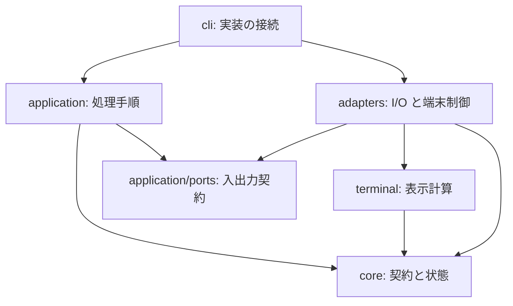

# hamio 実装設計

hamio は、入力検証、回答の解決、状態管理、表示計算、入出力を一つの CLI プロセスで処理する。利用側の業務を実行する機能は持たず、受け取った定義と状態を共通の UI・JSON 応答へ変換する。

本書は製品コードと配布コードの依存方向、処理手順、資源の寿命を定める。製品の目的と品質条件は[基本設計](design.md)、公開するデータと終了規則は [API v1](api.md)、検査コマンドは[開発手順](development.md)、導入・公開の操作は[配布手順](distribution.md)を参照する。

## 1. モジュールと依存方向

入力の意味を決める規則、処理を進める手順、表示文字列の計算、外部との入出力を分ける。CLI が実装を組み立て、値と関数を渡す。

図は主要な依存方向を示す。`application` は具体的なアダプターを import せず、アダプターが `Ports` を実装する。表示条件の値型 `Appearance` は `application/command.ts` にあり、アダプターと表示計算も型として参照する。

| モジュール    | 担当する判断・状態                                  | 外部への副作用                           |
| ------------- | --------------------------------------------------- | ---------------------------------------- |
| `core`        | 契約の検証、回答の解決、run / task の遷移、秘密指定 | なし                                     |
| `application` | コマンドの処理順序、回答、Session、event 応答バッチ | 渡された入出力インターフェースの呼び出し |
| `terminal`    | 無害化、幅、省略、質問と表示の文字列                | なし                                     |
| `adapters`    | 未完成入力、出力待ち、質問と描画の寿命              | ファイル、ストリーム、端末、timer        |
| `cli`         | 一回の実行の入出力と AbortController                | 環境の読み取り、signal、プロセス終了     |

`core` は I/O、環境変数、timer、端末ライブラリへ依存しない。Session の状態更新はインスタンス内に閉じ、呼び出し間で共有しない。`terminal` は渡された値から文字列を生成し、出力先を所有しない。Bun・Clack 固有の型や設定を公開契約へ漏らさない。

## 2. コマンドの組み立てと入出力契約

[cli.ts](../src/cli.ts) は標準入出力、TTY、端末幅、`TERM`、`CI`、`NO_COLOR` を読み、[command.ts](../src/application/command.ts) の `parseCommand` へ値として渡す。判定関数は環境を直接参照しない。

コマンドは種類ごとの union とする。フォームの定義・提供値・対話条件と、連続表示の event 出力指定を型で区別する。不正なオプションの組み合わせは入力を読む前に拒否し、表示幅を20〜240列へ収める。

[run.ts](../src/application/run.ts) の `execute` は、[ports.ts](../src/application/ports.ts) の次の操作を使う。

| 操作                             | 契約                                          |
| -------------------------------- | --------------------------------------------- |
| `output.write(text)`             | 応答を書き、完了まで待つ                      |
| `signal`                         | キャンセルまたは実行障害による中断を伝える    |
| `readDocument(path)`             | 上限付きで UTF-8 文書を読む                   |
| `readEvents()`                   | read ごとに、行を遅延評価する iterable を返す |
| `openView(appearance)`           | 人向け表示を開く                              |
| `ask(fields, title, appearance)` | 不足項目を質問し、検証済み回答を返す          |

本番では標準入出力や端末の実装を、試験ではメモリ上の入出力などを渡す。回答、Session、出力バッチ、キャンセルは一回の実行が所有する。

JSON 形式の `render`・`stream` は `openView` を呼ばない。`form` は必須回答が不足し、対話条件を満たす場合だけ `ask` を呼ぶ。CLI はこれらの呼び出し時に端末アダプターを読み込み、機械モードの起動経路に端末初期化を含めない。

## 3. 入力から検証済みモデルへの変換

[input.ts](../src/adapters/input.ts) は文書を256 KiB、連続入力を1行64 KiBまで読み、UTF-8 の妥当性と中断を扱う。[validation.ts](../src/core/validation.ts) は文字列から公開契約に従ったモデルを作る。

1. JSON を `unknown` として解析する。
2. 階層、ノード数、文字列、予約キーなどの共通制約を検証する。
3. 種類ごとの許可キー、必須項目、型、数値範囲、件数を検証する。
4. 既定値を補完したモデルを返す。

`decodeForm`、`decodeValues`、`decodeDisplay`、`decodeEvent` がこの入口を担う。共通検証済みの JSON 型を種別の検証へ渡し、同じ木の共通検査を繰り返さない。状態管理と表示は検証済みモデルを使う。

型、API 版、上限、公開エラーは [contract.ts](../src/core/contract.ts) に集約する。製品版は `package.json` から取得する。利用側に対する上限の説明は [API 契約](api.md#資源上限と機能照会)を正本とする。

## 4. フォームの回答と対話

`application` が定義と提供値を読み、[form.ts](../src/core/form.ts) の `resolveForm` が明示値、既定値の順に回答を解決する。項目の型、長さ、選択肢、必須条件を検証し、次の処理を決める。

| 解決結果                   | 動作                                 |
| -------------------------- | ------------------------------------ |
| 無効な提供値がある         | 質問を開かず `invalid_values` を返す |
| 非対話で必須回答が不足する | `needs_input` と不足項目 ID を返す   |
| 対話で必須回答が不足する   | 不足項目だけを定義の配列順に質問する |
| 必須回答が揃う             | 検証済みの回答を成功 JSON として返す |

任意項目は提供値も既定値もなければ省略する。不足、無効値、中断では部分回答を返さない。対話で取得した値にも同じ項目制約を適用する。

[prompts.ts](../src/adapters/prompts.ts) が `@clack/core` の文字入力・確認・選択・複数選択・秘密入力を接続する。Clack がキー操作と質問状態を扱い、[prompt-view.ts](../src/terminal/prompt-view.ts) が画面を生成する。

キー入力は stdin、画面は stderr、回答は stdout を使う。質問は一つずつ開き、質問間で出力を排出する。入力は1質問16 KiB、描画待ち行列は256 KiBを上限とする。選択肢はカーソル周囲の最大8件、長い文字入力はカーソル周辺を表示する。

秘密入力の表示計算にはマスク済み文字列を渡し、確定画面に `[redacted]` を表示する。実値は成功応答の `values` だけに含める。中断と出力障害では質問を閉じ、listener、raw mode、カーソルを復旧する。

## 5. 表示の正規化と文字列計算

`render` は表示定義の全体を検証してから処理する。[redaction.ts](../src/core/redaction.ts) が秘密指定した値と列を `[redacted]` に置換する。JSON 形式は正規化した部品を応答に含め、人向け形式は同じ部品から表示行を生成する。自由文と `result.data` の秘密情報は利用側が管理する。

[text.ts](../src/terminal/text.ts) は外部の端末命令を除去し、制御文字と双方向制御文字を無害化してから幅を測る。`Bun.stringWidth` と必要時に初期化する `Intl.Segmenter` を使い、書記素の境界を保って省略する。[format.ts](../src/terminal/format.ts) が色と装飾を組み立てる。JSON の非秘密値に表示上の置換や省略は適用しない。

表は20行まで表示し、省略件数を示す。formatter は行を逐次生成し、端末アダプターは16 KiBを目安にまとめて書く。行を分割しないため、バッチには最大1行分が閾値に加わる。全行を出力待ち行列へ蓄積しない。

## 6. 連続入力と run の状態

### 入力単位と適用順序

`readEvents` は1回の read ごとに行の iterable を返す。完全な行は入力バッファを直接 decode し、read をまたぐ未完成行だけをコピーして保持する。行の切り出しは同期処理とし、read と出力の境界で待機する。

`application` は必要な行だけを検証し、[session.ts](../src/core/session.ts) の Session へ適用する。`run.finish` を受理したら同じ read の残りも処理せず、最終応答を返す。完了前の EOF はプロトコル違反とする。

### 状態と保持量

Session は開始前・実行中・完了を union で表す。decoder がデータの構造を、Session が run ID、seq、task の順序と遷移を検証する。

| データ                     | 寿命と上限                          |
| -------------------------- | ----------------------------------- |
| run ID、直前の seq、集計値 | run 終了まで                        |
| 活動中 task のラベル・進捗 | `task.finish` まで。最大100件       |
| 使用済み task ID           | run 終了まで。最大10,000件          |
| warning / error 通知       | 最終応答まで。合計100件             |
| 確定した業務結果           | `run.finish` の受理から最終応答まで |

task は未使用 ID で開始し、活動中だけ進捗と完了を受け付ける。進捗は単調に増加し、total は変えない。`run.finish` はすべての task の完了後に受け付ける。業務結果は Session が所有し、最終集計時に別の結果で上書きしない。

描画用 snapshot は必要な状態だけをコピーする。内部の Map と Set は公開しない。info / success 通知、完了 task の詳細、全 event の履歴は蓄積しない。

### event 応答

機械出力は最終応答一つを既定とする。`--events` 指定時は受理済み event を順序通りの NDJSON で返す。バッチの閾値を16 KiBとし、最大1応答分が加わる。

閾値到達、各 read の処理終了、run 完了、エラー時に排出する。次の入力を待つ前に排出し、送信側の停止によって受理済み event が残らないようにする。後続の不正 event に対するエラーより前に受理済み event を配送し、配送障害は終了コードで知らせる。

## 7. 描画の予約と背圧

[terminal.ts](../src/adapters/terminal.ts) の `TerminalView` は、最新状態の取得関数、timer、進行中の書き込みを各一つだけ持つ。`progress` は描画対象を更新し、timer が snapshot と文字列を生成して最大10 fpsで一行を描画する。

書き込み中の更新は最新状態へ集約する。完了後に必要な描画だけを予約し、変化がなければ timer を動かさない。通知と結果は保留中の進捗を整理してから書く。`close` 後は再描画しない。

[output.ts](../src/adapters/output.ts) は書き込み完了、エラー、5秒の期限を扱う。呼び出し元が完了を待つことで受信先の速度に従い、書き込みを無制限に積み上げない。状態取得や書き込みの失敗は中断経路へ伝える。

## 8. 終了・中断・障害

CLI は `AbortController` を一回の実行に割り当て、SIGINT と SIGTERM を中断へ変換する。質問中の Ctrl-C、EOF、Ctrl-D も質問を閉じる。業務処理の停止や再開は利用側が判断する。

| 所有者         | 解放する資源と処理                                                |
| -------------- | ----------------------------------------------------------------- |
| CLI            | signal listener を外し、stdin を pause し、出力アダプターを閉じる |
| 入力アダプター | read を中断し、listener と保持バッファを解放する                  |
| 出力アダプター | 書き込みの成否を確定し、listener と期限 timer を解放する          |
| 質問アダプター | 質問を中断し、出力を排出または失敗させ、端末を復旧する            |
| 端末アダプター | timer を止め、書き込みを待ち、描画行と保留状態を整理する          |
| application    | finally で event 応答バッチを排出し、View を閉じる                |

`ContractError` は公開エラーの code と終了コードを持つ。`reportFailure` が中断、契約エラー、内部障害を応答へ変換する。入力値、ファイル内容、秘密、stack は含めない。エラー JSON を書けない場合も終了コード7で失敗を示す。

## 9. ビルドと配布の境界

### 実行ファイル

[flake.nix](../flake.nix) は開発用 Bun と同梱用の公式 Bun を同じ Nix 入力で固定する。同梱用は `bun.src` の版と hash に従って展開し、Nix 向け loader 修正を加えない。

[build.ts](../scripts/build.ts) は `HAMIO_BUN_RUNTIME` を `compile.executablePath` へ渡し、`src/cli.ts` と製品依存を bundle する。製品版は `package.json` の静的 import で埋め込む。出力はホストの OS・CPU 向けの `dist/hamio` とする。

| 設定     | 内容                                                                          |
| -------- | ----------------------------------------------------------------------------- |
| 最適化   | minify 有効。bytecode と smol は使わない                                      |
| 暗黙設定 | `.env`、`bunfig.toml`、`package.json`、`tsconfig.json` の自動読み込みを無効化 |
| 依存取得 | `--no-install`。実行時の外部 import・取得を設けない                           |
| 圧縮     | 梱包コマンドで gzip level 9 を使う。build・check では圧縮しない               |

`BUN_OPTIONS` と `BUN_BE_BUN` はアプリの入口より前に作用する。起動元の環境と、実行に必要な OS 標準ライブラリを実行条件に含める。[Bun の実行ファイル仕様](https://bun.com/docs/bundler/executables)

### 配布コード

製品は配布コードを呼び出さない。梱包はビルドしたファイルを入力として受け取り、インストーラーは公開資産を検証して配置する。

| 入口                                                    | 責務                                                                        |
| ------------------------------------------------------- | --------------------------------------------------------------------------- |
| [release/metadata.ts](../scripts/release/metadata.ts)   | 対象・版の検証、production 依存の解決、在庫の構成、ストリームでの hash 計算 |
| [release/package.ts](../scripts/release/package.ts)     | 本体と Bun の版照合、gzip、checksum、SBOM、notices の生成                   |
| [release/preflight.ts](../scripts/release/preflight.ts) | repository、tag、版、ライセンス、clean worktree、master への包含の検査      |
| [Release workflow](../.github/workflows/release.yml)    | ビルド、証明発行、公開、公開物の導入試験を権限別の job で実行               |
| [install.sh](../scripts/install.sh)                     | 取得、由来・完全性検証、lock、版ごとの保存、symlink 切り替え                |
| [action.yml](../action.yml)                             | 利用側 CI の指定をインストーラーへ渡し、PATH と実行ファイル位置を返す       |

本体の MIT 本文は `LICENSE`、ライセンス識別子は `package.json` から取得し、notices と SBOM に反映する。production npm 依存は解決済みグラフから列挙する。Bun は内部部品を含む一つの部品として記録し、個別に解決していない native 部品の版・ライセンスを推測しない。

インストーラーは配置先ごとの lock と一時領域を所有する。全検証に成功してから版ごとの保存先へ移し、最後に使用中の symlink を切り替える。更新とロールバックには同じ経路を使う。信頼条件と配布内容は[配布手順](distribution.md)に定める。

## 10. 検証の構成

利用側が観測する回答、終了状態、順序、秘密の扱い、資源の寿命を中心に試験する。I/O のない規則の直接試験と、実際の CLI・端末・実行ファイルを使う試験を併用する。

| 対象             | 確認内容                                                                | 入口                                                                                 |
| ---------------- | ----------------------------------------------------------------------- | ------------------------------------------------------------------------------------ |
| 契約・状態・CLI  | 不正要求、回答、順序、上限、UTF-8、秘密、終了状態                       | [api.test.ts](../tests/api.test.ts)                                                  |
| PTY              | 入力5種、日本語、中断、貼り付け上限、端末復旧                           | [api.test.ts](../tests/api.test.ts)                                                  |
| 実行境界・描画   | 同時呼び出しの分離、event 排出、遅い出力、描画時評価、終了と失敗        | [runtime.test.ts](../tests/runtime.test.ts)                                          |
| 同梱実行ファイル | Bun のない PATH、暗黙設定、Shell 連携、端末入力                         | [executable.test.ts](../tests/executable.test.ts)                                    |
| 配布・更新       | 固定版、更新・ロールバック、由来・hash の失敗、lock、既存ファイル、在庫 | [distribution.test.ts](../tests/distribution.test.ts)                                |
| 開発基盤         | hooks の拒否と復元、録画・再利用・更新漏れ                              | [hooks.test.ts](../tests/hooks.test.ts)、[preview.test.ts](../tests/preview.test.ts) |
| 見た目           | 製品入口の入力・進捗・結果を PNG と GIF で確認                          | [プレビュー](previews/README.md)                                                     |
| 性能             | 起動、処理時間、並列実行、入力応答、CPU、メモリ、サイズ                 | [測定手順](development.md#製品試験と性能測定)                                        |

配布のローカル試験は GitHub CLI の代替実装で検証方針と失敗処理を確認する。GitHub の署名と公開資産の結び付きは Release workflow の公開後の導入試験で確認する。検査コードの存在、実行した環境、測定値、正式な保証範囲を別々に記録する。
