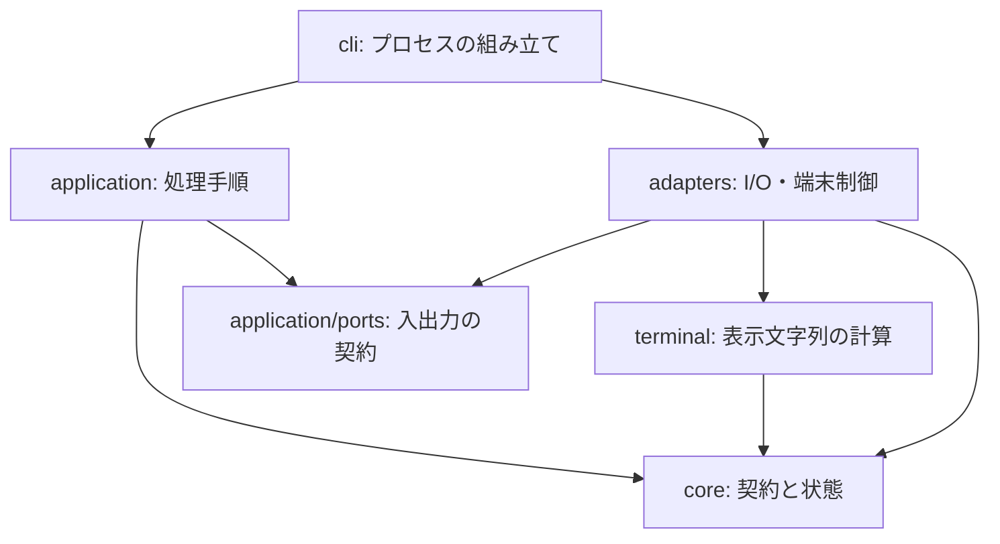

# hamio 実装設計

hamio は一つの CLI プロセス内で、要求の検証、フォーム値の解決、run / task の状態管理、端末表示、JSON 応答を処理する。公開する入出力は [API v1](api.md)に従い、業務処理は利用側が実行する。

本書は実装に参加する開発者向けに、モジュールの依存方向、処理の流れ、状態と資源の所有者を定める。製品の目的と品質条件は[基本設計](design.md)、操作コマンドは[開発手順](development.md)を参照する。

## 1. モジュールの構成

契約と状態の規則、コマンドの処理手順、表示文字列の計算、外部への入出力を別の責務とする。CLI は必要な実装を組み立てて渡す。

矢印は主要な実装の依存方向を表す。`application` は具体的なアダプターを import しない。`adapters` は `application/ports.ts` のインターフェースに従って動作する。表示設定の値型 `Appearance` は `application/command.ts` にあり、`adapters` と `terminal` から型として参照する。

| 層            | 外部との接続                             | 保持するもの                                           |
| ------------- | ---------------------------------------- | ------------------------------------------------------ |
| `core`        | なし                                     | 検証済みのデータ、フォームの解決結果、Session 内の状態 |
| `application` | 渡された入出力インターフェースを呼ぶ     | コマンド、処理中の回答、Session、event 出力バッチ      |
| `terminal`    | なし                                     | 表示設定と、表示計算に使う補助オブジェクト             |
| `adapters`    | ファイル、ストリーム、端末、timer        | 入力の未完成行、出力待ち、質問と進捗の寿命             |
| `cli`         | process の標準入出力、環境、signal、終了 | アダプター、AbortController、signal listener           |

`core` は I/O、環境変数、timer、端末ライブラリへ依存しない。Session の更新はインスタンス内に閉じ、保持する Map や Set を外へ公開しない。`terminal` は渡された値から文字列を生成し、書き込みを行わない。処理順序を変える場合は `application`、出力先や端末制御を変える場合は `adapters`、表示規則を変える場合は `terminal` が変更の入口となる。

## 2. ファイルの役割

### 契約と状態

| ファイル                                        | 責務                                                       |
| ----------------------------------------------- | ---------------------------------------------------------- |
| [core/contract.ts](../src/core/contract.ts)     | 実装版、API 版、型、資源上限、安定したエラー               |
| [core/validation.ts](../src/core/validation.ts) | 未知の JSON を検証済みモデルへ変換する                     |
| [core/form.ts](../src/core/form.ts)             | 提供値・既定値の解決、項目制約、必須の不足を判定する       |
| [core/session.ts](../src/core/session.ts)       | run / task の状態遷移、保持上限、描画用 snapshot、最終集計 |
| [core/redaction.ts](../src/core/redaction.ts)   | 表示データに指定された秘密値を除く                         |

### コマンドと実行境界

| ファイル                                                | 責務                                                                      |
| ------------------------------------------------------- | ------------------------------------------------------------------------- |
| [application/command.ts](../src/application/command.ts) | 引数と環境値からコマンド・表示条件を決め、help と capabilities を定義する |
| [application/ports.ts](../src/application/ports.ts)     | 読み取り、書き込み、質問、描画に必要なインターフェース                    |
| [application/run.ts](../src/application/run.ts)         | コマンドの処理順序、応答、event 出力バッチ、失敗の変換                    |
| [cli.ts](../src/cli.ts)                                 | 標準入出力と実装の接続、環境の読み取り、signal、中断、終了コード          |

### 入出力と表示

| ファイル                                                  | 責務                                                         |
| --------------------------------------------------------- | ------------------------------------------------------------ |
| [adapters/input.ts](../src/adapters/input.ts)             | 上限付き UTF-8 読み取り、NDJSON の切り出し、入力中断         |
| [adapters/output.ts](../src/adapters/output.ts)           | 書き込み完了、エラー、5秒の期限、listener の解放             |
| [adapters/prompts.ts](../src/adapters/prompts.ts)         | Clack への変換、キー入力、質問ごとの上限、出力待ち、端末復旧 |
| [adapters/terminal.ts](../src/adapters/terminal.ts)       | 表示行のバッチ書き込み、進捗 timer、描画中断と終了           |
| [terminal/text.ts](../src/terminal/text.ts)               | 外部文字列の無害化、表示幅、省略                             |
| [terminal/format.ts](../src/terminal/format.ts)           | 色、通知、値の一覧、表、結果、進捗の文字列                   |
| [terminal/prompt-view.ts](../src/terminal/prompt-view.ts) | 質問の状態別画面、入力カーソル、選択肢の表示範囲             |

## 3. コマンドと入出力の接続

CLI は起動時に stdin・stdout・stderr、TTY、端末幅、`TERM`、`CI`、`NO_COLOR` を読み取る。`parseCommand` には引数と環境値を渡し、コマンド、対話可否、色、幅、進捗描画の可否を決める。判定処理自身は環境を読み取らず、書き換えない。

コマンドは種類ごとの union とする。フォームだけが定義・提供値・対話条件を持ち、連続表示だけが event 出力の指定を持つ。適用できないオプションと不正な組み合わせは入力を読む前に拒否する。表示幅は20〜240列に収める。

`execute` に渡す `Ports` は、処理手順が必要とする機能だけを公開する。

| 要素                             | 意味                                               |
| -------------------------------- | -------------------------------------------------- |
| `output.write(text)`             | 応答を書き、完了まで待つ                           |
| `signal`                         | 実行の中断通知                                     |
| `readDocument(path)`             | 上限付きで UTF-8 文書を読む                        |
| `readEvents()`                   | 入力 read ごとに、遅延評価する行の iterable を返す |
| `openView(appearance)`           | 人向け表示を開く                                   |
| `ask(fields, title, appearance)` | 指定した不足項目を質問し、検証済み回答を返す       |

CLI はこのインターフェースへ実アダプターを渡す。試験ではメモリ上の読み書きなどを渡し、端末やファイルを用意せずに処理順序を確認できる。フォーム値、Session、出力バッチ、キャンセルは実行ごとに所有する。

機械向けの `render`・`stream` は `openView` を呼ばない。フォームは対話が必要なときだけ `ask` を呼ぶ。CLI はその時点で対応する端末アダプターを動的に読み込む。プロセス全体の初期化へ UI の初期化を組み込まない。

## 4. 入力検証

`readDocument` は256 KiBまでのバイト列を読み、UTF-8 として decode する。連続表示の入力は1行64 KiBを上限とする。不正な UTF-8 は I/O の境界で拒否し、JSON の構文と意味は `core` で検証する。

公開要求の入口は `decodeForm`、`decodeValues`、`decodeDisplay`、`decodeEvent` とする。処理は次の順とする。

1. JSON を `unknown` として解析する。
2. 階層、ノード数、文字列、予約キーなどの共通制約を一度検証する。
3. 種類ごとの許可キー、必須項目、型、数値範囲、件数を検証する。
4. 既定値を補完した検証済みモデルを返す。

種別の検証は共通検証済みの JSON 型を受け取り、同じ木を共通制約のために繰り返し走査しない。後続の状態管理と表示は検証済みモデルを使い、独自の要求解釈を重ねない。公開する具体的な上限は [API 契約](api.md#資源上限と機能照会)に集約する。

## 5. フォームと対話

### 値の解決

`application` は定義と提供値を読み、`resolveForm` に渡す。提供値、既定値の順に採用し、項目の型・長さ・選択肢・必須条件を確認する。結果は無効値、または回答済みの値と不足項目の union で返す。

| 判定                     | 動作                                       |
| ------------------------ | ------------------------------------------ |
| 無効な提供値がある       | 質問を開かず `invalid_values` を返す       |
| 必須の不足があり、非対話 | `needs_input` と不足項目 ID を返す         |
| 必須の不足があり、対話   | 不足項目だけを配列順に質問する             |
| 回答が揃っている         | 検証済みの回答を一つの成功 JSON として返す |

任意項目は提供値も既定値もなければ省略する。無効値、不足、中断では部分回答を返さない。質問後の回答はアダプターの出口で共通の項目制約を検証してから `application` へ返す。

### 質問と端末

`@clack/core` 1.5.1 の入力・確認・選択・複数選択・秘密入力のクラスに、キー操作と質問状態を委譲する。質問の画面は `terminal/prompt-view.ts` の関数が作る。Clack の型と設定は `adapters/prompts.ts` に閉じる。[Clack Core の render・入出力 API](https://bomb.sh/docs/clack/packages/core/)

stdin をキー入力、stderr を画面、stdout を回答に使う。質問は一つずつ開き、質問間では出力を排出する。入力は1質問16 KiB、描画待ち行列は256 KiBを上限とする。選択肢はカーソルの周囲を最大8件表示し、長い文字入力はカーソル周辺だけを表示計算に使う。

秘密入力の画面にはマスク済み文字列だけを渡し、確定画面には `[redacted]` を表示する。実値は成功応答の `values` へだけ含める。SIGINT、SIGTERM、EOF、Ctrl-C、Ctrl-D、出力障害では質問を閉じ、listener、raw mode、カーソルを復旧する。

## 6. 表示データと文字列

表示定義は全体を検証してから処理する。JSON 形式では正規化した部品を返し、人向け形式では表示行を生成する。秘密指定の適用は `core/redaction.ts` に置き、端末に依存せず両形式で同じ規則を使う。自由文と `result.data` の秘密情報は利用側が管理する。

表示文字列は次の順で作る。

1. 外部文字列に含まれる端末命令を除く。
2. 制御文字と双方向制御文字を無害化する。
3. `Bun.stringWidth` で幅を測り、必要なら書記素の境界で省略する。
4. hamio の色と装飾を組み立てる。

通常の文字列はそのまま幅計算へ進める。書記素を扱う `Intl.Segmenter` は省略が必要になった時点で初期化する。機械向けの非秘密値には表示上の省略や置換を適用しない。

表は20行まで表示し、省略件数を示す。表と結果の formatter は行を逐次生成し、端末アダプターは16 KiBを目安にまとめて書く。行を分割しないため、閾値には最大1行分が加わる。行ごとの非同期書き込みと、全行分の待ち行列を作らない。

## 7. 連続表示

### 入力の切り出しと適用

`readEvents` は1回の入力 read ごとに行の iterable を返す。完全な行は入力バッファを直接 decode する。read をまたぐ未完成行だけをコピーし、次の read まで保持する。改行検索と行の切り出しは同期処理とし、非同期の待機は read と出力の境界に置く。

行は必要な分だけ切り出す。`application` は各行を検証して Session へ適用し、受理した event に応じて表示と応答を行う。`run.finish` を受理したら、同じ read の残りも処理せずに最終応答を返す。完了前の EOF はプロトコル違反とする。

### Session の状態

Session は run の開始前・実行中・完了を union で表す。実行中の状態は run ID と直前の seq、完了状態は確定した業務結果を持つ。構造の検証は decoder、順序と状態の検証は Session の責務とする。

| 保持データ                 | 寿命と上限                        |
| -------------------------- | --------------------------------- |
| run ID、seq、集計値        | run 終了まで                      |
| 活動中 task のラベル・進捗 | task.finish まで。最大100件       |
| 使用済み task ID           | run 終了まで。最大10,000件        |
| warning / error 通知       | 最終応答まで。合計100件           |
| 確定した業務結果           | run.finish の受理から最終応答まで |

task は未使用 ID で開始し、活動中だけ進捗更新と完了を受け付ける。進捗は単調に増加し、total を変えない。すべての task の完了を `run.finish` の前提とする。Session は完了結果を自ら所有し、最終集計時に別の結果を外から受け取らない。

描画用 snapshot は必要な状態だけをコピーして返す。外へ Map や Set を渡さない。info / success 通知と完了 task の詳細を最終応答用の履歴へ蓄積しない。

### event 応答

機械出力の既定は最終応答のみとする。`--events` を指定した場合は、受理済み event を順序通りの NDJSON として返す。application が持つ出力バッチは16 KiBを閾値とし、最大1応答分が加わる。応答サイズは入力制約から制限される。

閾値に達したとき、各 read の処理が終わったとき、run が完了したとき、エラーで終了するときに排出する。次の入力を待つ前に出力するため、送信側が停止しても受理済み event をバッチに残さない。後続 event が不正な場合も、受理済み event をエラー応答より前に配送する。配送自体に失敗した場合は終了コードで失敗を示す。

## 8. 描画と資源の寿命

### 進捗描画

`TerminalView` は最新状態を取得する関数、timer、実行中の書き込みをそれぞれ一つだけ持つ。`progress` は表示文字列を作らず、次の描画で読む状態を指定する。timer が発火したときに snapshot と文字列を生成し、最大10 fpsで一行を更新する。

書き込み中は次の描画を始めず、更新を最新状態へ集約する。完了後に必要な描画だけを予約する。通知と結果は保留中の進捗を整理してから書く。変化がなければ timer を動かさず、`close` 後は再描画しない。状態の取得や書き込みの失敗はプロセスの中断経路へ伝える。

### 中断と後始末

| 所有者         | 資源                                                     | 終了時の処理                                                  |
| -------------- | -------------------------------------------------------- | ------------------------------------------------------------- |
| cli            | AbortController、signal listener、標準入出力のアダプター | listener を外し、stdin を停止し、出力アダプターを閉じる       |
| 入力アダプター | 読み取り中のストリーム、未完成行                         | 中断を読み取りへ伝え、listener と保持バッファを解放する       |
| 出力アダプター | 書き込み、error listener、期限 timer                     | 完了・エラー・5秒の期限を処理し、listener と timer を解放する |
| 質問アダプター | 質問、キー入力 listener、描画待ち行列、端末状態          | 質問を中断し、出力を排出または失敗させ、端末を復旧する        |
| 端末アダプター | 進捗 timer、書き込み、最新状態の取得関数                 | timer を止め、書き込みを待ち、描画行と保留状態を整理する      |
| application    | View、event 出力バッチ、実行状態                         | finally でバッチの排出と View の終了を行う                    |

AbortController は CLI のプロセス中断の入口とし、入力と質問へ signal を渡す。利用側の業務処理や子プロセスは停止しない。業務の取り消しと hamio の資源解放は、それぞれの所有者が行う。

### エラー応答

`ContractError` は公開エラーの code と終了コードを持つ。`reportFailure` は中断、契約エラー、内部障害を応答へ変換する。入力値、ファイル内容、秘密、stack を応答へ含めない。出力障害でエラー JSON 自体を送れない場合は終了コード7を返す。

出力先の停止や切断では無制限に待機・再試行しない。正常終了、入力不正、中断、表示障害のいずれでも同じ所有関係に従って後始末する。

## 9. ビルドと配布候補

[flake.nix](../flake.nix) は開発用 Bun と同梱用 Bun を同じ Nix 入力で固定する。開発用は Nixpkgs のパッケージ、同梱用は Nixpkgs の `bun.src` が版・SHA-256 を指定する公式アーカイブから用意する。同梱用には Nix 向け loader 修正を加えない。

Nix shell が設定する `HAMIO_BUN_RUNTIME` を [build.ts](../scripts/build.ts) の `compile.executablePath` へ渡す。入口は `src/cli.ts` とし、本体と製品依存を bundle する。[Bun の実行ファイル仕様](https://bun.com/docs/bundler/executables)

| 項目         | 設定                                                                              |
| ------------ | --------------------------------------------------------------------------------- |
| 実行ファイル | `dist/hamio`。ホストの OS・CPU 向け                                               |
| 最適化       | minify 有効。bytecode と smol は使わない                                          |
| 暗黙設定     | `.env`、`bunfig.toml`、`package.json`、`tsconfig.json` の自動読み込みを無効にする |
| 依存取得     | `--no-install`。実行時の外部 import や依存取得を設けない                          |
| 製品依存     | `@clack/core` と推移依存を `bun.lock` の版・integrity で固定する                  |
| 開発用依存   | 検査、hooks、画像生成のツールは製品に含めない                                     |
| 圧縮候補     | `bun run package` で gzip level 9 の `dist/hamio.gz` を生成する                   |

ビルド中に別のランタイムをダウンロードしない。圧縮は配布候補を用意するときに明示的に行い、日常の build・check へ待ち時間を加えない。圧縮は転送量に作用し、展開後の実行ファイルと実行メモリは変えない。

Bun の `BUN_OPTIONS` と `BUN_BE_BUN` はアプリの入口より前に作用するため、起動元の環境を信頼境界に含める。実行ファイルには OS 標準ライブラリも必要となる。署名、provenance、SBOM、資産の検証と公開は[リリースの受け入れ条件](design.md#12-リリースの受け入れ条件)に従う別工程とする。

## 10. 検証の構成

試験は利用側が観測する回答、終了状態、順序、秘密の扱い、資源の寿命を中心にする。I/O のない規則は直接検証し、実際の CLI・端末・実行ファイルでも接続を確認する。

| 対象             | 確認内容                                                                 | 入口                                                                                 |
| ---------------- | ------------------------------------------------------------------------ | ------------------------------------------------------------------------------------ |
| 契約・状態・CLI  | 不正要求、値の解決、順序、上限、UTF-8、秘密、終了コード                  | [api.test.ts](../tests/api.test.ts)                                                  |
| PTY              | 入力5種、日本語、キャンセル、貼り付け上限、端末復旧                      | [api.test.ts](../tests/api.test.ts)                                                  |
| 実行境界・描画   | 同時呼び出しの分離、event の順序と排出、遅い出力、描画時評価、終了と失敗 | [runtime.test.ts](../tests/runtime.test.ts)                                          |
| 同梱実行ファイル | Bun が PATH にない環境、暗黙設定、Shell 連携、端末入力                   | [executable.test.ts](../tests/executable.test.ts)                                    |
| 開発基盤         | Git hooks の拒否・復元と、録画・再利用・更新漏れの検出                   | [hooks.test.ts](../tests/hooks.test.ts)、[preview.test.ts](../tests/preview.test.ts) |
| 見た目           | 製品入口を通した入力・進捗・結果の PNG と GIF                            | [プレビュー一覧](previews/README.md)                                                 |
| 性能             | 起動、表、event、同時実行、PTY 応答、CPU・maxRSS・サイズ                 | [測定手順](development.md#製品試験と性能測定)                                        |

性能記録には入力、環境、ソースと生成物の hash、全サンプルを残す。試験コードの存在、実行済みの OS、測定結果、正式な保証範囲を区別する。
