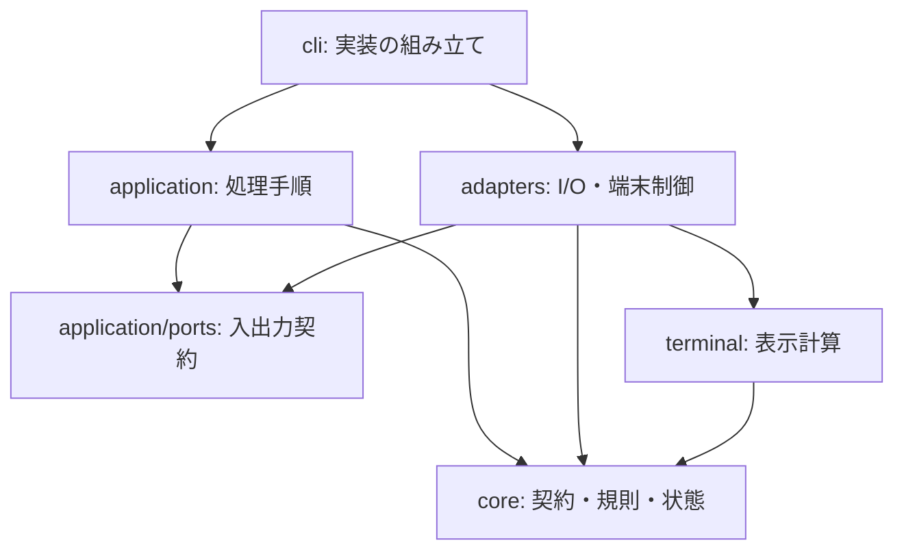

# hamio 実装設計

hamio の製品コードは、検証済みの質問・表示・状態を受け取り、画面と JSON 応答を生成する。業務処理は呼び出さない。実行ごとの状態と I/O の寿命を明示し、規則と表示計算を端末なしで検証できる構成とする。

本書はモジュール、依存方向、処理順序、副作用の所有者を定める。製品の目的と品質条件は[基本設計](design.md)、公開形式は [API 契約](api.md)、コマンド操作は[開発手順](development.md)と[配布手順](distribution.md)を参照する。

## 1. モジュールと依存方向

具体的なアダプターを選ぶのは CLI とする。`application` は `Ports` を受け取り、アダプターを import しない。`core` と表示計算は環境・標準入出力・timer を参照しない。

| 配置                                 | 所有する判断・状態                                 | 外部への作用                                   |
| ------------------------------------ | -------------------------------------------------- | ---------------------------------------------- |
| `src/core/`                          | 入力検証、回答の解決、run / task の遷移、秘密指定  | なし。Session の状態はインスタンス内で更新する |
| `src/application/`                   | コマンドの意味、処理順序、応答、バッチ             | 渡された入出力契約を呼ぶ                       |
| `src/terminal/`                      | 無害化、幅、省略、質問・表・進捗の文字列           | なし                                           |
| `src/adapters/`                      | ファイル、入力バッファ、出力待ち、質問・描画の寿命 | I/O、端末制御、timer                           |
| `src/cli.ts`                         | プロセスの環境、実装の接続、中断、終了             | 環境参照、signal、プロセス終了                 |
| `scripts/build/`・`scripts/release/` | ビルド入力、配布候補、検証、配置                   | 作業ファイル、依存取得、ビルド用子プロセス     |

表示条件の値型 `Appearance` は `terminal/appearance.ts` に置く。色、幅、live 表示の可否を表し、application と adapter も型として参照する。Bun・Clack 固有の型は公開契約へ含めない。製品コードはビルド・配布コードに依存しない。

## 2. コマンドの組み立てと入出力契約

[cli.ts](../src/cli.ts) は標準入出力、TTY、幅、`TERM`、`CI`、`NO_COLOR` を読み、値として [parseCommand](../src/application/command.ts) に渡す。parser は種類ごとの union を返し、無効なフラグや組み合わせを入力読み取り前に拒否する。表示幅は20〜240列へ収める。

照会コマンドの応答は [metadata.ts](../src/application/metadata.ts) が生成する。`package.json` の版もここで静的に参照する。CLI は help・version・capabilities に直接応答し、その他のコマンドで入力アダプターと [execute](../src/application/run.ts) を読み込む。

`execute` は次の [Ports](../src/application/ports.ts) を使う。

| 操作                             | 契約                                          |
| -------------------------------- | --------------------------------------------- |
| `output.write(text)`             | 応答を書き、完了まで待つ                      |
| `signal`                         | キャンセルまたは実行障害による中断を伝える    |
| `readDocument(path)`             | 上限付きの UTF-8 文書を返す                   |
| `readEvents()`                   | read ごとの、行を遅延評価する iterable を返す |
| `openView(appearance)`           | 人向け表示を開く                              |
| `ask(fields, title, appearance)` | 不足項目を質問し、検証済み回答を返す          |

本番では CLI が I/O を接続し、試験ではメモリ上の操作などを渡す。回答、Session、バッチ、中断状態を呼び出しごとに生成する。JSON の render・stream は View を開かず、form は対話可能な必須不足項目がある場合だけ ask を呼ぶ。端末アダプターはこれらの呼び出し時に読み込む。

## 3. 入力から検証済みモデルへの変換

[input.ts](../src/adapters/input.ts) が読み取り量、UTF-8、中断を扱い、[validation.ts](../src/core/validation.ts) がデータの意味を検証する。入口は `decodeForm`、`decodeValues`、`decodeDisplay`、`decodeEvent` とする。

1. 入力を上限内で読み取る。単発文書は256 KiB、連続入力は1行64 KiBまでとする。
2. JSON を `unknown` として解析する。
3. 階層、ノード数、文字列、数値、予約キーの共通制約を検証する。
4. 種類ごとの許可キー、必須項目、型、範囲、件数を検証し、既定値を補ったモデルを返す。

共通検証済みの JSON 型を種別の検証へ渡し、同じ木を重複検査しない。文字列は Unicode の妥当性を検証する。UTF-16 の1コード単位が最大3 UTF-8 bytesであることから短い文字列の byte 長の再走査を省き、境界付近では実際の byte 長を測る。event のモデルは検証した値から直接組み立てる。

型、API 版、上限、公開エラーは [contract.ts](../src/core/contract.ts) が定義する。状態管理と表示は検証済みモデルを扱う。[API の資源上限](api.md#資源上限と機能照会)を正本とし、型アサーションを外部入力の検証の代わりにしない。

## 4. フォームの回答と対話

[resolveForm](../src/core/form.ts) は定義と提供値から回答を決める。明示値を優先し、値がなければ既定値を使う。型、長さ、選択肢、必須条件を確認して次の状態を返す。

| 状態                   | application の処理                     |
| ---------------------- | -------------------------------------- |
| 無効な提供値           | 質問を開始せず `invalid_values` を返す |
| 非対話で必須回答が不足 | `needs_input` と不足項目 ID を返す     |
| 対話で必須回答が不足   | 定義の配列順に不足項目を質問する       |
| 必須回答が揃っている   | 成功 JSON を返す                       |

任意項目は値も既定値もなければ省略する。対話で取得した回答にも同じ制約を適用する。不足、無効値、中断では部分回答を返さない。

[prompts.ts](../src/adapters/prompts.ts) は Clack の文字入力、確認、単一選択、複数選択、秘密入力へ接続する。Clack がキー操作と状態を管理し、[prompt-view.ts](../src/terminal/prompt-view.ts) が表示を計算する。

キー入力は stdin、画面は stderr、回答は stdout を使う。質問は一つずつ開き、質問間で出力を排出する。1質問の入力は16 KiB、出力待ち行列は256 KiBを上限とする。選択肢はカーソル周囲の最大8件、長い文字入力はカーソル周辺を表示する。

秘密入力の表示計算にはマスク済み文字列を渡す。確定画面は `[redacted]` とし、実値は成功応答の `values` にだけ含める。中断・出力障害では質問を閉じ、listener、raw mode、カーソルを復旧する。

## 5. 表示の正規化と文字列計算

render は全体の検証後に表示または JSON 応答を生成する。[redaction.ts](../src/core/redaction.ts) の規則で秘密値を `[redacted]` に置換する。JSON は全行に適用し、秘密指定のない部品は複製しない。人向け表示は画面へ出すセルに同じ置換を適用する。自由文と `result.data` の秘密は利用側が管理する。

[text.ts](../src/terminal/text.ts) は外部の端末命令、制御文字、双方向制御文字を無害化する。`Bun.stringWidth` と必要時に初期化する `Intl.Segmenter` を使い、書記素を分断せずに幅へ収める。[format.ts](../src/terminal/format.ts) が装飾と表示行を組み立てる。これらの表示上の省略・置換を、JSON の非秘密値へ適用しない。

表は20行まで描画し、省略した件数を示す。formatter は行を逐次生成し、[BatchWriter](../src/application/batch.ts) が16 KiBを目安に書き込む。同じバッチ機構を event 応答でも使う。バッチには行全体を追加してから閾値を判定するため、最大1行分だけ閾値を超え得る。呼び出し元は排出の完了を待つ。

## 6. 連続入力と run の状態

### 行の取得と処理順序

`readEvents` は1回の read ごとに行の iterable を返す。完全な行は入力バッファから直接 decode し、read をまたぐ未完成行だけをコピーして保持する。行の切り出しと適用は同期処理とし、read と出力の境界で待機する。

application は必要な行を順に検証して [Session](../src/core/session.ts) へ適用する。`run.finish` を受理すると、その read の残りも評価せず最終応答を返す。完了前の EOF はプロトコル違反とする。

### 状態と保持データ

Session は開始前・実行中・完了を union で表す。decoder は構造を、Session は run ID、seq、task の順序と遷移を検証する。

| データ                     | 寿命・上限                          |
| -------------------------- | ----------------------------------- |
| run ID、直前の seq、集計値 | run 終了まで                        |
| 活動中 task のラベル・進捗 | task 完了まで。最大100件            |
| 使用済み task ID           | run 終了まで。最大10,000件          |
| warning / error 通知       | 最終応答まで。合計100件             |
| 業務結果                   | `run.finish` の受理から最終応答まで |

未使用の ID で task を開始し、活動中の task に進捗・完了を適用する。進捗は単調増加、total は固定とする。全 task が完了するまで `run.finish` を受理しない。利用側から受け取った業務結果を、UI 内部の集計結果で上書きしない。

描画用 snapshot は必要な値だけをコピーし、内部の Map・Set を公開しない。info / success 通知、完了 task の詳細、全 event の履歴は蓄積しない。

### event 応答

既定の機械出力は最終応答一つとする。`--events` 指定時は受理済み event を順序通りの NDJSON で返す。バッチは閾値到達、read の処理終了、run 完了、エラー時に排出する。

次の入力を待つ前に受理済み event を送り、後続の不正 event に対するエラーも順序を保つ。途中進捗の描画集約と `--events` の配送は別の経路とする。配送失敗は終了コードで知らせる。

## 7. 描画の予約と背圧

[TerminalView](../src/adapters/terminal.ts) は最新状態の取得関数、timer、進行中の書き込みを各一つ持つ。更新要求は取得関数を置き換え、timer が必要な状態と文字列を計算して最大10 fpsで描画する。

書き込み中の更新は最新状態に集約する。描画文字列が直前の進捗行と同じなら書かない。通知と結果を表示するときは進捗の timer・書き込みを整理し、行を消して記憶した文字列も破棄する。次の進捗は同じ内容でも描画できる。close 後に描画を予約しない。

[Output](../src/adapters/output.ts) は書き込み完了、エラー、5秒の期限を扱う。呼び出し元が完了を待ち、出力待ちを無制限に積み上げない。背景の描画で発生した状態取得・書き込みの失敗も、中断経路と後始末へ接続する。

## 8. 終了・中断・障害

CLI は一回の実行に `AbortController` を割り当て、SIGINT と SIGTERM を中断へ変換する。質問中の Ctrl-C、EOF、Ctrl-D でも回答を確定せず質問を閉じる。業務処理の中断・再開は利用側が制御する。

| 所有者         | 終了時の処理                                                      |
| -------------- | ----------------------------------------------------------------- |
| CLI            | signal listener を外し、stdin を pause し、出力アダプターを閉じる |
| 入力アダプター | read を中断し、listener と保持バッファを解放する                  |
| 出力アダプター | 書き込みの成否を確定し、listener と期限 timer を解放する          |
| 質問アダプター | 質問を中断し、出力を排出または失敗させ、端末を復旧する            |
| 端末アダプター | timer を止め、書き込みを待ち、描画行と保留状態を整理する          |
| application    | finally で event 応答を排出し、View を閉じる                      |

[response.ts](../src/application/response.ts) は応答の符号化と `reportFailure` を担当する。契約違反は `ContractError` の公開 code と終了コードを使い、内部障害は一般化した `UI_ERROR`、中断は `cancelled` へ変換する。入力値、ファイル内容、秘密、stack を含めず、エラー JSON 自体を書けない場合も終了コード7で失敗を示す。

## 9. ビルドと配布の境界

### 実行ファイルの生成

[flake.nix](../flake.nix) は開発用 Bun と同梱用の公式 Bun を同じ Nix 入力で固定する。同梱用には Nix 向け loader 修正を加えない。[build.ts](../scripts/build.ts) がルート、`HAMIO_BUN_RUNTIME`、出力先を読み、[compiler.ts](../scripts/build/compiler.ts) へ渡す。

compiler は `src/cli.ts` と製品依存を bundle し、指定した実行ファイルだけを作る。通常の出力は `dist/hamio`、試験と梱包は各自の一時領域とする。製品版は package の静的 import で埋め込む。

| 設定     | 値                                                                            |
| -------- | ----------------------------------------------------------------------------- |
| 最適化   | minify 有効。bytecode・smol は使わない                                        |
| 暗黙設定 | `.env`、`bunfig.toml`、`package.json`、`tsconfig.json` の自動読み込みを無効化 |
| 依存取得 | `--no-install`。実行時の外部 import・取得を設けない                           |
| 圧縮     | 梱包時に gzip level 9。build・check は圧縮しない                              |

`BUN_OPTIONS` と `BUN_BE_BUN` はアプリの入口より前に作用する。起動元の環境と OS 標準ライブラリを実行条件に含める。[Bun の実行ファイル仕様](https://bun.com/docs/bundler/executables)

### 配布モジュール

| モジュール                                            | 入力と責務                                                                           |
| ----------------------------------------------------- | ------------------------------------------------------------------------------------ |
| [source.ts](../scripts/release/source.ts)             | ソースの内容、commit、commit 時刻、変更有無を取得し、複製・内容 hash・変更検出を提供 |
| [dependencies.ts](../scripts/release/dependencies.ts) | 指定ルートの解決済み production 依存とライセンス本文を安定順で取得                   |
| [metadata.ts](../scripts/release/metadata.ts)         | 渡された値から対象・版・SBOM を計算。ファイルと現在時刻を読まない                    |
| [pipeline.ts](../scripts/release/pipeline.ts)         | 指定ソース・ランタイム・作業領域から一つの配布候補を生成                             |
| [artifacts.ts](../scripts/release/artifacts.ts)       | ストリームによる圧縮・hash、資産一覧、生成済みディレクトリの配置                     |
| [process.ts](../scripts/release/process.ts)           | ビルド用子プロセスの実行、終了待ち、時間・診断出力量の制限                           |
| [package.ts](../scripts/release/package.ts)           | 一候補の生成、入力再確認、配置、一時領域の解放                                       |
| [verify.ts](../scripts/release/verify.ts)             | 二候補の比較、展開後の試験、入力再確認、資産・検証記録の保存                         |
| [preflight.ts](../scripts/release/preflight.ts)       | 公開元、タグ、版、ライセンス、clean worktree、master への包含の検査                  |

### 入力の固定と候補の生成

取得対象は `src/`、ビルド・配布スクリプト、インストーラー、Release workflow、package、lockfile、Nix 定義、TypeScript 設定、LICENSE とする。symlink を拒否し、相対パスとファイル内容の hash から入力全体を特定する。SBOM の日時は commit 時刻から決める。

候補ごとにソースを複製し、`bun install --frozen-lockfile --ignore-scripts` で依存を取得する。ビルド後に本体の版とランタイムの内容 hash を照合し、gzip、checksum、SBOM、notices を生成する。Bun の版・revision・notices はレビュー済みの値と照合する。macOS の候補には共通インストーラーも含める。

子プロセスから `BUN_OPTIONS` と `BUN_BE_BUN` を除き、120秒の期限、stdout・stderr 各2 MiBの上限を設ける。診断の表示量も制限し、失敗時は子プロセスを終了させて待つ。依存取得とファイル生成は候補の作業領域で行い、共有の `dist/hamio` や試験の生成物を入力に使わない。

### 検証と配置

`release:verify` は異なるディレクトリで候補を順次生成し、公開する全ファイルの名前と SHA-256 を比較する。一つ目の gzip を展開して実行ファイルの hash を照合し、`HAMIO_TEST_BINARY` で API・端末試験へ渡す。渡された実行ファイルは試験で再ビルドしない。

公開資産の保存前に入力の内容・commit・変更有無を再確認する。出力先の lock を取得し、古い資産ディレクトリを退避してから候補へ入れ替える。配置失敗時は退避した資産を復元する。復元にも失敗した場合は退避先を残し、場所を含むエラーを返す。各コマンドが一時領域と lock の後始末を所有する。

検証済み資産は `dist/release/`、検証記録は `dist/release-verification.json` に置く。GitHub の証明発行・公開・公開物の導入は [Release workflow](../.github/workflows/release.yml) が担当する。利用側の配置は [install.sh](../scripts/install.sh)、CI との接続は [action.yml](../action.yml) が担当する。

## 10. 検証の構成

試験は利用側が観測する回答、状態、終了コード、秘密の扱い、資源の寿命を中心とする。純粋関数の試験と、実際の CLI・PTY・実行ファイルの試験を組み合わせる。

| 対象                 | 確認内容                                                              | 入口                                                                                 |
| -------------------- | --------------------------------------------------------------------- | ------------------------------------------------------------------------------------ |
| 契約・状態・CLI・PTY | 定義、回答、エラー、順序、上限、UTF-8、秘密、日本語入力、中断         | [api.test.ts](../tests/api.test.ts)                                                  |
| 実行境界・描画       | 呼び出しの分離、バッチ、遅い出力、描画集約、同一文字列、終了後の資源  | [runtime.test.ts](../tests/runtime.test.ts)                                          |
| 同梱実行ファイル     | Bun のない PATH、暗黙設定、Shell 連携、端末入力                       | [executable.test.ts](../tests/executable.test.ts)                                    |
| 配布・更新           | pin、更新・ロールバック、由来と hash の失敗、lock、既存ファイル、在庫 | [distribution.test.ts](../tests/distribution.test.ts)                                |
| ビルド・再現性       | 独立ルートの一致、既存出力からの独立、ソース変更、symlink、配置の復元 | [release.test.ts](../tests/release.test.ts)                                          |
| 開発基盤             | hooks の拒否と復元、録画、再利用、更新漏れ                            | [hooks.test.ts](../tests/hooks.test.ts)、[preview.test.ts](../tests/preview.test.ts) |
| 配布候補             | 二回の依存取得・梱包、全資産の一致、展開した実行ファイル              | `bun run release:verify`                                                             |
| 見た目               | 入力・進捗・結果の PNG・GIF                                           | [プレビュー](previews/README.md)                                                     |
| 性能                 | 起動、応答、CPU、メモリ、並列処理、サイズ、出力量                     | [測定手順](development.md#製品試験と性能測定)                                        |

通常の実行ファイル試験は一時領域へビルドする。再現性の通常試験は同じ依存を使って異なるルートの実行ファイルを比較し、依存取得から全資産までの比較は `release:verify` で行う。

配布の失敗処理は GitHub CLI の代替実装で検証し、実際の署名・公開資産の結び付きは公開後の導入試験で確認する。試験の存在と実施済みの結果を区別し、対象ソース・環境・未確認範囲を結果に記録する。
