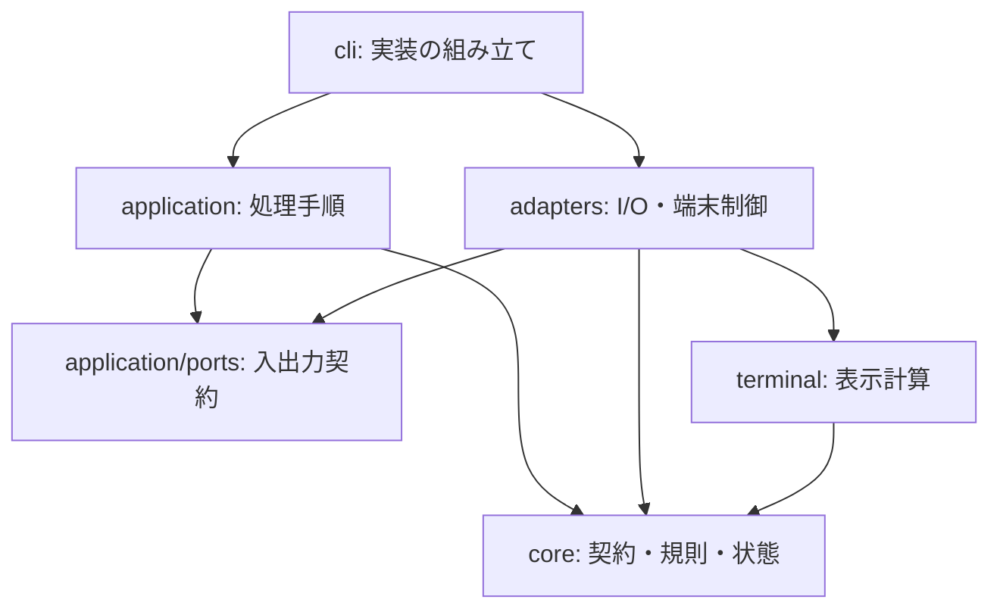

# hamio 実装設計

hamio の実装は、外部入力を検証済みモデルへ変換し、回答・業務状態をターミナル表示と JSON 応答へ変換する処理で構成する。実行状態と資源の寿命は一回の呼び出しに閉じる。業務処理は利用側が実行し、hamio のモジュールは業務のコマンドや権限を持たない。

本書はモジュールの依存方向、処理順序、副作用、資源の所有者を定める。製品の責務は[基本設計](design.md)、公開データは [API 契約](api.md)、操作は[開発手順](development.md)と[配布手順](distribution.md)を参照する。

## 1. モジュールと依存方向

| 配置                                 | 所有する判断・状態                                | 外部への作用                                   |
| ------------------------------------ | ------------------------------------------------- | ---------------------------------------------- |
| `src/core/`                          | 入力検証、回答の解決、run / task の遷移、秘密指定 | なし。Session の状態更新はインスタンス内で完結 |
| `src/application/`                   | コマンドの意味、処理順序、応答、出力バッチ        | 渡された入出力契約を呼ぶ                       |
| `src/terminal/`                      | 無害化、幅、省略、質問・表・進捗の文字列          | なし                                           |
| `src/adapters/`                      | 入力バッファ、出力待ち、質問・描画の寿命          | ファイル、ストリーム、端末、timer              |
| `src/cli.ts`                         | 環境の取得、実装の接続、中断、終了                | 環境参照、signal、プロセス終了                 |
| `scripts/build/`・`scripts/release/` | ビルド入力、候補、検証、配置                      | 作業ファイル、依存取得、ビルド用子プロセス     |

具体的な adapter を選ぶのは CLI とする。application は `Ports` を受け取り、adapter を import しない。core と表示計算は環境・標準入出力・timer を参照せず、製品コードはビルド・配布コードに依存しない。

色、幅、live 表示の可否は `terminal/appearance.ts` の値型 `Appearance` で共有する。Bun・Clack 固有の型は adapter の実装に閉じ、利用側との公開契約へ含めない。

## 2. コマンドの組み立てと入出力契約

[cli.ts](../src/cli.ts) は TTY、表示幅、`TERM`、`CI`、`NO_COLOR` を読み、値として [parseCommand](../src/application/command.ts) に渡す。parser はコマンド別の union を返し、無効なフラグと組み合わせを入力読み取り前に拒否する。表示幅は20〜240列に収める。

help・version・capabilities は [metadata.ts](../src/application/metadata.ts) の情報から直接返す。製品版は `package.json` の静的 import で得る。その他のコマンドでは入力 adapter と [execute](../src/application/run.ts) を読み込む。

| [Ports](../src/application/ports.ts) の操作 | 契約                                        |
| ------------------------------------------- | ------------------------------------------- |
| `output.write(text)`                        | JSON 応答を書き、完了まで待つ               |
| `signal`                                    | キャンセルまたは実行障害による中断を伝える  |
| `readDocument(path)`                        | 上限付きの UTF-8 文書を返す                 |
| `readEvents()`                              | read ごとに行を遅延評価する iterable を返す |
| `openView(appearance)`                      | 人向けの表示を開く                          |
| `ask(fields, title, appearance)`            | 不足項目を質問し、検証済み回答を返す        |

回答、Session、バッチ、中断状態は呼び出しごとに生成する。JSON の render・stream は View を開かず、form は対話可能な必須不足項目がある場合にだけ ask を呼ぶ。端末 adapter はこれらの操作時に読み込む。試験では同じ契約へメモリ上の入出力を接続できる。

## 3. 入力から検証済みモデルへの変換

[input.ts](../src/adapters/input.ts) が byte 数、UTF-8、中断を扱い、[validation.ts](../src/core/validation.ts) がデータの意味を検証する。入口は `decodeForm`、`decodeValues`、`decodeDisplay`、`decodeEvent` とする。

1. 単発文書は256 KiB、連続入力は1行64 KiBを上限に読み取る。
2. JSON を `unknown` として解析する。
3. 階層、ノード数、文字列、数値、予約キーの共通制約を検証する。
4. 種類ごとの許可キー、必須項目、型、範囲、件数を検証し、既定値を補ったモデルを返す。

共通検証済みの JSON 型を種別検証へ渡し、同じ木の共通制約を重複して調べない。文字列は Unicode の妥当性を検証する。UTF-16 の1コード単位が最大3 UTF-8 bytesであることを用い、上限に届かない短い文字列では byte 長の再走査を省き、境界付近では実際の長さを測る。event のモデルは検証した値から直接組み立てる。

型、契約版、上限、公開エラーは [contract.ts](../src/core/contract.ts) に定義する。状態管理と表示は検証済みモデルを扱い、型アサーションだけで外部入力を信頼しない。制約値の公開上の意味は [API 契約](api.md#資源上限と機能照会)に従う。

## 4. フォームの回答と対話

[resolveForm](../src/core/form.ts) は定義と提供値から回答を決める。明示値を優先し、未提供の場合に既定値を使う。任意項目は値も既定値もなければ省略する。

| 解決結果               | application の処理                     |
| ---------------------- | -------------------------------------- |
| 無効な提供値がある     | 質問を開始せず `invalid_values` を返す |
| 非対話で必須回答が不足 | `needs_input` と不足項目 ID を返す     |
| 対話で必須回答が不足   | 定義の配列順に不足項目を質問する       |
| 必須回答が揃う         | 検証済みの回答を成功 JSON で返す       |

対話の回答にも同じ制約を適用する。不足、無効値、中断では部分回答を返さない。確認の false を不足や失敗とみなさない。

[prompts.ts](../src/adapters/prompts.ts) が Clack の入力機能へ接続し、[prompt-view.ts](../src/terminal/prompt-view.ts) が表示を計算する。キー入力は stdin、画面は stderr、回答は stdout を使う。質問は一つずつ開き、質問間で出力を排出する。

1質問の入力は16 KiB、描画の出力待ち行列は256 KiBまでとする。選択肢はカーソル周囲の最大8件、長い文字入力はカーソル周辺を表示する。秘密入力の表示計算にはマスク済み文字列を渡し、確定画面は `[redacted]` とする。実値は成功応答の `values` にだけ含める。中断・出力障害では質問を閉じ、listener、raw mode、カーソルを復旧する。

## 5. 表示の正規化と文字列計算

render は全体を検証してから表示と応答を生成する。[redaction.ts](../src/core/redaction.ts) の規則で秘密指定された値を `[redacted]` に置換する。JSON では全行に適用し、人向け表示では表示するセルに同じ規則を適用する。秘密指定のない部品は不要な複製を行わない。自由文と `result.data` の秘密は利用側が管理する。

[text.ts](../src/terminal/text.ts) は外部の端末命令、制御文字、双方向制御文字を無害化する。`Bun.stringWidth` と必要時に初期化する `Intl.Segmenter` で書記素を分断せずに幅へ収め、[format.ts](../src/terminal/format.ts) が表示行を組み立てる。この表示上の省略・置換を JSON の非秘密値へ適用しない。

表は20行まで描画し、省略件数を示す。formatter が行を逐次生成し、[BatchWriter](../src/application/batch.ts) が16 KiBを目安にまとめて出力する。行全体を追加してから閾値を判定するため、最大1行分だけ閾値を超え得る。呼び出し元は排出の完了を待つ。

## 6. 連続入力と run の状態

### 行の取得と処理順序

`readEvents` は1回の read ごとに行の iterable を返す。完全な行は入力バッファから直接 decode し、read をまたぐ未完成行だけをコピーする。行の切り出しと状態適用は同期処理とし、read と出力の境界で待機する。

application は必要な行を順に検証し、[Session](../src/core/session.ts) へ適用する。`run.finish` を受理すると同じ read の残りも評価せず、最終応答を返す。完了前の EOF はプロトコル違反として処理する。

### 状態と保持データ

Session は開始前・実行中・完了を union で表す。decoder が event の構造を、Session が run ID、seq、task の順序と遷移を検証する。

| データ                     | 寿命・上限                          |
| -------------------------- | ----------------------------------- |
| run ID、直前の seq、集計値 | run 終了まで                        |
| 活動中 task のラベル・進捗 | task 完了まで。最大100件            |
| 使用済み task ID           | run 終了まで。最大10,000件          |
| warning / error 通知       | 最終応答まで。合計100件             |
| 業務結果                   | `run.finish` の受理から最終応答まで |

未使用の ID で task を開始し、活動中の task に進捗・完了を適用する。current は単調増加、total は固定とする。全 task が完了するまで `run.finish` を受け付けない。利用側が送った業務結果を内部の失敗件数で上書きしない。

描画用 snapshot は必要な値だけをコピーし、内部の Map・Set を公開しない。info / success 通知、完了 task の詳細、全 event の履歴は蓄積しない。

### event 応答

機械出力は最終応答一つを既定とする。`--events` 指定時は受理済み event を順序通りに返し、出力バッチを閾値到達、read の処理終了、run 完了、エラー時に排出する。

次の入力を待つ前に受理済み event を送り、後続の不正 event のエラーも順序を保つ。途中進捗の描画は集約できるが、`--events` の配送は省略しない。出力障害で応答を配送できなければ終了コードで失敗を示す。

## 7. 描画の予約と背圧

[TerminalView](../src/adapters/terminal.ts) は最新状態の取得関数、timer、進行中の書き込みを各一つ持つ。更新要求が取得関数を置き換え、描画時に必要な状態と文字列を計算する。更新周期は最大10 fpsとする。

書き込み中の更新は最新状態へ集約し、直前と同じ進捗文字列は書かない。通知と結果の表示では timer と書き込みを整理し、進捗行を消して記憶した文字列を破棄する。次の進捗は同じ内容でも再描画できる。close 後の描画予約は禁止する。

[Output](../src/adapters/output.ts) は書き込みの完了、エラー、5秒の期限を扱う。呼び出し元が完了を待つことで、出力待ちを無制限に積み上げない。背景の描画で発生した状態取得・書き込みの失敗も、中断と後始末へ接続する。

## 8. 終了・中断・障害

CLI は一回の実行に `AbortController` を割り当て、SIGINT と SIGTERM を中断へ変換する。質問中の Ctrl-C、EOF、Ctrl-D でも回答を確定せず質問を閉じる。業務処理の中断・再開は利用側が制御する。

| 所有者       | 終了時の処理                                                     |
| ------------ | ---------------------------------------------------------------- |
| CLI          | signal listener を外し、stdin を pause し、出力 adapter を閉じる |
| 入力 adapter | read を中断し、listener と保持バッファを解放する                 |
| 出力 adapter | 書き込みの成否を確定し、listener と期限 timer を解放する         |
| 質問 adapter | 質問を中断し、出力を排出または失敗させ、端末を復旧する           |
| 端末 adapter | timer を止め、書き込みを待ち、描画行と保留状態を整理する         |
| application  | finally で event 応答を排出し、View を閉じる                     |

[response.ts](../src/application/response.ts) は JSON の符号化と `reportFailure` を担当する。契約違反には `ContractError` の公開 code と終了コード、内部障害には一般化した `UI_ERROR`、中断には `cancelled` を使う。入力値、秘密、ファイル内容、内部 stack を応答へ含めない。エラー JSON 自体を書けない場合も終了コード7で失敗を示す。

## 9. ビルドと配布の境界

### 実行ファイルの生成

[flake.nix](../flake.nix) は開発用 Bun と同梱用の公式 Bun を固定する。同梱用には Nix 向け loader 修正を加えない。[build.ts](../scripts/build.ts) がルート、`HAMIO_BUN_RUNTIME`、出力先を読み、[compiler.ts](../scripts/build/compiler.ts) へ渡す。

compiler は `src/cli.ts` と製品依存を bundle し、指定した実行ファイルだけを生成する。通常の出力は `dist/hamio`、試験と梱包は各自の一時領域を使う。

| 設定     | 値                                                                            |
| -------- | ----------------------------------------------------------------------------- |
| 最適化   | minify 有効。bytecode・smol は使わない                                        |
| 暗黙設定 | `.env`、`bunfig.toml`、`package.json`、`tsconfig.json` の自動読み込みを無効化 |
| 依存取得 | `--no-install`。実行時の外部 import・取得を設けない                           |
| 圧縮     | 梱包時の gzip level 9。build・check では圧縮しない                            |

`BUN_OPTIONS` と `BUN_BE_BUN` はアプリ開始前に作用するため、起動元の環境を実行条件に含める。

### 配布モジュール

| モジュール                                            | 入力と責務                                                                     |
| ----------------------------------------------------- | ------------------------------------------------------------------------------ |
| [source.ts](../scripts/release/source.ts)             | ソース内容、commit、時刻、変更有無の取得。複製、内容 hash、変更検出            |
| [dependencies.ts](../scripts/release/dependencies.ts) | 指定ルートの production 依存と許諾本文を安定順で取得                           |
| [metadata.ts](../scripts/release/metadata.ts)         | 渡された値から対象、版、SBOM を計算                                            |
| [pipeline.ts](../scripts/release/pipeline.ts)         | 指定ソース・ランタイム・作業領域から一つの候補を生成                           |
| [artifacts.ts](../scripts/release/artifacts.ts)       | ストリームによる圧縮・hash、資産一覧、ディレクトリの配置                       |
| [process.ts](../scripts/release/process.ts)           | 子プロセスの実行、終了待ち、時間・診断出力量の制限                             |
| [package.ts](../scripts/release/package.ts)           | 一候補の生成、入力再確認、配置、一時領域の解放                                 |
| [verify.ts](../scripts/release/verify.ts)             | 二候補の比較、展開後の試験、資産・検証記録の保存                               |
| [policy.ts](../scripts/release/policy.ts)             | 公開元・モード・ref の許可条件を副作用なしで検査                               |
| [preflight.ts](../scripts/release/preflight.ts)       | 実行モード、公開元、版、ライセンス、clean worktree、公開時の master 包含を検査 |

### 候補の生成と保存

ソース、ビルド・配布スクリプト、導入・候補検証スクリプト、Release workflow、package、lockfile、Nix 定義、TypeScript 設定、LICENSE を内容で取得する。symlink を拒否し、相対パスと各ファイルの hash から入力全体を特定する。SBOM の日時は commit 時刻で固定する。

候補ごとにソースを複製し、`bun install --frozen-lockfile --ignore-scripts` で依存を取得する。Bun の版・revision・notices をレビュー済みの値と照合し、ビルドした製品版とランタイムの hash を確認して資産を生成する。macOS の資産には共通インストーラーを含める。

ビルド用子プロセスから `BUN_OPTIONS` と `BUN_BE_BUN` を除き、120秒の期限と stdout・stderr 各2 MiBの上限を設ける。失敗時は子プロセスを終了させて待つ。共有の `dist/hamio` や試験の生成物を配布の入力には使わない。

`release:verify` は異なるディレクトリで候補を二回生成し、全資産の名前と SHA-256 を比較する。gzip を展開して実行ファイルの hash を照合し、`HAMIO_TEST_BINARY` で API・端末試験へ渡す。この試験では実行ファイルを再ビルドしない。

配置前に入力の内容・commit・変更有無を再確認する。出力先の lock を取得し、古い資産を退避して候補へ入れ替える。失敗時は退避した資産を復元し、復元不能なら退避先を残してエラーで場所を示す。成功した資産は `dist/release/`、記録は `dist/release-verification.json` に保存する。

### 証明・公開・利用側への配置

[Release workflow](../.github/workflows/release.yml) は候補生成、証明発行、候補検証、公開、公開物の導入を別 job に分ける。所有者が `verify`、`publish`、`verify-install` を指定し、次の依存関係で実行する。

| モード           | job の依存関係                                                      | 対象の識別                                                     |
| ---------------- | ------------------------------------------------------------------- | -------------------------------------------------------------- |
| `verify`         | build → attest → verify-candidate                                   | 選択した workflow ref のソース commit                          |
| `publish`        | build → attest → verify-candidate → 承認 → publish → verify-install | workflow と製品の両方を版タグへ固定                            |
| `verify-install` | verify-install のみ                                                 | workflow の ref と、`version` が指す公開製品の commit を分ける |

build は3対象の native runner で候補を生成する。attest は全資産の provenance と gzip に結び付く SBOM の証明を発行する。verify-candidate は別の runner を使い、[verify-candidate.sh](../scripts/verify-candidate.sh) で repository・workflow・ref・commit・runner と資産 hash を照合する。

[smoke-consumer.sh](../scripts/smoke-consumer.sh) は新しいローカル Git ディレクトリで版、機能照会、非対話フォームを試験する。実行時は token を渡さず、限定した環境変数と Bun・Node.js・Nix のない PATH を使う。

公開の管理設定は所有者が確認し、`release` Environment の承認を与える。publish job は `contents: write` で draft に全資産を添付してから公開し、immutable release を検証する。attest と publish は製品コードを実行せず、必要な書き込み権限をそれぞれの job に限定する。

公開資産の取得・検証・配置は [install.sh](../scripts/install.sh)、利用側 CI の PATH と出力への接続は [action.yml](../action.yml) が担当する。verify-install は公開版のタグから製品 commit を取得し、公開されたインストーラーとその commit の Action を試験する。検証用の workflow commit から製品や Action を置き換えない。

候補検証は由来と実行を、公開物の導入試験は immutable release、資産への帰属、取得・配置、利用側 Action を確認する。実行のモード、workflow と製品の識別情報、各工程の結果を[リリース評価](release-readiness.md)に記録する。権限、承認、失敗時の操作は[配布手順](distribution.md#保守者のリリース工程)に定める。

## 10. 検証の構成

試験は利用側が観測する回答、状態、終了コード、秘密の扱い、資源の寿命を確認する。純粋関数と実際の CLI・PTY・実行ファイルの試験を組み合わせる。

| 対象             | 入口と確認内容                                                                                                     |
| ---------------- | ------------------------------------------------------------------------------------------------------------------ |
| 契約・CLI・PTY   | [api.test.ts](../tests/api.test.ts): 定義、回答、終了、順序、上限、UTF-8、秘密、日本語、中断                       |
| 実行境界・描画   | [runtime.test.ts](../tests/runtime.test.ts): 呼び出しの分離、バッチ、背圧、集約、再描画、資源解放                  |
| 同梱実行ファイル | [executable.test.ts](../tests/executable.test.ts): Bun のない PATH、暗黙設定、Shell、端末入力                      |
| 配布・更新       | [distribution.test.ts](../tests/distribution.test.ts): 版固定、更新・復旧、検証失敗、lock、既存ファイル、在庫      |
| 候補生成         | [release.test.ts](../tests/release.test.ts): 独立ルート、入力の固定、配置・復元、公開モードの拒否条件              |
| 開発基盤         | [hooks.test.ts](../tests/hooks.test.ts)・[preview.test.ts](../tests/preview.test.ts): 検査の拒否・復元、録画、照合 |
| 配布再現性       | `release:verify`: 二回の依存取得・梱包、全資産の一致、展開後の実行                                                 |
| 証明と導入       | Release workflow: 実際の provenance、候補実行、公開後の取得・配置                                                  |
| 見た目と性能     | [プレビュー](previews/README.md)と[性能測定](development.md#製品試験と性能測定)                                    |

通常試験のビルドは一時領域で行う。通常の再現性試験は同じ依存を使った別ルートのビルド、`release:verify` は依存取得から梱包までの比較を担当する。GitHub CLI の代替実装は検証条件と失敗処理を試験し、実際の署名検証は workflow で行う。検査の実装と実施結果は区別して記録する。
