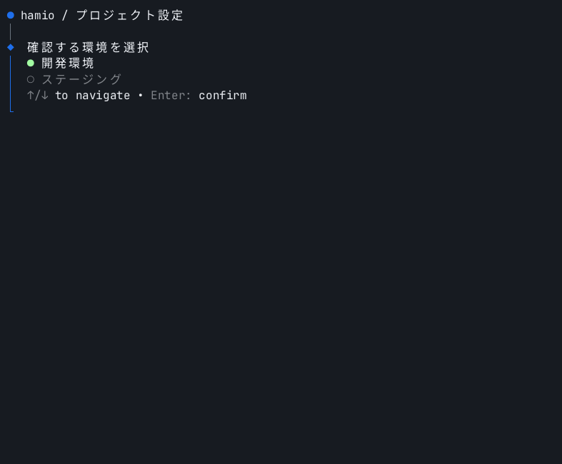
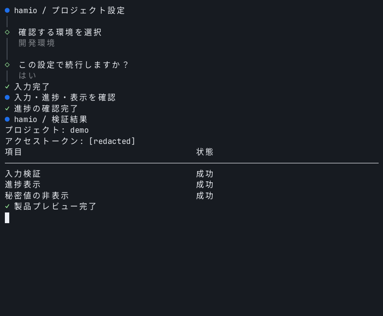
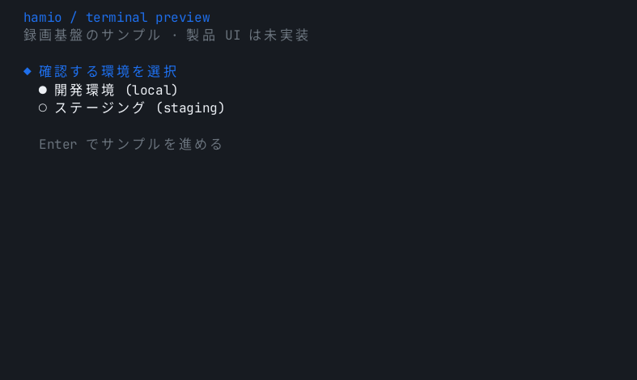
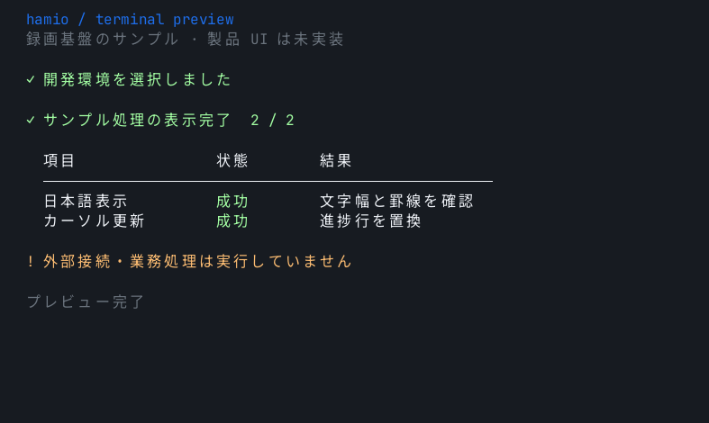

# ターミナル UI のプレビュー

このディレクトリには、実際の疑似端末出力を固定したフォントと端末サイズで描画した PNG を置きます。PR とチャットで日本語、余白、色、カーソル更新を確認するための資料です。生成と共有のコマンドは[開発手順](../development.md#8-ターミナル-ui-のプレビュー)を参照してください。

## 製品 CLI: product

80列・28行の端末で製品の `form`、`stream`、`render` を実行します。環境の選択、確認入力、進捗更新、秘密値の非表示、結果表をダミーデータで確認します。シナリオ内で実際のデプロイや外部接続は行いません。

## 録画基盤: fixture

80列・20行の端末で録画基盤の検証用プログラムを実行します。日本語と選択肢を表示し、Enter に応じて進捗と結果表を出力します。製品 API の確認は product、記録と描画の基盤の確認は fixture が担当します。

シナリオは [scenarios.ts](../../scripts/preview/scenarios.ts)、生成元と画像の照合情報は [manifest.json](manifest.json) にあります。操作過程の GIF、生成・目視・共有の手順は[開発手順](../development.md#8-ターミナル-ui-のプレビュー)を参照してください。
