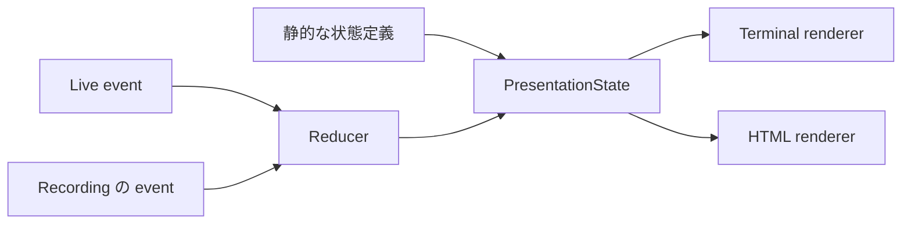

# Phase 1 — Presentation Domain と状態契約

この文書は新しい Presentation System の**設計仕様**である。以下の TypeScript は実装ではなく型のスケッチであり、Phase 3 の実装時にこの意味と不変条件を保つ。現行 API v1 の正本は移行が完了するまで [API 契約](https://github.com/9uiLe/hamio/blob/v0.1.0/docs/api.md)であり、現行実装の事実は [Phase 0 監査](current-state.md)を参照する。

## 1. 境界と用語

hamio が扱うのは、利用側の業務状態そのものではなく、**利用側が人間へ提示すると決めた意味**である。ビルド、テスト、AI の推論、権限、再試行、並列実行は利用側が所有する。hamio は提示状態の不変条件、提示 event の順序、両 renderer に渡す状態を所有する。[ADR 0001](adr/0001-presentation-state-and-replay.md)。

| 語                  | 定義                                                                                                 |
| ------------------- | ---------------------------------------------------------------------------------------------------- |
| Presentation        | 人間へ伝えるために選ばれた意味と状態の一単位                                                         |
| Presentation Model  | 媒体に依存しない item、run、task、result などの語彙と不変条件                                        |
| Presentation State  | ある時点の完全な Presentation。renderer の唯一の意味入力                                             |
| Presentation Event  | 提示状態に起きた事実。実際の業務 domain event ではなく、描画命令でもない                             |
| Run                 | 一連の提示をまとめる識別可能な実行。利用側の業務結果とは独立に結果を宣言する                         |
| Task                | run 内の追跡可能な作業単位。task ID は run 内で再利用しない                                          |
| Task Group          | 同じ run 内で task を意味的に束ねる見出し。自身の status は持たない                                  |
| Progress            | 作業の進み具合。`none`、`indeterminate`、`determinate` を区別する                                    |
| Result              | Task または Run の終端結果。`succeeded`、`failed`、`cancelled` のいずれか                            |
| Failure             | `failed` Result に必須の、機械用 code と人間用 message を持つ説明                                    |
| Message             | 単独の通知。level は `info`、`success`、`warning`、`error`。level は Task/Run の成否を変えない       |
| Status              | `TaskState` / `RunState` / `Result` の `kind` から読める状態語。独立した真偽値や自由文字列は作らない |
| Static Presentation | 完全な Presentation State を直接渡す取得方法。run が含まれてもよい                                   |
| Live Presentation   | Presentation Event を受理し、同じ reducer が更新した状態を提示する取得方法                           |
| Replay              | 記録済みの受理済み event を同じ reducer へ順に再投入する取得方法                                     |
| Recording           | event の順序と完結性を保持する、版付きの永続化単位                                                   |
| Renderer            | Presentation State を媒体固有の表現へ変換するもの。業務・protocol 状態は更新しない                   |
| Scenario            | 一つの意味状態または event 列と、検査する表示条件の組                                                |
| Catalog             | 共通 Scenario から両 renderer と実 Terminal capture を比較する開発環境                               |
| Protocol            | 未信頼の JSON/NDJSON を版付きで読み書きし、domain 値へ渡す境界                                       |

動詞は event の**過去に起きた事実**に `.started` / `.finished` / `.declared` / `.published` を使う。状態には現在形の `pending` / `running` と終端形の `succeeded` / `failed` / `cancelled` を使う。`complete` / `completed` / `done` は domain status に使わない。`success` / `failure` は説明文では使えるが、識別子は `succeeded` / `failed` に統一する。renderer が「成功」などへ翻訳するのは表現であり、状態名の追加ではない。

## 2. 一つの意味状態、三つの取得方法



`PresentationState` は次の構造を持つ。`run: none` は run のない静的資料を明示し、`run: present` は live / replay だけでなく静的 snapshot にも使える。`items` は意味上の順序を保持する。Task と Task Group は item の一種であり、Task の状態を別の top-level map と二重保持しない。reducer の内部 index は実装上の探索用に限る。

```ts
type PresentationState = {
  run: { kind: "none" } | { kind: "present"; value: Run };
  items: readonly PresentationItem[];
};

type Run = { id: string; title: string; state: RunState };
type RunState = { kind: "running" } | Result;

type Task = { id: string; label: string; state: TaskState };
type TaskState = { kind: "pending" } | { kind: "running"; progress: ProgressState } | Result;
type TaskGroup = { id: string; label: string; tasks: readonly Task[] };

type ProgressState =
  | { kind: "none" }
  | { kind: "indeterminate" }
  | { kind: "determinate"; current: number; total: number };

type StructuredValue =
  | null
  | boolean
  | number
  | string
  | readonly StructuredValue[]
  | Readonly<Record<string, StructuredValue>>;
type DataPresence = { kind: "none" } | { kind: "value"; value: StructuredValue };
type Failure = { code: string; message: string; details: DataPresence };
type Result =
  | { kind: "succeeded"; message?: string; data: DataPresence }
  | { kind: "failed"; failure: Failure }
  | { kind: "cancelled"; reason?: string };
```

この union により、同時に succeeded と failed になること、Failure のない failed、running task の progress の欠落を型で避ける。`message?` と `reason?` は状態を表す欠落ではなく、付記しないことを許す**任意の説明データ**である。`data` と `details` は `none` / `value` を区別し、値 `null` と「値なし」を混同しない。`StructuredValue` は JSON と交換できる有限の機械データで、wire version や JSON frame の型ではない。Task と Run は同じ Result 語彙を使うが、Run の結果は Task の集計から推測しない。`current` / `total` の正数・範囲や ID 一意性は TypeScript の一般的な数値型では表せないため、domain 入口で一度検証する。型パズルや数値 brand は導入しない（Meyer 1992 の事前条件・不変条件）。

`TaskGroup` は一段の grouping とし、group 自体の `running` / `failed` を持たない。子 Task の状態を集約表示するかどうかは renderer の選択である。入れ子 group は意味と event の使用例が示されるまで追加しない。Task/TaskGroup item がある State は `run: present` を必須とする。静的な Task scenario も run を含む snapshot として定義する。Run が `succeeded` / `failed` / `cancelled` になるには、全 Task が終端状態でなければならない。空の run は終端可能。完了 Task は削除しない。保持量が上限に達した場合は省略して偽の完全状態を作らず、受理・録画・表示の契約に従って明示的に失敗させる。

## 3. Concept taxonomy と採否

「公開」は将来の利用側 API に概念を出す必要性であり、全内部型を export する約束ではない。`S` は静的 snapshot、`L` は live、`R` は replay を示す。L/R は同じ State を使う。

| 概念            | 意味と採否                                                         | 別概念との関係・媒体依存                                            | 公開候補     | 使用  |
| --------------- | ------------------------------------------------------------------ | ------------------------------------------------------------------- | ------------ | ----- |
| Run             | 採用。実行全体の題名と終端結果                                     | Task の親だが、成否は Task から導出しない                           | 必要         | S/L/R |
| Task            | 採用。識別可能な作業と状態                                         | `pending` / `running` / 終端を持つ                                  | 必要         | S/L/R |
| TaskGroup       | 採用。一段の意味的なまとまり                                       | 独自 status なし。見た目の card や border は持たない                | 必要に応じて | S/L/R |
| Progress        | 採用。none / indeterminate / determinate                           | Task の running state に付く。単独 Progress item も静的資料に使える | 必要         | S/L/R |
| Message         | 採用。一件の通知                                                   | level は結果ではない                                                | 必要         | S/L/R |
| Status          | 独立 entity は不採用                                               | Task/Run/Result の `kind` を読む。色や記号は renderer の責務        | 型語彙のみ   | S/L/R |
| Result          | 採用。仕事の終端結果                                               | Task と Run で同じ意味。静的な Result item にも使う                 | 必要         | S/L/R |
| Error / Failure | Failure を採用。Error は処理障害と紛らわしいため domain 名にしない | Failure item は診断表示。protocol/IO error は別 concern             | 必要         | S/L/R |
| Table           | 採用。列・行を持つ比較可能な値                                     | 幅・スクロール・表示行数は renderer の責務                          | 必要         | S/L/R |
| KeyValue        | 採用。名前付きの値の列                                             | Table と違い行列ではない                                            | 必要         | S/L/R |
| Code            | 採用。ソース文字列と言語情報                                       | syntax color は renderer の責務                                     | 必要         | S/L/R |
| Diff            | 採用。context / added / removed の変化列                           | ANSI/HTML patch markup は保持しない                                 | 必要         | S/L/R |
| Tree            | 採用。親子関係を持つ項目                                           | 折り畳みは HTML の表現であり node の意味ではない                    | 必要         | S/L/R |
| Summary         | 採用。全体の短い結論と根拠点                                       | 任意の KeyValue や Result と同一視しない                            | 必要に応じて | S/L/R |

`PresentationItem` は root Task、TaskGroup、Message、単独 Progress、Result、Failure、Table、KeyValue、Code、Diff、Tree、Summary、秘匿済み item の閉じた union とする。Task は root または一つの TaskGroup 内に一度だけ存在する。`task.declared` の placement は `{kind:"root"}` または `{kind:"group"; groupId}` で、`groupId?` に隠れた意味を持たせない。

Table は列定義と、列数が一致した行を持つ。KeyValue の値と Table の cell は `visible(value)` / `redacted` の union を使う。Code は本文と任意の言語名、Diff は行ごとの `context` / `added` / `removed`、Tree は label と子の列、Summary は headline と要点の列を持つ。Code/Diff/Tree/Table に「元データ自体が省略された」場合は `complete` / `truncated` を明示する。狭い画面で renderer が一時的に切り詰めたこととは別である。空配列は空の意味を持つ。大きなデータの pagination や diagram は現段階の共有 model に加えない。

| Content item        | 意味データと不変条件                                                                         |
| ------------------- | -------------------------------------------------------------------------------------------- |
| Message             | `level` と text。text は公開可能な Unicode 文字列                                            |
| standalone Progress | label と ProgressState。一度公開した item 自体は immutable。更新を続ける進捗には Task を使う |
| Result / Failure    | 上記 Result / Failure。単独 item の表示は Run/Task state を変更しない                        |
| Table               | 一意な column key と label の列、column 数に一致する cell を持つ行の列、source extent        |
| KeyValue            | key が一意な label / value の列。value は scalar の visible / redacted                       |
| Code                | text、任意の language 名、source extent。language の欠落は状態ではなく付加 metadata の欠落   |
| Diff                | `context` / `added` / `removed` を持つ行の列、任意の source 名、source extent                |
| Tree                | label と子を持つ node の列、source extent。循環と過大深度を拒否                              |
| Summary             | headline と要点の列。Result の成否を置き換えない                                             |
| Redacted            | 元の item の値を一切保持しない秘匿 placeholder                                               |

`source extent` は `{kind:"complete"}` または `{kind:"truncated"; omittedCount?: number}` とする。`omittedCount?` は「分かる場合のみ付ける正の件数」であり、状態は `kind` が決める。Run/Task/Group の title・label、Message text、Failure code/message、Summary headline は空文字を拒否する。Code text と各 item の配列は空を許し、Catalog で空状態を確認する。Table は少なくとも一列を持ち、行は 0 件を許す。Phase 3 で確定する byte・depth 制限は、これらの意味を変えずに resource policy として適用する。

HTML 固有の Tabs、Accordion、Detail Panel、Diagram、Architecture Map、Sequence Visualization、Evidence Inspector は**意味モデルの種類としては追加しない**。同じ item を HTML が探索・折り畳み・図で表示するための表現候補とし、図固有の意味が後に判明した場合だけ別仕様で設計する。Terminal の Interactive Prompt、Cursor Selection、TTY live redraw は Form/環境 adapter の責務であり、共有 item ではない。[ADR 0002](adr/0002-boundaries-and-form.md)。

## 4. 状態と不変条件

| 状態                   | 許される変化                                                     | 禁止する変化・理由                                                     |
| ---------------------- | ---------------------------------------------------------------- | ---------------------------------------------------------------------- |
| Run absent             | `run.started` → running                                          | 先頭以外の event を受理しない                                          |
| Run running            | `run.finished(result)` → succeeded / failed / cancelled          | 未終端 Task を残したまま終了しない。Run 結果を Task 件数から推測しない |
| Run terminal           | 変化なし                                                         | 二重終了や事後の event を拒否                                          |
| Task pending           | `task.started` → running、`task.finished(cancelled)` → cancelled | 開始前に成功・失敗としない                                             |
| Task running           | `task.progressed` → running、`task.finished(result)` → terminal  | progress 変更は実行中のみ                                              |
| Task terminal          | 変化なし                                                         | ID 再利用と再開を禁止                                                  |
| Progress none          | indeterminate / determinate へ                                   | `none` と 0% は異なる                                                  |
| Progress indeterminate | determinate へ                                                   | 不確定表示を 0% とみなさない                                           |
| Progress determinate   | 同じ total で current が非減少                                   | total 変更、後退、indeterminate/none への戻しを禁止                    |

`determinate` は finite safe integer の `total > 0` と `0 ≤ current ≤ total` を満たす。`current = 0` と `current = total` は別状態として Catalog に置く。Task の終了に `current = total` は要求しない。重複した同値の progress event は受理しても状態を変えず、renderer は不要な再描画を省ける。失敗した Task の再試行は同じ ID の再開ではなく、利用側が新しい Task を宣言する。Run の `cancelled` は利用側が明示した結果であり、TTY の Ctrl-C や event 入力の断絶から自動生成しない。

## 5. Presentation Event と state machine

Event は利用側が**提示したと宣言する事実**である。hamio は業務の実行を観測・推定しない。event は `protocolVersion: 2`、`runId`、0 から連続する `seq`、`type` を持つ版付き wire frame として運ぶ。ID の wire 形式は現行と同じ `[A-Za-z0-9][A-Za-z0-9_.-]{0,63}` とし、大小文字を区別する。domain event の語彙は `type` 以下と同じだが、wire version、JSON framing、byte limits は domain ではなく protocol に置く。未信頼 frame は protocol が検証し、reducer は意味上の順序と不変条件を検証する。accepted event のみ recording に渡す。

静的 JSON 文書の外枠は `{ "protocolVersion": 2, "state": PresentationState }`、live NDJSON は上記の event frame を一行ずつ運ぶ。静的 decoder も Task/Run の終端整合、ID 一意性、表の cell 数などの domain invariant を確認した State だけを renderer へ渡す。v2 の可視値は `visible` / `redacted` を指定し、生の秘密値を `secret: true` と共に送ってから renderer に隠させる契約にはしない。

| Event                 | 必須 payload と事実                            | 受理前 → 受理後                              | 主な拒否条件                        |
| --------------------- | ---------------------------------------------- | -------------------------------------------- | ----------------------------------- |
| `run.started`         | title                                          | absent → Run running                         | seq ≠ 0、二重開始、空 ID            |
| `task-group.declared` | groupId、label                                 | running → group を末尾に追加                 | ID 再利用、run が非 running         |
| `task.declared`       | taskId、label、placement                       | running → Task pending を指定位置に追加      | 未宣言 group、ID 再利用             |
| `task.started`        | taskId                                         | pending → running(progress none)             | 未宣言・終端 Task                   |
| `task.progressed`     | taskId、progress = indeterminate / determinate | running → running                            | 上記 Progress 規則に反する値・順序  |
| `task.finished`       | taskId、result                                 | pending → cancelled、または running → Result | pending → success/failure、二重終了 |
| `content.published`   | Task/TaskGroup 以外の PresentationItem         | running → item を末尾へ追加                  | 非 running、未検証 item             |
| `run.finished`        | result                                         | running → Result                             | 未終端 Task、二重終了               |

全 event の `runId` は `run.started` の ID と一致し、`seq` は 1 ずつ増える。Task と TaskGroup の ID は同一 run の一つの名前空間で一意とする。順序は `seq` と宣言順で決まり、wall clock では決まらない。`content.published(message)` が通知に対応する。`content.published(failure)` は表示項目を追加するだけで、Run/Task を失敗へ遷移させない。`task.finished(failed)` / `run.finished(failed)` は Failure が必須である。

## 6. Recording と Replay

一つの Recording は**一 run の accepted event 列**と framing 情報を持つ。逐次書込みの形式は `recordingVersion: 1` の header、`protocolVersion: 2` の event frames、完了を示す trailer とする。header は run ID を確定せず、最初の `run.started` が所有 run を確定する。trailer は event 数と最終 seq、`complete` または `partial` の記録状態を含む。trailer が無い crash/EOF も partial として読める。記録は不正 event を accepted event と偽って追記しない。

Replay は `decode → reduce` を同じ順序で行い、同じ受理済み event 列から同じ `PresentationState` を得る。clock、乱数、TTY 幅、locale、renderer は reducer へ入れない。timestamp が必要なら event の外側の記録 metadata として保持し、状態遷移や意味上の順序には使わない。アニメーションの frame、カーソル位置、測定した端末幅は recording に保存しない。Renderer が event を直接解釈しないため、replay でも同じ意味状態を両媒体へ渡せる。

Recording が有効な live 実行では、入力を検証して次の State を計算し、秘匿済みの event frame を書き終えてからその State を renderer へ公開する。書込み途中の frame は replay 時に不完全として捨て、accepted prefix と recording の `partial` を報告する。frame が完成した直後に live 表示前の crash が起きても、replay は記録された事実を再現する。これは電源断に対する fsync 耐久性の保証ではなく、必要なら Phase 10 で別途定義する。Recording を使わない live 実行は検証後に State を公開する。

| Recording/入力状態                        | Replay の結果                             | 表示上の意味                                                                      |
| ----------------------------------------- | ----------------------------------------- | --------------------------------------------------------------------------------- |
| 正しい `run.finished` と complete trailer | `{kind:"complete", state}`                | Result の succeeded / failed / cancelled をそのまま表示                           |
| `run.finished` 前の EOF、I/O 中断         | `{kind:"partial", state, reason}`         | Run は running のまま。別枠で「記録が不完全」を示し、失敗・cancelled を推測しない |
| `run.finished` 後の trailer 欠落          | `{kind:"partial", state, reason}`         | Run の Result は保持し、記録の完結性だけを未確認と示す                            |
| 不正 event / 版 / seq / byte limit        | `{kind:"invalid", acceptedPrefix, issue}` | 問題位置を報告し、無効 frame を状態へ混入させない                                 |
| Result が cancelled の complete recording | `{kind:"complete", state}`                | 利用側が明示した cancellation。輸送中断とは区別                                   |

`ReplayResult` の `partial` / `invalid` は記録の状態であり、Presentation domain の Run status ではない。live reader が不正 event を見た場合も同じ accepted prefix を示せるが、公開 machine response の形式と終了コードは application/CLI で定義する。将来の schema 変更は protocol decoder が版ごとに明示的に扱う。未知の版・event を黙って飛ばさない。古い版の変換が必要なら、版付き ingress で一度だけ新 domain event へ写し、reducer に互換分岐を持たせない。

記録には**提示してよい正規化済み event**だけを保存する。key-value/table の秘匿 cell は値を保持しない `redacted` に変換し、自由文・Code・Diff・Tree・Result data は利用側が公開可否を決め、必要なら item 全体を redacted にする。v1 の `secret` 入力を移行する場合は保存前に値を捨てる。生の stdin や秘密を含む受信 frame は recording に保存しない。機械出力と人向け出力の秘匿規則を同じ正規化済み状態から適用する。ただし自由文に未指定の秘密が含まれる場合は自動検出できないため、入力側の責務と Phase 10 の report 検証項目に残す。録画のサイズ、event 数、task 数、各 content のサイズには protocol と保持側で上限を設ける。正確な予算は Phase 2/3 の利用側負荷計測で決める。

## 7. Specification alignment matrix

Renderer 入力はすべて `PresentationState`。Catalog は下記の semantic scenario を一つだけ定義し、Terminal と HTML に渡す。

| 仕様状態                                 | Domain                                                          | Protocol/event                                    | Renderer 入力                   | Catalog scenario                                                                            |
| ---------------------------------------- | --------------------------------------------------------------- | ------------------------------------------------- | ------------------------------- | ------------------------------------------------------------------------------------------- |
| Task pending                             | `Task.state.kind=pending`                                       | `task.declared`                                   | Task pending                    | `task-pending`                                                                              |
| Task running                             | `Task.state.kind=running`                                       | `task.started`                                    | Task running                    | `task-running`                                                                              |
| Task succeeded / failed / cancelled      | `Task.state.kind` 同名。failed は Failure 必須                  | `task.finished(result.kind=...)`                  | 同名の Task terminal state      | `task-succeeded` / `task-failed` / `task-cancelled`                                         |
| Progress none                            | `ProgressState.kind=none`                                       | `task.started` の初期値                           | running Task の progress none   | `progress-none`                                                                             |
| Progress indeterminate                   | 同名                                                            | `task.progressed(indeterminate)`                  | 同名                            | `progress-indeterminate`                                                                    |
| Progress 0% / partial / complete         | `determinate(current,total)`                                    | `task.progressed(determinate)`                    | 同じ比率。色や bar は未定       | `progress-zero` / `progress-partial` / `progress-complete`                                  |
| Message info / success / warning / error | `Message.level` 同名                                            | `content.published(message)`                      | 同 level の Message             | `message-info` 等                                                                           |
| Result success / failure / cancellation  | `Result.kind=succeeded/failed/cancelled`                        | `task.finished` / `run.finished`、または静的 item | 同じ Result。data は none/value | `result-succeeded-no-data` / `result-succeeded-data` / `result-failed` / `result-cancelled` |
| Run absent / running / terminal          | `run.kind=none` / `run.kind=present` と `run.value.state.kind`  | 静的状態 / `run.started` / `run.finished`         | 同じ Run state                  | `run-static` / `run-running` / `run-succeeded` / `run-failed` / `run-cancelled`             |
| Incomplete recording                     | `ReplayResult.kind=partial`。Run は受理済み prefix の状態を保持 | trailer 欠落・明示 partial                        | State + 記録不完全の説明        | `replay-partial-running` / `replay-partial-finished`                                        |

`status=success` のような別語彙は renderer に作らない。表示文言が異なる場合も、この表の元状態へ追跡できるようにする。TaskGroup、Table、KeyValue、Code、Diff、Tree、Summary の empty / long / nested / truncated と狭い viewport は同じ Scenario registry に加える。viewport は表示条件であり domain state ではない。
