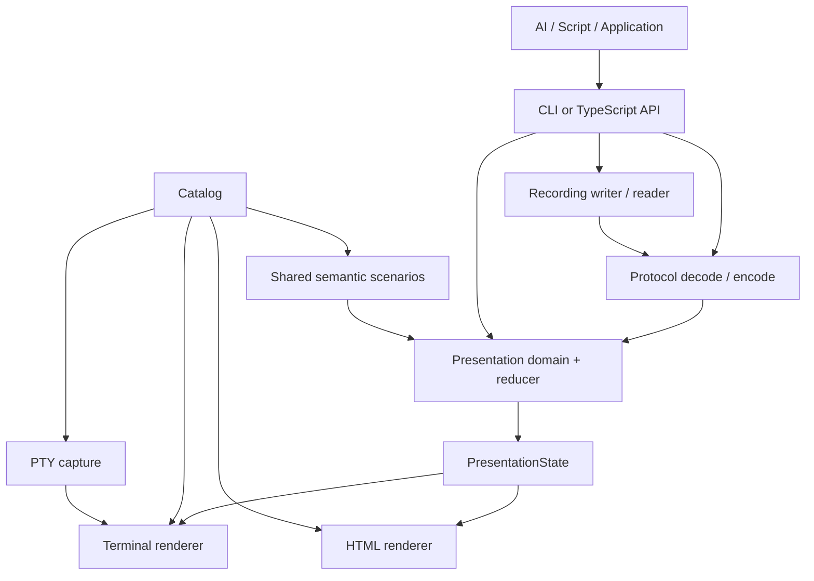
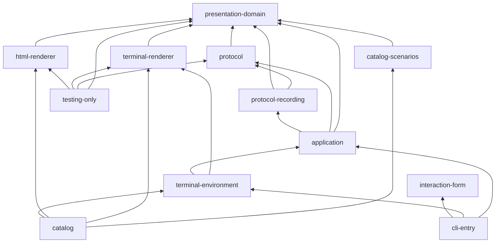

# Phase 1 — Target Architecture

Status: **設計確定 / 実装前**。この文書と [Domain・状態契約](domain-model.md)、[ADR 0001](adr/0001-presentation-state-and-replay.md)、[ADR 0002](adr/0002-boundaries-and-form.md)が Phase 1 の設計成果物である。現行製品の動作契約は移行完了まで [API v1](../api.md)、現状の証拠は [Phase 0 監査](current-state.md)を正本とする。以後の製品実装では新しい意味・状態について本書を基準とし、API v1 の内容を無言で上書きしない。

## 1. 製品責務と Phase 0 からの導出

hamio は **AI / Script / Application が人間へ提示すると選んだ情報の意味、状態、提示 event を標準化し、媒体ごとの renderer へ同じ意味を渡すシステム**である。業務処理、権限、再試行、並列実行、Task/Run の業務上の成否決定は利用側に残す。Terminal と HTML は sibling renderer であり、互いの出力や内部実装に依存しない。

| Phase 0 で確かめた事実                         | Phase 1 の決定または検証結果                                                                                                   |
| ---------------------------------------------- | ------------------------------------------------------------------------------------------------------------------------------ |
| `Block[]` と `Session` は別の model            | 両方を [一つの `PresentationState`](domain-model.md#2-一つの意味状態三つの取得方法)へ置き換える。旧 `Block` の名前変更ではない |
| `Session.snapshot()` は先頭 active task と件数 | renderer 入力には全 Task と終端状態を残し、要約は renderer が導出する                                                          |
| Core が輸送、フォーム、状態を含む              | Presentation domain、protocol、interaction/Form の論理境界を分ける                                                             |
| application が `terminal/Appearance` に依存    | CLI/environment が媒体の設定を決め、application は semantic state と出力先の抽象だけを扱う                                     |
| 実 PTY の capture / manifest がある            | capture 技術を Catalog で利用し、fixture data は意味 scenario から新しく定義する                                               |
| native CLI の配布が中心                        | TypeScript/HTML の公開物を CLI と同一単位と決めつけず、Phase 2 で build・release 単位を確定する                                |

## 2. Quality priorities と比較

設計評価には **ISO/IEC 25010:2023** を使う。重点は機能適合性（同じ意味が表せること）、保守性（責務と変更境界）、信頼性（replay と不正順序）、セキュリティ（秘匿した記録）とする。互換性、相互作用性、柔軟性はこれらの決定を評価する補助軸である。性能は利用側負荷と実測で Phase 2/3 以降に確認し、初期設計のために早すぎる cache や worker を加えない。これはユーザー指定の優先順位に沿う。

| 案                                                             | 機能適合性                          | 保守性                                 | 信頼性・秘匿                          | 判断     |
| -------------------------------------------------------------- | ----------------------------------- | -------------------------------------- | ------------------------------------- | -------- |
| A: 現行 Block と Session を残し HTML adapter を追加            | 静的と live の状態語彙が分裂        | renderer ごとに写像が増える            | replay 時に欠けた完了 Task を補えない | 不採用   |
| B: 共通 State を中心に、event は一つの reducer で State へ変換 | Static / Live / Replay の意味が一致 | presentation と媒体の変更を分離        | 受理順序と完結性を独立検証できる      | **採用** |
| C: Event だけを公開し各 renderer が状態を再構成                | 静的資料に不要な event 列が必要     | renderer ごとに state machine が増える | 再生結果が媒体間でずれ得る            | 不採用   |

感度点は `PresentationState` の語彙、Result と Failure の分離、recording の accepted-only 境界である。ここが曖昧だと renderer と protocol の両方へ誤りが伝播する。主なトレードオフは、完了 Task を保持することによるメモリ増と、後から同じ意味を確認できることの間にある。上限で使用量を管理し、黙って履歴を捨てない。もう一つは個別 package の境界による独立配布と、設定・DTO・release の増加である。現段階では論理 module を採用する（Parnas 1972、ISO/IEC 25010:2023）。

## 3. データフローと依存方向

最初の図の矢印は**実行時のデータの流れ**を示す。次の図の矢印 `A → B` は **A が B の公開された意味または API に依存する**ことを示す。

厳密な import DAG は次に示す。`domain` は外部 package に依存しない。`protocol` は domain の意味型へ decode する。`terminal` と `html` は domain の State を読むが互いを import しない。`catalog/scenarios` は domain、`catalog` は scenarios と両 renderer と capture を使う。`application` は domain/protocol と renderer 呼び出しを組み立てる。CLI の環境 adapter は application と terminal の設定を結ぶ。Form は presentation とは並列の interaction concern で、CLI が組み合わせる。

`application` が `terminal` / `html` の具象を同時に import せず、利用側入口の composition root が renderer を選ぶ。HTML report の組み立ても composition root から renderer に State を渡す。`testing-only` は製品から参照されない。`protocol-recording` は独立 package ではなく protocol 周辺の論理 module 名である。上の DAG に循環はない。新たな媒体を追加するときは domain と protocol の語彙が足りるかを先に判断し、Terminal の幅や HTML の DOM を domain に加えない。

## 4. Logical module boundaries

次の名前は **責務の境界**であり、Phase 1 では filesystem や npm workspace の確定案ではない。物理的な package は、利用側へ独立配布する必要、変更頻度、build・test、公開版管理の差が確認されたときだけ分ける。[ADR 0002](adr/0002-boundaries-and-form.md)。

| Concern / 論理 module   | 責務と所属理由                                                                              | 依存先 / 利用者 / 変更理由                                                |
| ----------------------- | ------------------------------------------------------------------------------------------- | ------------------------------------------------------------------------- |
| Domain (`presentation`) | State、Item、Result、Failure、不変条件、event reducer。媒体と輸送より長く安定する意味の中心 | 依存なし / protocol、renderers、application、scenarios / 意味と遷移の変更 |
| Protocol                | JSON/NDJSON の shape、版、ID/size 制限、decode/encode。未信頼境界を一箇所に置く             | Domain / CLI、recording、外部利用者 / 輸送と版の変更                      |
| Recording / Replay      | 受理済み event の保存、header/trailer、部分列の分類。reducer 自体は Domain と共有           | Protocol、Domain / application、report / 永続形式と復元の変更             |
| Application             | static/live/replay を選び、State を renderer へ渡し、機械応答と障害を扱う                   | Domain、Protocol、Recording / CLI・SDK / 利用手順の変更                   |
| Terminal renderer       | State → 文本・ANSI。幅、制御文字、表示上の省略を所有                                        | Domain / CLI、Catalog / Terminal 表現の変更                               |
| HTML renderer           | State → semantic HTML。escape、accessibility、responsive な構造を所有                       | Domain / report、Catalog / HTML 表現の変更                                |
| Environment / I/O       | TTY 判定、stream、背圧、clock、cancel、PTY。利用環境から意味を推測しない                    | application と選択した renderer / CLI、Catalog / OS・runtime の変更       |
| Design                  | 媒体ごとの表現 token と component specification。status 語彙の意味は Domain を参照          | Domain と各 renderer / renderer / Design Input Gate 後の表現変更          |
| Catalog scenario        | 意味 State または accepted event 列と表示条件の一元管理                                     | Domain / Catalog、visual test / 確認対象 state の変更                     |
| Catalog                 | scenario inventory、両 renderer 比較、実 Terminal capture、responsive/a11y review           | Scenarios、Terminal、HTML、capture / 開発環境の変更                       |
| Interaction / Form      | 回答の入力・検証・キャンセル。提示とは別の利用者との往復                                    | 自身の契約、Terminal prompt adapter / CLI / 質問と入力の変更              |
| Testing                 | 各境界の契約試験と必要な fixture。製品 import graph へ入れない                              | 対象 module / CI / 検証方法の変更                                         |

Core / Domain / Protocol に ANSI、TTY、HTML、DOM、CSS、browser、`process.stdout`、端末幅、Web Component、React、Lit、Catalog UI を import させない。`components` という共有 package は作らず、共有するのは `PresentationItem` の**意味**である。見た目の component は renderer ごとに実装する。`tokens` も Phase 5 の Design Input Gate より前は責務境界だけ定め、最終値・独立 package は作らない。

結合の定性評価は `module_unit: logical TypeScript module` を基準とする（参考値: Khononov 2024, Ch.7–10）。`BALANCE = (STRENGTH XOR DISTANCE) OR NOT VOLATILITY` は変更波及を考えるための定性的な問いであり、計測値や合否ではない。強い意味共有は同じ repository の近い module に留め、外部境界では明示契約に狭める。

| 依存境界                 | 共有要素 / 目標 Strength                             | Distance と Volatility の見積り                                           | 設計上の扱い                                                     |
| ------------------------ | ---------------------------------------------------- | ------------------------------------------------------------------------- | ---------------------------------------------------------------- |
| Domain ↔ renderer        | `PresentationState`、`Result`。Model coupling        | 同一 repository の namespace 間。表現は変わりやすいが domain は比較的安定 | 片方向 import。媒体固有情報は戻さず、意味変更だけを共有          |
| Domain ↔ Protocol        | domain event と State invariant。Model coupling      | 同一 repository の namespace 間。wire は版ごとに変わり得る                | decode を protocol 側に閉じ、旧 wire の分岐を reducer に入れない |
| Protocol ↔ 外部 consumer | `protocolVersion: 2` の JSON 契約。Contract coupling | system 間。consumer の変更圧力は高い                                      | version と閉じた decode で距離に見合う弱い結合にする             |
| Catalog ↔ renderer       | State を受ける公開 renderer 入口。Contract coupling  | 同一 repository の namespace 間。デザイン変更圧力は高い                   | Catalog が renderer 内部の DOM/ANSI 構造へ依存しない             |

強 Strength と遠 Distance と高 Volatility が重なる境界は設計しない。具体的な削減策は、外部 consumer との共有要素を内部型一式から版付き wire 契約へ**狭める**ことで、Domain の内部変更が consumer へ伝播する経路を減らすこと。近い module 間の意味共有は無理に DTO へ複製せず、重複したモデルを避ける。後の Phase で物理 package を分ける際もこの見積りを再確認する（参考値: Khononov 2024, Ch.7–10; Parnas 1972）。

## 5. 入力検証と機械応答

| 境界                     | 一度だけ確認する条件                                                                | 担当                    |
| ------------------------ | ----------------------------------------------------------------------------------- | ----------------------- |
| 外部 byte → JSON         | UTF-8、文書/行の byte 制限、JSON 構文、深さ/ノード/文字列上限                       | Protocol の ingress     |
| JSON → protocol frame    | `protocolVersion`、閉じた shape、event payload、ID 構文、数値の基礎範囲             | Protocol decoder        |
| protocol frame → Domain  | ID の所有・一意性、seq と run/order、Progress の遷移、Run/Task の不変条件           | Domain reducer          |
| State → renderer         | 信頼できる State からの HTML escape、Terminal 制御文字無害化、幅・省略、a11y markup | 各 renderer             |
| State → recording/report | 秘匿値が正規化済みか、受理済み event のみか、recording の完結性                     | Recording / application |

Protocol の wire 型と Domain の型を**別目的**として扱うが、すべての field に重複 DTO を作らない。decoder が shape を検証して domain event を構築し、reducer は同じ shape 検査を繰り返さない。内部 TypeScript API でも利用側入力は domain invariant を満たす必要がある。Failure の `code` は業務の提示情報で、`INVALID_JSON` や `IO_ERROR` のような hamio 自身の処理障害とは別である。hamio の処理障害と利用側の failed Result を machine response で区別する。入力の中断を利用側の cancelled Result に変えない。公開する error code、終了コード、機械応答の細目は Phase 2/3 の contract 更新で決める（Meyer 1992、RFC 8259）。

秘匿は入口で値を落とし、State と Recording には表示許可済みの値だけを入れる。Terminal と HTML の escape は、秘匿とは別の媒体固有の安全策として各 renderer が行う。自由文や任意 JSON に埋め込まれた秘密は自動判別できないため、利用側の宣言と report 前の検証が必要である（Saltzer & Schroeder 1975、NIST SP 800-53）。

## 6. Catalog と Design Input Gate

`Scenario = {id, description, state または accepted events, viewport 等の表示条件}` を共通の registry に置く。Terminal と HTML の fixture を別々に管理しない。State を直接置く scenario は static、event 列を置く scenario は同じ reducer を通し live/replay の代表点を選ぶ。イベント数を増やすことを目的にせず、Task 5 状態、Progress 3 種と 0/partial/complete、Message 4 level、Result のデータ有無、Table/Code/Diff/Tree の empty/long/truncated、狭い幅を意味ごとに選ぶ。Terminal pane は実 renderer の ANSI/text と PTY capture に結び、HTML pane は同じ State を表示する。既存 `scripts/preview/capture.ts` の安全な PTY 取得を候補として再利用するが、`fixture.ts` の見た目は使わない。

Phase 4 で必要な診断用表現は、状態名と内容を読める最小限に留める。最終 typography、色、余白、記号、border、motion、progress の見た目、light/dark は **Phase 5 の参考資料分析後**に決める。Design token の責務は「共有 semantic tone を各媒体の表現へ写す」ことだけ先に決め、具体値は固定しない。Accessibility は Terminal の意味を失わない文字表現と HTML の semantic structure、keyboard、focus、reduced motion の確認項目として仕様化するが、最終表示の判断は Gate 後に行う。

## 7. Public API と物理 package 方針

将来の TypeScript API 候補は「静的 State を提示する」「Run/Task の event を発行する」「recording を replay する」の少数の入口である。利用側が model を構築するための必要な型と Result/Failure の判別語彙は公開候補とする。内部 reducer の index、protocol DTO、renderer の DOM/ANSI、複数媒体に一律な汎用 hook、未使用の extension point は公開しない。API の関数形は Phase 9 で利用側 script に対して検証する。Phase 1 で汎用 UI framework や plugin 機構を約束しない。

Phase 2 は clean checkout の setup/check/build、Catalog command、配布単位を検証する。固定済み Nixpkgs の Prettier は `3.9.6`、現在の `bun.lock` に固定した Prettier は `3.9.7` なので、formatter を Nix に一本化するかも版・lockfile・local/CI command を揃えて判断する。必要性が確認できるまでは single repository 内の論理 module で十分。Phase 3 の Core / Protocol 実装、Phase 4 の Catalog、Phase 7/8 の renderer 本実装で物理 package が必要と判明した場合にだけ分ける。別 npm package の version と lockfile、release・Nix・SBOM の責務を同時に決める。`packages/core`, `packages/protocol`, `packages/components`, `packages/tokens`, `packages/testing` を要件の名前だけで作らない。

## 8. Migration strategy

新 Presentation 契約は **`protocolVersion: 2`** とし、現行 `apiVersion: 1` の意味を密かに変えない。Phase 1 は移行設計のみで、compatibility wrapper や二重実装は作らない。実装 Phase で新しい入口が動くまで v1 の機能・試験を壊さず、切替時に v1 の不要な構造を削除する。既存利用側には明示的な移行ガイドと例を提供する。

| 現行                                          | 方針          | 新しい責務または理由                                                                       |
| --------------------------------------------- | ------------- | ------------------------------------------------------------------------------------------ |
| `Block`, `DisplayDefinition`                  | Replace       | PresentationState + semantic Item。flat な UI 部品の改名ではない                           |
| `Result.success`, `message?`, `data?`         | Replace       | discriminated Result + Failure + DataPresence。付記と状態を区別                            |
| `run.start`                                   | Replace       | `run.started`。事実と `running` state を対応                                               |
| `task.start`                                  | Split         | `task.declared` (pending) と `task.started` (running)                                      |
| `task.progress`                               | Replace       | `task.progressed` と explicit ProgressState                                                |
| `task.finish`                                 | Replace       | `task.finished` + succeeded / failed / cancelled Result                                    |
| `message`                                     | Replace       | `content.published(message)`。通知は結果を変えない                                         |
| `run.finish`                                  | Replace       | `run.finished` + Result。全 Task 終端を要求                                                |
| `render`                                      | Replace       | State を直接提示する入口。CLI の最終名は Phase 9 で決める                                  |
| `stream`, `--events`                          | Replace       | 同じ reducer を通る live event 入力と accepted event 記録。CLI 名は Phase 9                |
| `capabilities`                                | Revisit later | 新 contract の発見方法として必要なら更新。v1 の列挙を機械的に移さない                      |
| Form                                          | Move          | Presentation と並列の interaction capability。Terminal prompt は環境 adapter               |
| `Session`                                     | Replace       | 全 Task と結果を保つ domain reducer。先頭 task の一行 snapshot は Terminal renderer の導出 |
| `Appearance`                                  | Move          | Terminal renderer / environment の設定。Application と Domain の型から除く                 |
| `validation.ts` と `contract.ts`              | Split         | wire 検証、domain invariant、Form 契約、処理 error を責務別に配置                          |
| Terminal format と preview fixture の外観     | Remove        | Phase 5 以降の Design Language を基準に本実装で交換                                        |
| PTY capture、backpressure、文字幅、安全な出力 | Keep          | Terminal 環境の制約として保持。新しい意味 model へは混ぜない                               |

## 9. Phase 1 quality review と次段の検証

| Gate                | Phase 1 の確認結果                                                                                                                                                |
| ------------------- | ----------------------------------------------------------------------------------------------------------------------------------------------------------------- |
| 状態・illegal state | Result は判別 union、Failure は failed に必須、Progress の欠落を明示。数値・順序だけ domain 入口で検証                                                            |
| 語彙整合            | [状態/event 対応表](domain-model.md#5-presentation-event-と-state-machine)と [alignment matrix](domain-model.md#7-specification-alignment-matrix)を共通正本にした |
| 責務・依存          | Domain と renderer、Protocol と Domain、Form と Presentation を分け、上記 DAG に循環なし                                                                          |
| 結合・抽象          | `components` / `tokens` / `testing` の package を先取りせず、DTO や wrapper を増やさない                                                                          |
| Public API          | 候補の入口だけを示し、内部 State 管理・renderer 詳細を公開しない                                                                                                  |
| Test / comment      | 製品コード・試験・コメントは変更しない。次段の試験責務のみ定義                                                                                                    |
| 複雑性              | Event の追加は pending、group、content、cancelled に必要なものに限定。Recorder は reducer を複製しない                                                            |

Phase 3 の Domain test は transition・Progress・ID と replay の決定性に限定する。Protocol test は shape/version/size と受理済み event だけの記録、renderer test は escape/width/HTML semantics、統合 test は Protocol → reducer → renderer の代表例、Catalog/visual test は配置と状態 inventory を担当する。同じ条件を全層へ複製しない。Phase 2 で既存 tests の所有層を整理するまで削除しない。

残る実装上の検証は、保持量上限の具体値、partial recording の永続形式の復旧試験、実際の利用側 script に必要な TypeScript API の形、HTML report の秘匿レビュー、配布単位と build 時間である。これらは設計上の意味を変える未決事項ではなく、Phase 2/3/9/10 の検証項目とする。Design Input Gate は未通過であり、視覚仕様を確定していない。

## References

- ISO/IEC. [ISO/IEC 25010:2023 — Product quality model](https://www.iso.org/standard/78176.html)。機能適合性・保守性・信頼性・セキュリティの評価軸。
- Parnas, D. L. (1972). [On the Criteria To Be Used in Decomposing Systems into Modules](https://doi.org/10.1145/361598.361623)。変更理由による境界。
- Meyer, B. (1992). [Applying Design by Contract](https://doi.org/10.1109/2.161279)。状態の事前条件と不変条件。
- Khononov, V. (2024). [Balancing Coupling in Software Design](https://www.informit.com/store/balancing-coupling-in-software-design-universal-design-9780137353484)。Ch.7–10 の結合設計の定性的検討。
- Saltzer, J. H., & Schroeder, M. D. (1975). [The Protection of Information in Computer Systems](https://doi.org/10.1109/PROC.1975.9939)。情報の最小公開と境界。
- IETF. [RFC 8259 — The JavaScript Object Notation (JSON) Data Interchange Format](https://www.rfc-editor.org/rfc/rfc8259)。JSON 輸送境界。
- NIST. [SP 800-53 Revision 5](https://csrc.nist.gov/pubs/sp/800/53/r5/upd1/final)。情報の保護と記録。
